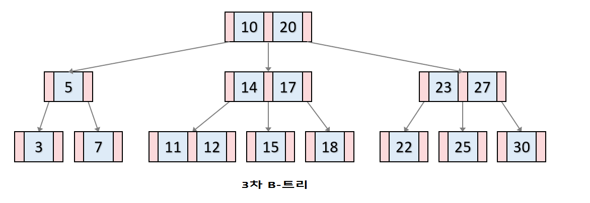
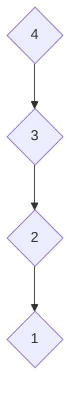

# B-Tree

B-Tree는 부모 노드에 여러개의 값을 저장할 수 있고, 부모 노드에 저장된 값에 대한 범위를 나눠서 자식 노드에 저장할 수 있는 트리형 자료 구조이다. 

최대 2개의 자식 노드를 저장할 수 있는 이진 탐색 트리보다 자식 노드의 최대 갯수를 늘리기 위해, 편향된 구조를 가질 수 있는 이진 트리의 단점을 보완하기 위해 고안되었다.

B-Tree의 기본적인 구조는 아래와 같다.

- 각 노드에 저장된 값은 key라고 한다. key는 항상 오름차순으로 정렬되어 있다
- 왼쪽 자식 노드는 key중 가장 작은 값보다 작은 데이터가 저장된다
- 가운데 자식 노드는 부모 노드의 key의 범위안에 들어가는 데이터가 저장된다. 
- 오른쪽 자식 노드는 key중 가장 큰 값보다 큰 데이터가 저장된다 

## B-Tree의 규칙
B-Tree에서 **가장 중요한 파라미터는 자녀 노드의 최대 개수이다**. 여기서는 M이라고 하겠다. B-Tree의 규칙은 M값에 따라서 아래와 같이 결정된다. 정해진 M에 대한 B-Tree를 M차 B-Tree라고 한다. 

- 최대 M개의 자녀를 가질 수 있는 B-Tree를 M차 B-Tree라고 부른다.
- 각 노드가 가질 수 있는 최대 key의 수는 M - 1 이다. 
- 루트 노드와 리프 노드를 제외한 각 노드의 최소 자녀 노드수는 [M / 2]이다. ([ ] = 반올림 기호)
- 루트 노드를 제외한 각 노드가 가질 수 있는 최소한의 key의 수는 [M / 2] - 1이다. ([ ] = 반올림 기호)

## B-Tree의 데이터 관리
B-Tree의 삽입, 조회, 삭제 과정은 아래 링크를 활용하면 자세히 볼 수 있다.
https://www.cs.usfca.edu/~galles/visualization/BTree.html

각 과정을 간단하게 요약하면 아래와 같다.

### 삽입
B-Tree 데이터 삽입에 대한 순서는 아래와 같다.

1. 리프 노드에 데이터를 추가한다
2. 만약 노드가 넘치면 가운데 key를 기준으로 좌,우 key들은 분할하고 가운데 key는 부모 노드로 승격한다

### 삭제
B-Tree 데이터 삭제에 대한 규칙은 아래와 같다.

- 삭제는 항상 리프 노드에서 발생한다
    - 중간 노드인 경우 부모 노드와 위치를 바꾼 후 삭제한다
 
- 삭제 후 최소로 가져야 하는 key수보다 적어졌다면 트리를 재조정한다
    1. key수가 여유 있는 형제 노드의 지원을 받는다
    2. 위 과정이 불가능하면 부모 노드의 지원을 받고 형제 노드와 합친다
    3. 위 과정에 부모 노드에 문제가 생기면 부모 노드의 위치에서 트리를 재조정한다

## B-Tree의 장점

위 예시처럼 한쪽으로 편향된 이진 탐색 트리의 경우, 특정 데이터를 조회할때 최악의 시간복잡도는 O(N)이 될 수 있다. 1을 찾으려면 리프 노드까지 찾아야 하는 예시를 보면 알 수 있다.

하지만 B-Tree의 경우 삽입, 삭제 연산에서 B-Tree에 대한 규칙이 어긋났을 경우 트리 재조정으로 인해  **모든 리프 노드가 같은 레벨로 구성되어 있는 균형잡인 트리이다.** 따라서 검색을 할때 평균/최악의 시간복잡도는 **O(logN)으로 같다.**

### B-Tree 계열이 DB의 인덱스로 사용되는 이유
B-Tree의 조회, 삽입, 삭제 시간복잡도는 위에서 살펴봤듯이 O(logN)이다. 물론 AVL 트리, Red-Black 트리도 동일한 시간복잡도를 가지고 있지만, B-Tree가 가질 수 있는 노드의 개수가 더 많으므로 검색 범위가 더 많다는 장점이 있다. 

출처 : 쉬운코드 (https://www.youtube.com/watch?v=bqkcoSm_rCs&list=PLcXyemr8ZeoREWGhhZi5FZs6cvymjIBVe&index=26)