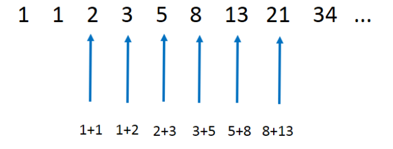

# 재귀

재귀란 큰 문제를 **반복해서** 적용 가능한 작은 문제로 나눠서 푸는 방법이다. 재귀 함수는 함수의 매개변수 값을 바꿔서 **자기 스스로를 호출**하는 방식으로 구현한다.

재귀 함수의 가장 큰 특성 중 하나는 함수 호출의 무한루프를 방지하기 위한 **탈출 조건**이 필요하다는 것이다.

## 예시

### 피보나치 수열

재귀 함수의 가장 대표적인 예시는 피보나치 수열이다. 피보나치 수열이란 첫째, 둘째항이 1으로 시작하고, 그 뒤의 모든 항의 바로 앞의 두 항의 합입 수열이다. 

피보나치 수열의 n번째 항의 수를 구하는 함수를 재귀함수로 작성한 코드는 다음과 같다.

```java
public class Fibonacci {

    public int fibonacci(int n) {
        // 탈출 조건
        if(n <= 1) {
            return n;
        }

        return fibonacci(n - 1) + fibonacci(n - 2);
    }
}
```

### 팩토리얼
n보다 작거나 같은 모든 양의 정수의 곱을 구하는 팩토리얼 메소드를 재귀함수로 작성한 코드는 다음과 같다.
```java
public class Factorial {
    public int factorial(int n) {
        // 탈출 조건
        if(n <= 1) {
            return 1;
        }

        return n * factorial(n - 1);
    }
}
```

### n번째 수까지의 합
0부터 양의 정수 n번째 수까지의 총합을 구하는 메소드를 재귀함수로 작성한 코드는 다음과 같다.
```java
public class Sum {
    public int sum(int n) {
        if (n <= 1) {
            return n;
        }

        return n + sum(n - 1);
    }
}
```

## 재귀함수의 장단점
### 장점
재귀 함수의 장점은 다음과 같다.
- 가독성이 좋다
- 코드가 짧다
- 메소드의 변수가 각각 독립적인 스택 프레임을 가진다
- 코드 검증이 쉽다

### 단점
재귀 함수의 단점은 다음과 같다.
- 직관적이지 않다
- 맹목적인 믿음이 필요하다
- 재귀 함수 조건이 너무 깊은 경우 스택 오버플로우가 발생할 수 있다
- 반복적인 함수 호출에 따른 과부하가 일어날 수 있다

## 꼬리 재귀
재귀함수는 기본적으로 자기 자신을 호출할때 스택 프레임이 새롭게 생성된다. 이는 스택 프레임 내부에 각 변수상태를 독립적으로 저장할 수 있는 장점이 있지만, 일반 반복문을 사용하는것에 비해 추가적인 메모리가 필요하고 성능 또한 느리다. 꼬리 재귀란 함수의 **가장 마지막 부분**에 자기 자신을 호출함으로써, **새로운 스택 프레임을 생성하지 않고** 재귀 함수의 연산을 바로 수행하는 최적화 기법이다.

### 꼬리 재귀 지원
위에서 설명한 꼬리 재귀의 스택 프레임을 생성하지 않는 최적화를 TCO (Tail Call Optimization)이라고 한다. 하지만 모든 언어나 컴파일러가 TCO를 지원하지는 않는다. 대표적으로 JVM은 TCO를 지원하지 않는다. 
