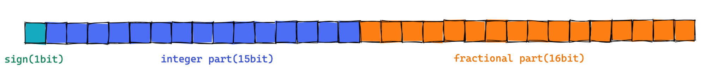
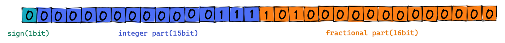

# IEEE 754

## IEEE란

미국전기공학자협회(American Institute of Electrical Engineers)와 통신협회(Institute of Radio Engineers)에서 창설한 전기/전자/전산 분야의 국제 기구 및 학회이다. 주요 전지 전자 산업에 대한 표준 회의를 통하여 정하고 이것을 공표하여 산업 기기간의 표준화를 구현하는 기관이다.

정식 명칭은 전지전자공학자협회(Institute of Electrical and Electronics Engineers)이다. 일반적으로 ‘I-triple-E’라고 발음한다.

## IEEE 754

IEEE 754는 컴퓨터에서 부동 소수점을 표현하는 가장 널리 쓰이는 표준이다. 

### 고정 소수점 vs 부동 소수점

먼저 부동 소수점과 같은 역할의 실수 표현방식 중 하나인 고정 소수점의 실수 표기 방식에 대해서 먼저 알아보자.

**고정 소수점 (fixed point)**

정수와 소수를 표현하는 비트 수를 미리 **고정**하고 실수를 표현하는 방식이다. 32 비트로 예시를 들어보자.

- 첫번째 비트는 부호를 나타낸다. 0이면 양수 1이면 음수다
- 두번째 비트부터 16번째 자리의 비트는 정수가 표현한다
- 16번째 비트부터 나머지는 소수를 표현한다

예시로 7.625를 32비트 고정 소수점 표기법으로 표현해보자. 먼저 정수 부분과 소수 부분의 이진수를 각각 따로 구해준다.

- 정수 부분의 7은 20 + 21 + 22으로 표현할 수 있다. 이진법으로 표기하면 111(2)이다.
- 소수 부분의 0.625는 2-1 + 2-3으로 표현할 수 있다. 이진법으로 표기하면 .101(2)이다.

정수와 소수부분을 다 구해줬으니 32 비트안에서 표현을 하면 다음과 같다.

- 양수이므로 부호 비트는 0으로 채운다.
- 정수는 정수부분에 111(2)를 넣어준다. 나머지 비트는 0으로 채운다.
- 소수는 소수부분이 101(2)를 넣어준다. 나머지 비트는 0으로 채운다.

고정 소수점은 정수와 소수를 표현하는 연산이 간결하고 빠르다는 장점이 있지만, 표현할 수 있는 비트수가 각각 정해져 있다보니 정확한 실수를 표현하는데 한계가 있다는 단점이 있다.

**부동 소수점 (floating point)**
부동은 '움직인다' = floating의 의미를 가지고 있다. 즉 소숫점을 옮기면서 실수를 표현하는 방식이다. 마찬가지로 32 비트로 예시를 들어보자.

- 첫번째 비트는 부호를 나타낸다. 0이면 양수 1이면 음수다
- 두번째 비트부터 10번째 자리의 비트는 지수부 (exponent)를 나타낸다. 소숫점의 위치를 가르키는 제곱승이 들어간다
- 11번째 자리부터 나머지는 가수부(mantissa)를 나타낸다. 실제 값을 저장하는 부분

똑같이 7.625를 32 비트 부동 소수점 표현 방식으로 표현해보자.

우선 부동 소수점 방식으로 실수를 표현하기 위해서는 실수의 정규화 과정부터 거쳐야 한다. 정규화란 이진법에서 정수부분은 한자리 남겨두고 나머지 부분을 x 2n 방식으로 표현하는 기법이다.

앞서 7.625를 고정 소수점 방식으로 표현했을 때의 값은 111.101(2)이었다. 여기서 정규화를 먼저 한다. 정규화란 2진수를 1.xxxx * 2n 꼴로 변환하는 것을 의미한다.

1. 정규화를 위해 소숫점을 왼쪽으로 옮기면 1.11101(2)이다.
2. 옮겨진 소숫점의 자릿수만큼 2n 을 곱해준다. 여기서는 두 자리를 옮겼으므로 22를 곱해준다
3. 최종적으로 정규화된 값은 1.11101 x 22 이다.

정규화 과정까지 마쳤으니 부동 소수점 방식으로 표현해보면 다음과 같다.

- 부호는 양수이므로 똑같이 0으로 채운다. 
- 지수부는 정규화된 값에서 2의 **2**제곱을 곱했다. 따라서 지수부의 값은 **2**가 된다. 여기서 지수부에 bias라는 특정 값을 더해준다. Bias 사용하는 이유는 지수 부분에 음수와 양수 값을 표현하기 위해서이다. Bias 값은 32 비트 표현 방식 에서는 127이다. 따라서 2+127 = 129가 된다. 이진법으료 표현하면 10000001(2)이 된다.
- 가수부에 정규화 된 값의 소수 부분인 11101(2)을 채워준다. 나머지 부분은 0으로 채워준다.

### 부동 소수점의 반올림
정규화와 함께 수반되는 것은 반올림으로, 가수부의 일부 끝자리가 잘려나갈 경우 어떻게 처리할 것인지를 나타낸다. 가장 기본적인 반올림 방식은 짝수로 반올림 (round to nearest, ties to even) 방식이다.

- <strong>올림 (round toward +∞) :</strong> 항상 자리올림이 된다
- <strong>버림 (round toward -∞) :</strong> 항상 자리내림이 된다
- <strong>절삭 (round toward zero = truncate) :</strong> 뒤에 어떤 수가 오든 기준 소수점 뒤에 있는 수는 모두 버린다.
- <strong>짝수로 반올림 (round to nearest, ties to even) :</strong> 반올림에서 5 미만의 숫자는 버림하며 5 초과의 숫자는 올림한다. 5의 경우에는 5의 앞자리가 홀수인 경우엔 올림을 하고 짝수인 경우엔 버림을 하여 짝수로 만들어준다.
- <strong>큰 절대값으로 반올림 (round to nearest, ties away from zero) :</strong> 반올림에서 5 미만의 숫자는 버림하며 5 초과의 숫자는 올림한다. 5의 경우에는 절대값이 큰 쪽으로 반올림한다.