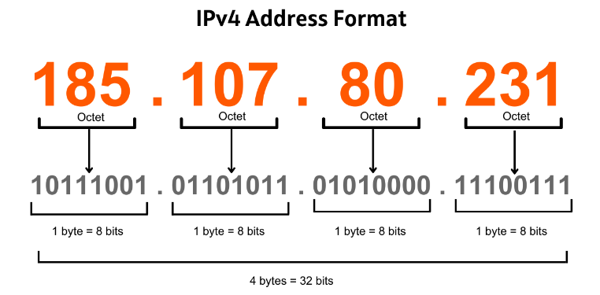
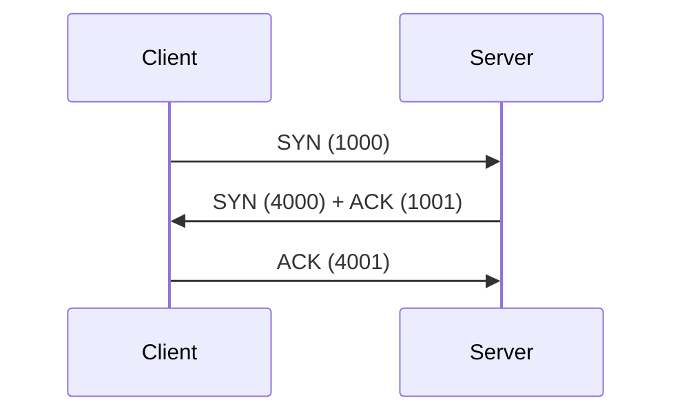
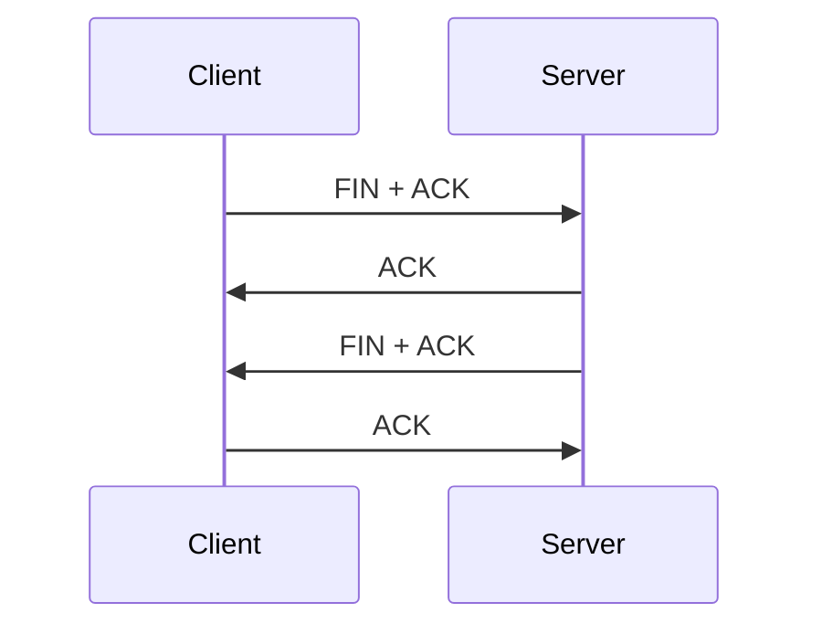

# OSI 7 계층

## L1 물리 계층 (Physical Layer)
데이터를 전기적인 신호(Bit)로 변환하여 전송하는 공간. 데이터를 전송하는 역할만 담당한다.

## L2 데이터 링크 계층 (Data Link Layer)
데이터 링크 계층은 물리 계층에서 송수신되는 정보를 MAC 주소가 포함된 프레임 단위의 데이터로 전달하는 역할을 담당한다. 

### 식별자
L2의 데이터 전송 대상 식별자는 **MAC 주소**이다. 하드웨어 주소, 물리 주소라고 하며 NIC (Network Interface Card) (혹은 LAN) 카드의 고유 식별자이다.

### 데이터 전송 단위
L2의 데이터 전송 단위는 **프레임(Frame)**이다. 프레임은 대략 10KB 정도의 데이터이며 

48 bit로 구성되어 있으며 16진수로 표기한다. MAC 주소의 예시는 다음과 같다.
- 5C:1C:2A:3B:4F:55

### NIC
컴퓨터를 네트워크에 연결하는 하드웨어 장치이며, 랜카드 (LAN Card)라고도 불린다. L2에서의 데이터 전송 대상의 식별자인 MAC 주소를 가지고 있다.

### L2 Switch
**L2 Swtich 혹은 스위칭 허브**라고 불리는 장비는 MAC 주소를 기반으로 연결된 기기들을 식별하여 프레임을 전달한다.

## L3 네트워크 계층 (Network Layer)
최적의 경로(Route)와 주소(IP)를 정하고 패킷을 전달해주는 역할을 담당한다. 

### 식별자

L3의 데이터 전송 대상 식별자는 **IP**다 IPv4 기준으로 **32비트 주소 체계**를 사용하며 8bit x 4의 구조를 가진다. 처음 24비트는 Network ID, 마지막 8비트는 Host ID로 구성된다.

Network ID는 시군구 주소, Host ID는 동 호수와 같은 상세 주소 정도로 비유할 수 있다.

### 데이터 전송 단위
L3의 데이터 전송 단위는 **Packet**이다. 패킷의 최대 크기는 1500 바이트 (1.4KB) 이며 **MTU (Maximum Transmission Unit)** 이라고 한다.

## L4 전송 계층 (Transport Layer)
송수신자간의 신뢰성있는 데이터를 주고 받게 해주는 역할을 한다. 데이터의 오류검출, 흐름제어, 중복 검사등을 수행한다. **TCP와 UDP** 프로토콜을 통해 데이터를 전달한다.

### 식별자
L4의 데이터 전송 대상 식별자는 **Port**이다. 웹 어플리케이션의 구분을 위해 사용하는 번호이다. 일반적으로 웹 어플리케이션은 80번 포트를 사용한다. 이는 브라우저에 url을 입력하면 자동으로 :80이 붙는 이유다. 또 다른 예로 SSL 프로토콜을 사용하려면 443 포트를 사용한다.

### 데이터 전송 단위
L4의 데이터 전송 단위는 **TCP는 Segment, UDP는 Datagram**이다. 

### TCP
TCP는 연결(Connection, Session)에 대한 개념이 있다. 클라이언트와 서버로 구성되며, 서버는 특정 포트를 열고 소켓을 통해 클라이언트 연결을 대기하는데, 이를 **listen** 한다고 한다. 

#### TCP 연결 과정 (3-way hanshaking, 4-way handshaking)
클라이언트와 서버간 TCP 연결을 수립하는 과정은 **3-way hanshaking**을 통해 이루어진다. 과정은 다음과 같다.

1. 클라이언트는 TCP 연결 수립을 위해 SYN 패킷을 서버에게 전송한다
    - 이 때 임의의 시퀀스 번호를 임의로 생성하여 SYN 패킷과 함께 전송한다 (그림에서는 1000)
2. SYN 패킷을 수신한 서버는 새로운 SYN 패킷과 클라이언트의 SYN 패킷을 제대로 수신했다는 ACK 패킷을 클라이언트로 전송한다
    - 클라이언트에게 수신한 SYN 패킷의 시퀀스 번호에 1을 더한 값을 ACK 패킷에 응답한다 (그림에서는 1001)
    - 서버도 임의의 시퀀스 번호를 생성하여 SYN 패킷과 함께 전송한다 (그림에서는 4000)
3. 클라이언트는 서버의 SYN 패킷을 제대로 수신했다는 ACK 패킷을 서버로 전송한다. 서버는 수신한 ACK 패킷으로 TCP 연결이 수립되었다고 판단한다
    - 서버에게 수신한 SYN 패킷의 시퀀스 번호에 1을 더한 값을 ACK 패킷에 응답한다 (그림에서는 4001) 

이 밖에도 클라이언트와 서버간의 정책을 수립한다. 위 예시로 들었던 시퀀스 번호 교환과, 대표적으로 최대 전송할 수 있는 segment 단위인 MSS (Maximum Segment Size)를 정하는 과정이 있다.

클라이언트와 서버간 TCP 연결을 종료하는 과정은 **4-way hanshaking**을 통해 이루어진다. 과정은 다음과 같다.

1. 클라이언트가 연결 종료 요청을 의미하는 FIN + ACK 패킷을 서버에게 전송한다
2. 서버는 클라이언트의 FIN + ACK 패킷을 수신했다는 ACK 패킷을 클라이언트로 전송한다
3. 서버는 클라이언트에게 연결 종료 요청을 의미하는 FIN + ACK 패킷을 클라이언트에게 전송한다
4. 클라이언트는 서버의 FIN + ACK 패킷을 수신했다는 ACK 패킷을 서버로 전송하며 상호간의 TCP 연결이 종료된다

## L5 세션 계층 (Session Layer)
데이터 통신을 위한 논리적인 연결을 설정한다. TCP/IP 세션을 만들고 없애는 역할을 담당한다

## L6 표현 계층 (Presentation Layer)
전송하는 데이터의 표현방식을 결정한다. 데이터의 암복호화, 압축, 파일 인코딩 등을 수행한다

## L7 응용 계층 (Application Layer)
최종 사용자와 직접 상호작용하는 서비스나 프로세스가 동작하는 영역이다. HTTP, FTP

