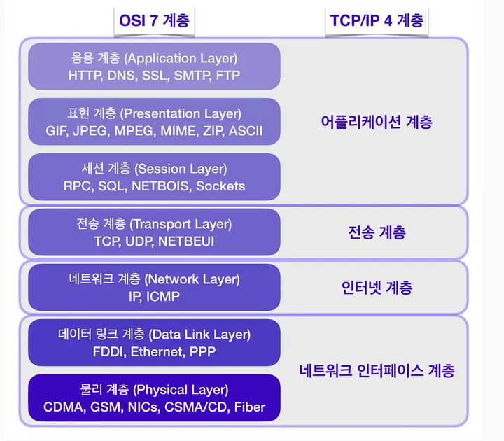

# OSI 7 계층

### 물리 계층 (Physical Layer)
데이터를 전기적인 신호(Bit)로 변환하여 전송하는 공간. 데이터를 전송하는 역할만 담당한다.

### 데이터 링크 계층 (Data Link Layer)
물리 계층에서 송수신되는 정보(Frame)의 오류와 흐름을 제어해 정보가 안전하게 전달되도록 도와주는 계층이다. 이 계층에서는 MAC 주소를 가지고 통신한다.
- 흐름 제어 : 송수신측의 속도 차이를 조정한다
- 오류 제어 : 오류를 검충하고 재전송한다
- 순서 제어 : 프레임의 순서적인 전송을 보장한다
- 프레임 동기화 : 프레임의 시작과 끝을 구별하기 위해 동기화한다

### 네트워크 계층 (Network Layer)
최적의 경로(Route)와 주소(IP)를 정하고 패킷을 전달해주는 역할을 담당한다. 

### 전송 계층 (Transport Layer)
송수신자간의 신뢰성있는 데이터(Segment)를 주고 받게 해주는 역할을 한다. 데이터의 오류검출, 흐름제어, 중복 검사등을 수행한다. 포트를 열고 TCP와 UDP 프로토콜을 통해 데이터를 전달한다.

### 세션 계층 (Session Layer)
데이터 통신을 위한 논리적인 연결을 설정한다. TCP/IP 세션을 만들고 없애는 역할을 담당한다

### 표현 계층 (Presentation Layer)
전송하는 데이터의 표현방식을 결정한다. 데이터의 암복호화, 압축, 파일 인코딩 등을 수행한다

### 응용 계층 (Application Layer)
최종 사용자와 직접 상호작용하는 서비스나 프로세스가 동작하는 영역이다. HTTP, FTP
