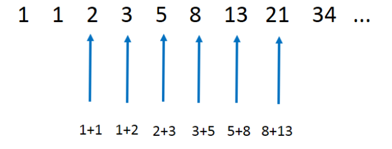

# 재귀

재귀란 큰 문제를 **반복해서** 적용 가능한 작은 문제로 나눠서 푸는 방법이다. 재귀 함수는 함수의 매개변수를 바꿔서 **스스로를 호출**하는 방식으로 구현한다.

## 예시

재귀 함수의 가장 대표적인 예시는 피보나치 수열이다. 피보나치 수열이란 첫째, 둘째항이 1으로 시작하고, 그 뒤의 모든 항의 바로 앞의 두 항의 합입 수열이다. 

피보나치 수열의 n번째 항의 수를 구하는 함수를 재귀함수로 작성한 코드는 다음과 같다.

```java
public class Fibonacci {

    public int fibonacci(int n) {
        // 탈출 조건
        if(n <= 1) {
            return n;
        }

        return fibonacci(n - 1) + fibonacci(n - 2);
    }
}
```

재귀 함수의 가장 큰 특성 중 하나는 함수 호출의 무한루프를 방지하기 위한 탈출 조건이 필요하다는 것이다.

## 장단점

### 장점
재귀 함수의 장점은 다음과 같다.
- 가독성이 좋다
- 코드가 짧다
- 각 메소드 호출 단계의 변수 상태가 독립적인 스택 프레임을 가진다
- 코드 검증이 쉽다

### 단점
재귀 함수의 단점은 다음과 같다.
- 직관적이지 않다
- 맹목적인 믿음이 필요하다
- 재귀 함수 조건이 너무 깊은 경우 스택 오버플로우가 발생할 수 있다
- 반복적인 함수 호출에 따른 과부하가 일어날 수 있다

## 꼬리 재귀
