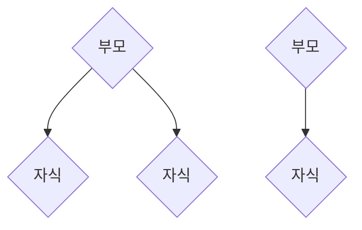
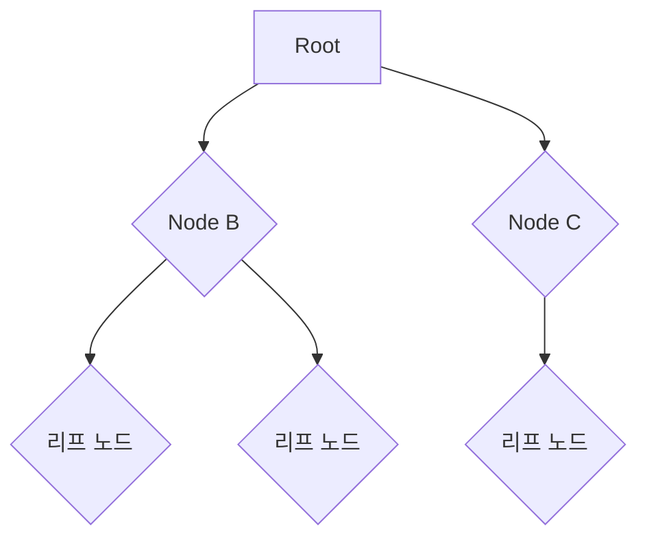

# 트리 (Tree)

트리란 나무(tree)의 계층적 구조를 표현한 자료구조이다. 트리는 다음과 같은 용도에서 사용된다.

- 계층적 데이터를 표현
    - HTML이나 XML의 문서 개체 모델 (DOM)을 표현
    - JSON이나 YAML처리 시 계층 관계를 표현
    - 프로그래밍 언어를 표현하는 추상 구문 트리
    - 인간 언어를 표현하는 파싱 트리

- 검색 트리를 통한 효율적인 검색 알고리즘 구현

## 트리 관련 용어

**노드 (node) :** 실제로 저장하는 데이터를 나타낸다. 


**부모 - 자식 :** 연결된 노드들 간의 상대적인 관계를 나타낸다
- 자식은 없을 수도 있고, 많이 있을 수도 있다
- 자식 노드의 부모 노드는 무조건 **한개**이다
- 조부모, 형제자매 등의 개념도 있다


**리프 (leaf) 노드 :** 가장 마지막에 위치한 데이터들을 나타낸다.
- 더 이상 자식 노드를 가지지 않음

**루트(root) 노드 :** 최상위에 위치한 데이터
- 맨 위에 있는 시작 노드를 의미한다
- 모든 노드와 직간접적으로 연결된다

**깊이(depth) :** 해당 노드에서 루트 노드로 가는 경로의 길이를 의미한다

**높이 (height) :** 해당 노드에서 리프 노드로 가는 최대 길이를 의미한다

**하위 트리 (subtree) :** 해당 노드 아래의 모든 것을 포함하는 트리

## 트리의 저장법 예시

범용적인 트리의 모습을 표현하는 알반적인 코드는 다음과 같다. 부모는 n개의 자식 노드를 가질 수 있으므로 부모 클래스에서 자식 클래스를 컬렉션과 함께 참조하는것이 직관적이다. 아래 예시를 확인해보자

- 자식이 여러개인 트리의 저장법
```java
public class Node {
    public int data;
    public ArrayList<Node> children;
}
```

- 자식이 최대 둘인 트리 (이진트리)의 저장법

```java
private class Node {
    public int data;
    public Node left;
    public Node right;
}
```

- 자식이 하나인 트리의 저장법. (연결 리스트와 비슷한 코드다)

```java
private class Node {
    public int data;
    public Node child;
}
```

### 이진 탐색 트리 (Binary Search Tree)


이진 트리는 최대 두개의 자식 노드를 가질 수 있다. 이진 검색 트리는 이진 트리에서 다음과 같은 조건을 추가한 트리 형태의 자료구조이다. 

- 왼쪽 자식은 언제나 부모보다 작다
- 오른쪽 자식은 언제나 부모보다 크다
- 부모 노드와 같은 값을 가지는 노드는 적당히 위 조건을 수정하여 저장한다.
    - ex) 왼쪽 자식은 언제나 부모보다 작거나 같다 or 오른쪽 자식은 언제나 부모보다 크거나 같다

위 조건으로 인해 이진 탐색 트리는 정렬된 자료구조의 특징을 가진다. 루트 노드를 기준으로 루트 노드보다 작은 값은 왼쪽에, 큰 값은 오른쪽에 포진되어 있다.


#### BST 검색
이진 탐색 트리의 검색 과정은 각 노드마다 두 하위트리로 이분뒤어 하위 트리로 내려갈때마다 검색 공간이 절반씩 줄어든다. 따라서 시간 복잡도는 O(logn)이다. 하지만 트리가 한쪽으로 편향된 구조를 가지는 경우 최악의 시간 복잡도는 O(n)이다.

검색 코드는 다음과 같이 재귀적으로 작성할 수 있다.

```java
public static Node getNodeOrNull(Node node, int data) {
    if(node == null) {
        return null;
    }
    
    // 검색하려는 값이 현재 노드보다 크면 오른쪽 노드 검색
    if(data > node.data) {
        return getNodeOrNull(node.right, data);
    }
    
    // 검색하려는 값이 현재 노드보다 작으면 왼쪽 노드 검색
    if(data < node.data) {
        return getNodeOrNull(node.left, data);
    }

    if(data == node.data) {
        return node;
    }
}
```

