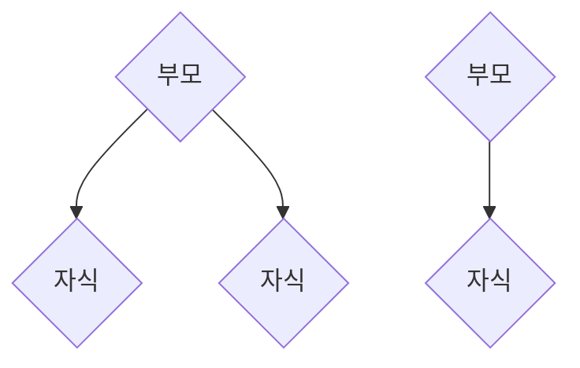
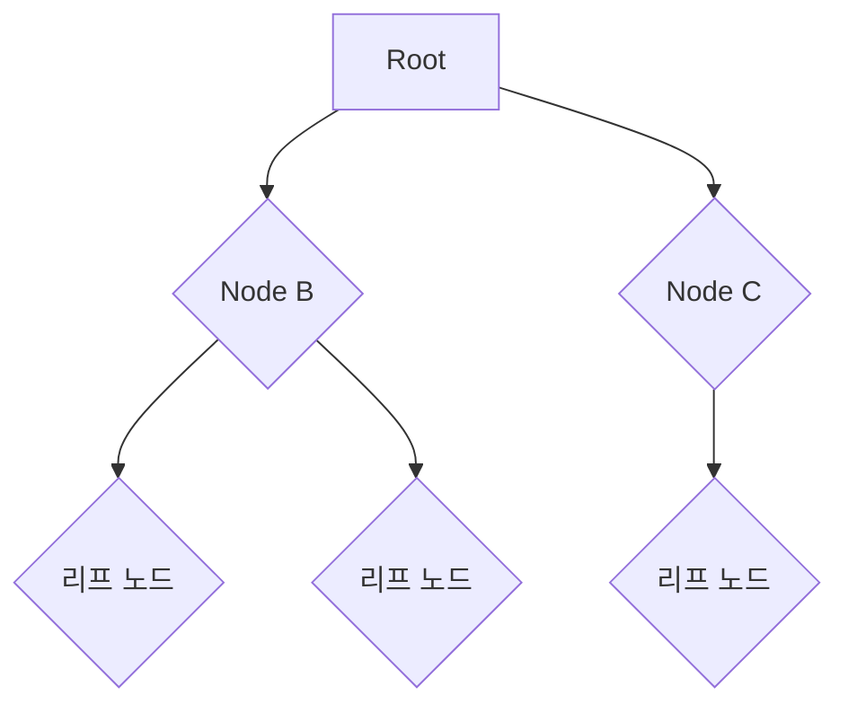

# 트리 (Tree)

트리란 나무(tree)의 계층적 구조를 표현한 자료구조이다.

## 트리 관련 용어

**노드 (node) :** 실제로 저장하는 데이터를 나타낸다. 


**부모 - 자식 :** 연결된 노드들 간의 상대적인 관계를 나타낸다
- 자식은 없을 수도 있고, 많이 있을 수도 있다
- 자식 노드의 부모 노드는 무조건 **한개**이다
- 조부모, 형제자매 등의 개념도 있다


**리프 (leaf) 노드 :** 가장 마지막에 위치한 데이터들을 나타낸다.
- 더 이상 자식 노드를 가지지 않음

**루트(root) 노드 :** 최상위에 위치한 데이터
- 맨 위에 있는 시작 노드를 의미한다
- 모든 노드와 직간접적으로 연결된다

**깊이(depth) :** 해당 노드에서 루트 노드로 가는 경로의 길이를 의미한다

**높이 (height) :** 해당 노드에서 리프 노드로 가는 최대 길이를 의미한다

**하위 트리 (subtree) :** 해당 노드 아래의 모든 것을 포함하는 트리

## 트리의 저장법 

범용적인 트리의 모습을 표현하는 알반적인 코드는 다음과 같다. 부모는 n개의 자식 노드를 가질 수 있으므로 부모 클래스에서 자식 클래스를 컬렉션과 함께 참조하는것이 직관적이다.
```java
public class Node {
    public int data;
    public ArrayList<Node> children;
}
```

- 자식이 최대 둘인 트리의 저장법

```java
```