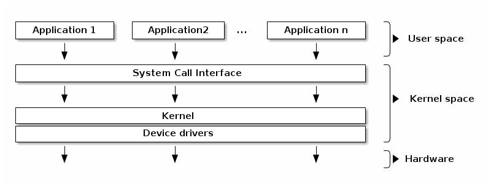

# User Mode & Kernal Mode

컴퓨터는 크게 소프트웨어와 하드웨어로 구성된다. 그 중에서 소프트웨어는 시스템 콜 인터페이스 (System Call Interface)를 경계로 유저 모드(User Mode)와 커널 모드(Kernal Mode)를 번갈아가며 각각의 작업을 수행한다. 

유저 모드와 커널 모드의 경계를 통해 유저 모드는 OS 내부의 중요한 자원에 직접적인 접근이 불가능하다. 

따라서 파일 입출력, 디바이스 입출력, 혹은 네트워크와 같은 OS 자원을 필요로 하는 작업에는 인터럽트나, 시스템 콜을 통해 커널 모드로 전환하여 필요한 작업을 수행한다.  

## 유저 모드 (User Mode)
유저 모드에서는 사용자 수준의 어플리케이션이 OS로부터 독립적인 메모리 공간을 할당받은 프로세스로써 동작한다. 

## 커널(Kernal)
커널은 운영체제 내부에서 사용하는 하드웨어에 직접 접근할 수 있으며, 운영체제의 전반적인 관리를 담당하는 운영체제의 핵심이다. 

### 커널 모드(Kernal Mode)
시스템이 커널 모드로 전환되면 커널을 통해 하드웨어의 접근이나, 네트워크 파일 입출력과 같은 OS 수준의 작업을 수행한다.

## 인터럽트 (Interrupt)
시스템을 사용하면서 발생하는 다양한 이벤트를 의미한다. 

인터럽트의 예시는 다음과 같다.
- I/O 작업의 완료
- 할당된 작업 시간이 다 되었을 때
- 0으로 나눴을 때
- 잘못된 메모리 공간에 접근을 시도할 때

인터럽트가 발생하면 CPU는 인터럽트를 즉각적으로 처리해야 하기 때문에 유저 모드에서 실행중인 프로세스를 잠시 멈추고 커널 모드로 전환하여 발생한 인터럽트를 처리한다.
 
## 시스템 콜 (System Call)
유저 모드의 프로세스가 OS 커널이 제공하는 서비스를 필요로 할 때, 실행중인 프로세스를 잠시 중단 한 후 시스템 콜을 통해 커널 모드로 전환하여 작업을 처리한다. 작업을 끝낸 후 유저 모드로 전환하여 중단된 프로세스를 다시 실행한다.

시스템 콜의 종류는 다음과 같다.
- 프로세스, 스레드 관련
- 파일 관련
- 장치 (디바이스) 관련
- 소켓 관련
- 프로세스간의 통신 관련

일반적으로 프로그래머가 사용하는 고수준 언어는 이러한 시스템 콜을 필요로 하는 작업을 네이티브 인터페이스로 제공한다. 대표적으로 자바의 경우 JNI(Java Native Interface)를 통한 네이티브 메소드들이 있다.