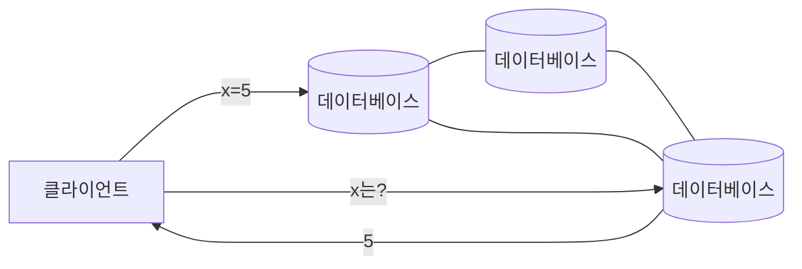
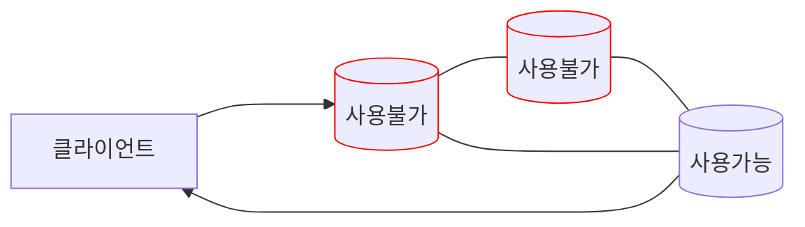
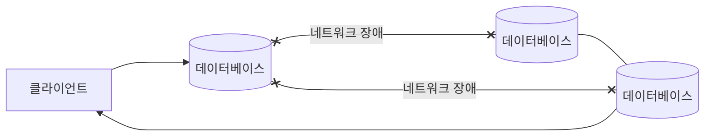

# CAP 이론 (CAP Theorem)

## CAP
### C : Consistency (일관성)

항상 모든 노드는 같은 시간에 일관된 데이터를 볼 수 있는 특징을 의미한다. 모든 노드의 읽기 작업에 항상 최신의 쓰기 작업이 반영되어있는 특성이다.

### A : Availability (가용성)

임의의 노드가 사용불가 상태가 되더라도 다른 노드에서 클라이언트의 요청을 처리할 수 있다는 특성이다.

### P : Partition Tolerance (분할 용인)

CAP 이론에서 Partition(네트워크 분할)이란 각각의 노드가 네트워크 장애가 일어나서 서로 통신을 하지 못하거나 응답이 지연되는 상태를 뜻한다. 따라서 분할 용인(Partiton Tolerance)은 구성 노드가 모두 정상임에도 불구하고, 네트워크 장애와 같이 시스템 일부가 망가져 노드간의 문제가 생겨도 서비스가 가능해야 하는 특성을 의미한다.

## CAP 이론
CAP 이론은 분산 시스템(주로 NoSQL)을 설계할때는 위에서 설명했던 일관성(Consistency), 가용성(Availability), 분단 용인(Partition Tolerance)의 세 가지 속성중에 **단 두 가지만** 가질 수 있다는 이론이다. 

### CP
일관성(Consistency)과 분할 용인(Partition Tolerance)를 보장하는 기법이다. 구성 노드간의 파티션이 발생하면 일관성을 보장하기 위해 문제가 해결될때까지 시스템을 중단해야 한다. 

### AP
가용성(Availability)과 용인(Partition Tolerance)를 보장하는 기법이다. 구성 노드간의 파티션이 발생해도 서비스를 계속 제공해야 한다. 따라서 특정 노드에 데이터 업데이트가 발생해도 나머지 노드에 대한 동기화가 이루어지지 않기 때문에 정합성을 보장할 수 없지만 어떤 상황에서도 시스템을 운영할 수 있다는 특징이 있다.

### CA
일관성(Consistency)와 가용성(Availability)를 보장하는 기법이다. 하지만 분할 용인을 허용할 수 없는 분산 시스템에서 가용성과 데이터 일관성을 보장하는 방법은 없기 때문에 단일 시스템은 가능하지만 분산 시스템에서는 적합하지 않은 속성이다. 
