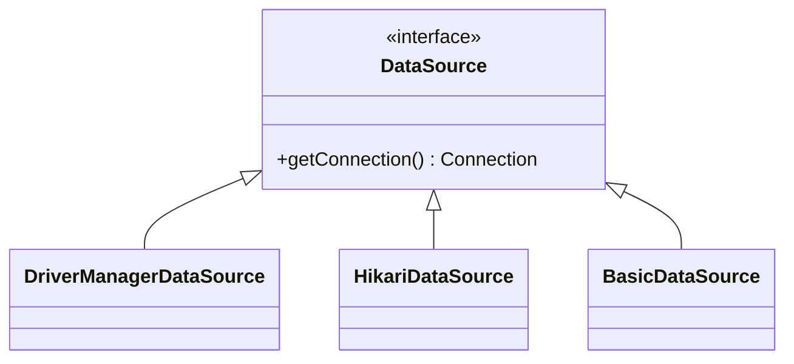

# DataSource
DataSource는 데이터베이스의 커넥션을 획득하기 위한 인터페이스이다. 제공하는 핵심 기능은 커넥션을 가져오는 것이다. 



```java
public interface DataSource  extends CommonDataSource, Wrapper {
  Connection getConnection() throws SQLException;
  // 나머지 생략
}
```

```java
Connection conn = dataSource.getConnection();
```

DataSource를 구현한 클래스에 따라서 일반 커넥션을 사용할 수 있고, 커넥션 풀링 기법을 사용할 수 도 있다.
- DriverManagerDataSource 통한 커넥션 획득 : DriverManagerDataSource 통해 새로운 커넥션 객체를 생성하고 가져온다
- DBCP를 활용한 커넥션 획득 : 커넥션 풀(HikariCp, DBCP2 등)에서 사용 가능한 커넥션을 가져온다


## DriverManagerSource를 통해 커넥션 가져오기
```java
public class DriverManager {
    // 코드 생략
    /* Prevent the DriverManager class from being instantiated. */
    private DriverManager(){}
}
```
DriverManager는 데이터베이스 드라이버들을 관리하고 어플리케이션에 등록된 드라이버를 찾아 커넥션을 생성하고 제공하는 기능을 담당한다. 
따라서 DriverManager를 통해 커넥션 객체를 생성하여 가져올 수 있지만, 안타깝게도 DataSource 인터페이스를 구현하지 않는다. 

```java
// DriverManagerDataSource를 활용해 커넥션 객체를 가져오기
DriverManagerDataSource driverManagerDataSource = new DriverManagerDataSource(URL, USER_NAME, PASSWORD);
```

```java
 */
public class DriverManagerDataSource extends AbstractDriverBasedDataSource {
    // 코드 생략 
    protected Connection getConnectionFromDriverManager(String url, Properties props) throws SQLException {
        return DriverManager.getConnection(url, props);
    }
}
```

DataSource 인터페이스를 구현한 DriverManagerSource 클래스를 활용할 수 있다. 내부에 DriverManager 객체를 사용하여 데이터베이스 커넥션을 생성한다.

## HikariDataSource를 통해 커넥션 가져오기
HikariDataSource 클래스는 커넥션 풀링을 제공하는 JDBC DataSource 인터페이스의 구현체다. HikariDataSource를 활용해 커넥션 풀을 설정하는 방법은 다음과 같다.

```java
// HikariCP를 사용한 커넥션 풀 사용
HikariDataSource dataSource = new HikariDataSource();

dataSource.setJdbcUrl(URL);
dataSource.setUsername(USER_NAME);
dataSource.setPassword(PASSWORD);
dataSource.setMaximumPoolSize(10);
dataSource.setPoolName("MyPool");
```

일반적으로 HikariDataSource 커넥션 풀의 최대 개수는 10개이다. 위 예시 외에도 데이터베이스 커넥션 타임아웃과 같은 값을 설정해줄 수 있다.

## Spring을 사용한 DataSource, PlatformTransactionManager 등록
커넥션 관리에 사용되는 DataSource는 자바 설정파일을 통해 직접 등록해줘야 한다.
```java
@Configuration
public class DataSourceConfig {
    @Bean
    public DataSource DataSource() {
        return new DriverManagerDataSource(DB_URL, USERNAME, PASSWORD);
    }

    @Bean
    public PlatformTransactionManager transactionManager() {
        return new DataSourceTransactionManager(dataSource());
    }
}
```

### Spring Boot를 사용한 자동 DataSource, PlatformTransactionManager 등록
Spring Boot를 사용하면 application.properties나 application.yml에 있는 속성을 참고해서 DataSource,PlatformTransactionManager  빈을 자동으로 등록해준다.

```
spring.datasource.driver-class-name=org.h2.Driver
spring.datasource.username=sa
spring.datasource.password=
```
