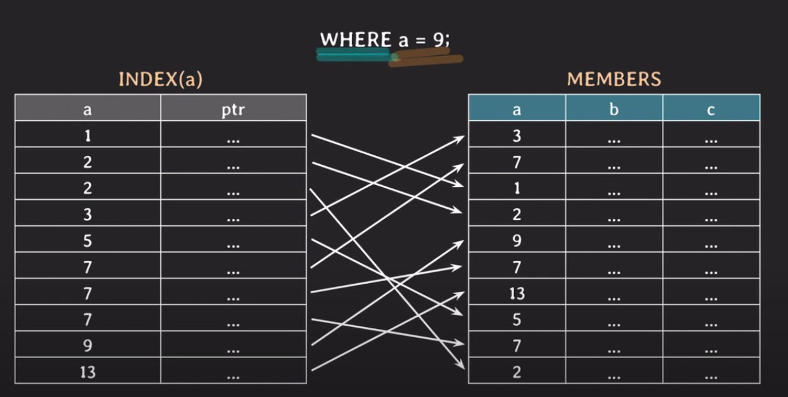

# Index
데이터베이스에서 인덱스는 조건에 맞는 로우들을 빠르게 조회할 때, 빠르게 정렬(order by)하거나 그룹핑(group by)할 때 사용하는 기법이다.

아래 예시로 위와 같이 이름, 등번호, 소속팀 id를 가지는 선수(player) 테이블이 있다.

| <u>id</u> | name | back_number | team_id |
| --- | --- | --- | --- |


만일 이 테이블의 로우 개수가 대략 백만개를 넘어갈때 다음과 같은 쿼리를 실행하면 어떻게 될까?
```sql
select *
from player
where name = "Son"
```

모든 로우를 방문하면서 name 컬럼의 값들을 비교하여 위 조건에 맞는 값을 찾는다. 이 때 시간복잡도는 **O(n)이 될 것이고 이를 Full Scan이라고 한다.**

하지만 name 컬럼에 인덱스를 적용하게 되면 해당 쿼리의 시간 복잡도를 O(logn)으로 줄일 수 있다. (B-tree 기반 인덱스 기준)

## Index 사용법
MySQL 기준으로 위 player 테이블에 대한 인덱스를 생성하는 방법은 다음과 같다.

```sql
-- 테이블 생성과 동시에 인덱스를 생성할 경우
create table player(
    id bigint primary key,
    name varchar(20) not null,
    team_id bigint,
    back_number int,
    index player_name_idx (name),
    unique index team_id_backnumber_uidx (team_id, back_number)
);

-- 이미 테이블이 생성된 경우
create index player_email_idx on player (email);

-- Unique Index를 사용하고 싶은 경우
create unique index player_team_id_backnumber_uidx on player (team_id, back_number);
```

대부분의 RDBMS의 경우에는 기본키에 대한 인덱스는 기본적으로 생성되어 있다. 

위 Unique Index 예시와 같이 두개 이상의 컬럼을 인덱스로 사용하는 경우, 해당 인덱스를 **다중컬럼 인덱스 (Multicolumn Index)** 혹은 **복합 인덱스(Composite Index)** 라고 한다.

### Index 목록 조회하기
player 테이블에 적용되어 있는 인덱스 목록을 조회하고 싶으면 다음과 같은 명령문을 사용할 수 있다.

```sql
show index from player;
```


## B-Tree 기반 Index 동작 방식

### 예시 1


a라는 컬럼이 인덱스로 적용되어 있는 MEMBER 테이블에 아래와 같은 쿼리가 발생했을때 B-Tree 기반 인덱스의 동작 방식은 다음과 같다.

- 인덱스에 해당하는 조건만 있는 쿼리
    ```sql
    select *
    from MEMBERS
    where a = 9;
    ```

    - a컬럼에 대한 인덱스의 값들은 **정렬되어 있다**
    - 인덱스에 정렬된 값을 바탕으로 where절인 a = 9에 해당하는 값들을 **이진 탐색으로 찾는다**
    - 인덱스의 포인터(ptr)의 주소를 참고해 본 테이블의 로우에 접근하여 해당하는 로우(들)을 가져온다

    <br>

- 인덱스 외 조건이 있는 쿼리
    ```sql
    select *
    from MEMBERS
    where a = 9 and b = 95;
    ```
    - a컬럼에 대한 인덱스의 값들은 **정렬되어 있다**
    - 인덱스에 정렬된 값을 바탕으로 where절인 a = 9에 해당하는 값들을 **이진 탐색으로 찾는다**
    - 인덱스의 포인터(ptr)의 주소를 참고해 a = 9인 값들의 로우를 가져온다
    - 가져온 로우를 대상으로 나머지 where절인 **b = 9의 값(들)을 하나씩 비교(풀스캔)하여 가져온다** 

    <br>

    해당 쿼리의 조회 성능을 더 향상시키려면 a와 b컬럼으로 구성된 다중컬럼 인덱스를 추가할 수 있다.

### 예시 2


a와 b컬럼이 다중컬럼 인덱스로 적용되어 있는 MEMBER 테이블에 아래와 같은 쿼리가 발생했을때 B-Tree 기반 인덱스의 동작 방식은 다음과 같다.

- 다중 컬럼 인덱스의 첫번째 순서에 있는 조건에 대한 쿼리
    ```sql
    select *
    from MEMBERS
    where a = 13;
    ```

    - 해당 인덱스는 a라는 컬럼을 기준으로 우선 정렬되어 있으므로 a와 b로 구성된 다중컬럼 인덱스라 할지라도 **a에 대한 조건만으로 해당 인덱스의 사용이 가능하다**
    - a = 13에 해당하는 값들을 이진 탐색으로 찾아 가져올 수 있다

    <br>

- 다중 컬럼 인덱스의 두번째 순서에 있는 조건에 대한 쿼리
    ```sql
    select *
    from MEMBERS
    where b = 9;
    ```

    - 해당 인덱스는 a라는 컬럼에 대해서 우선 정렬이 되어 있다
    - b컬럼의 값들은 a컬럼의 값들에 기반해서 정렬이 되어 있다, **즉, b의 값에 대해 전체 정렬이 되어 있지 않다**
    - 따라서 위 조회 쿼리를 사용하게 되면 **해당 인덱스의 효과를 볼 수 없다**

    <br>

    해당 쿼리의 조회 성능을 더 향상시키려면 b컬럼으로만 구성된 인덱스를 추가할 수 있다.


## 쿼리의 인덱스 사용여부 확인하기

실행시키고자 하는 쿼리가 어떤 인덱스를 사용했는지 확인하려면 쿼리의 실행 계획을 봐야 한다. **쿼리 실행 계획은 explain 키워드를 사용하여 볼 수 있다.**

사용하고자 하는 인덱스를 따로 명시해주지 않으면 Optimizer가 cost 기반으로 쿼리를 분석하여 사용할 인덱스를 선택한다.


```sql
explain
select * from player
where name = 'Sonny';
```

이 명령을 실행하면, DB는 다음과 같은 정보를 제공한다

- id: 쿼리의 순서 또는 단계
- select_type: 쿼리의 유형 (예: SIMPLE, PRIMARY, SUBQUERY 등)
- table: 액세스하는 테이블의 이름
- type: 조인 유형 (예: ALL, index, range, ref, eq_ref, const, system)
- possible_keys: 쿼리에서 사용될 수 있는 인덱스
- key: 실제로 사용된 인덱스
- key_len: 사용된 인덱스의 길이
- ref: 조인에 사용된 열
- rows: 예상되는 읽기 행의 수
- Extra: 추가적인 정보 (예: Using where, Using index, Using temporary 등)

### 인덱스 강제하기
간혹 Optimizer가 잘못된 인덱스를 선택하는 경우가 발생할 수 있다. 이런 경우에는 사용하고자 하는 인덱스를 아래와 같이 명시해줄 수 있다.

```sql
select *
from player
force index (<사용하고자 하는 인덱스>)
where name = 'Sonny';
```

## Covering Index
조회하는 속성을 본 테이블에 볼 필요도 없이 인덱스 수준에서 가져올 수 있을때 해당 인덱스를 Covering Index라고 한다

예를 들어 다음과 같은 인덱스가 있다고 가정했을 때
```sql
create unique index player_team_id_backnumber_uidx on player (team_id, back_number);
```

아래와 같은 조회 쿼리를 실행하면
```sql
select team_id, back_number from player where team_id = 1;
```

team_id, back_number의 컬럼은 모두 위 인덱스에 포함되어 있고 where 절에 검색조건 또한 위 인덱스를 사용할 수 있으므로 본 테이블에 접근하지 않고 바로 조회가 가능하다.


## 해시 인덱스 (Hash Index)
B-Tree 인덱스 외에 사용할 수 있는 인덱스의 종류는 해시 인덱스가 있다. 내부적으로 해시테이블을 사용하여 인덱스를 구현한다. 따라서 검색에 대한 시간 복잡도는 O(1)으로 B-Tree 인덱스보다 빠르지만, 범위 검색이 불가능하다는 점과 데이터가 늘어났을 경우 rehashing에 사용되는 추가 연산 비용이 필요하다는 단점이 있다.

또한 복합 인덱스를 Hash Index에 적용할 경우, 인덱스에 구성되는 모든 속성으로 조회를 해야만 인덱스가 적용된다는 특성이 있다.

## Index 사용 시 주의점

인덱스는 조회 성능을 개선할 수 있는 확실한 장점이 있지만 이에 따라 발생하는 트레이드 오프 또한 고려해야 한다. 

인덱스를 사용할 경우 발생할 수 있는 단점들은 다음과 같다.

- 인덱스를 생성할 추가적인 공간 필요하다
- table에 write할 때 마다 인덱스 변경이 발생한다
- 읽기를 제외한 나머지 작업을 진행 시 인덱스가 다시 정렬되는 작업(b-tree rebalancing)이 발생 할 수 있다
- 이미 데이터가 몇 백만건 이상 있는 테이블에 인덱스를 생성하는 경우 시간이 오래 소요될 수 있고, DB 성능에 안좋은 영향을 줄 수 있다

### Full Scan이 더 좋은 경우
아래와 같은 경우에 따라 인덱스를 사용하는 것보다 Full Scan을 사용하는 것이 좋은 경우도 있다.

- 테이블에 데이터가 소량으로 있을 때 (몇 십 ~ 몇 백건)
- 조회하려는 데이터가 테이블의 상당 부분을 차지할 때 (**카디널리티가 낮을 때**)
    - ex) 성별 컬럼의 남자, 여자, 통신사 컬럼의 SKT, KT, LG


출처 : 쉬운코드 (https://www.youtube.com/watch?v=IMDH4iAQ6zM&list=PLcXyemr8ZeoREWGhhZi5FZs6cvymjIBVe&index=25)