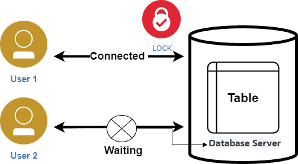
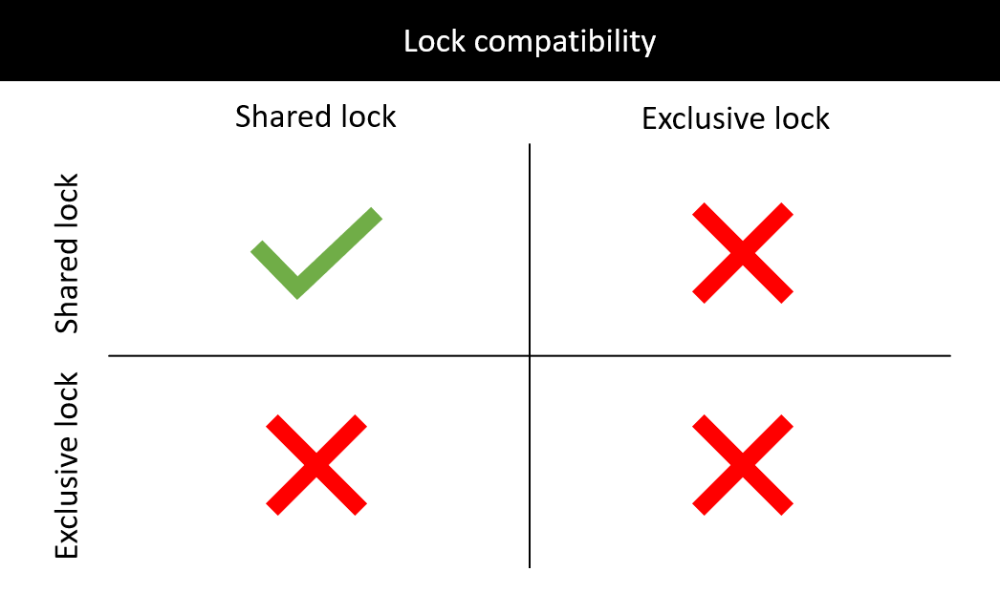

# Lock

데이터베이스에서 락이란 동시성 문제를 위해 사용하는 수단이다. 서로 다른 트랜잭션이 동일한 데이터에 접근하는 상황이 생겼을때, 먼저 접근한 트랜잭션이 락을 획득한 상태로 작업을 수행하고, 작업이 종료되면 락을 반환(unlock)한다. 그 후에 대기중인 나중에 접근한 트랜잭션이 락을 획득해 작업을 수행하는 방식으로 데이터의 일관성을 유지하고 동시성 제어를 한다.

데이터베이스에서 락은 2가지 종류가 있다. 종류는 다음과 같다.

## Write Lock (Exclusive Lock)
베타적 락이라고 한다. read / write(update, insert, delete)작업을 할 때 사용한다. 다른 트랜잭션이 같은 데이터를 read / write 하는 것을 허용하지 않는다.

## Read Lock (Shared Lock)
공유 락이라고 한다. read 작업을 할 때 사용한다. 다른 트랜잭션에 같은 데이터를 read 하는 것을 허용하지만, write하는 것을 허용하지 않는다.

