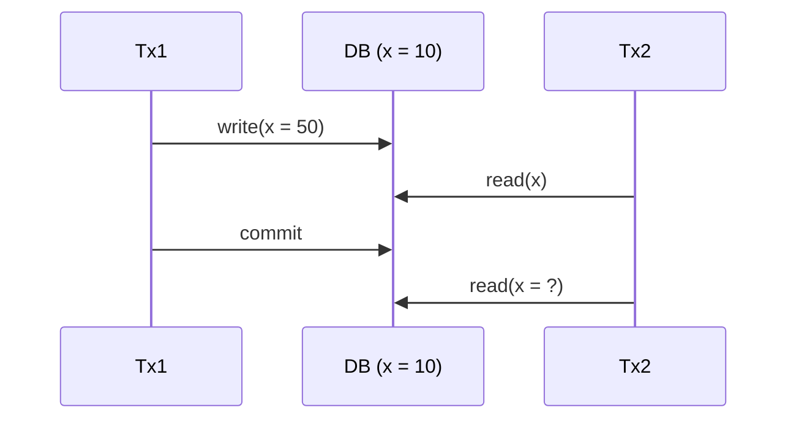
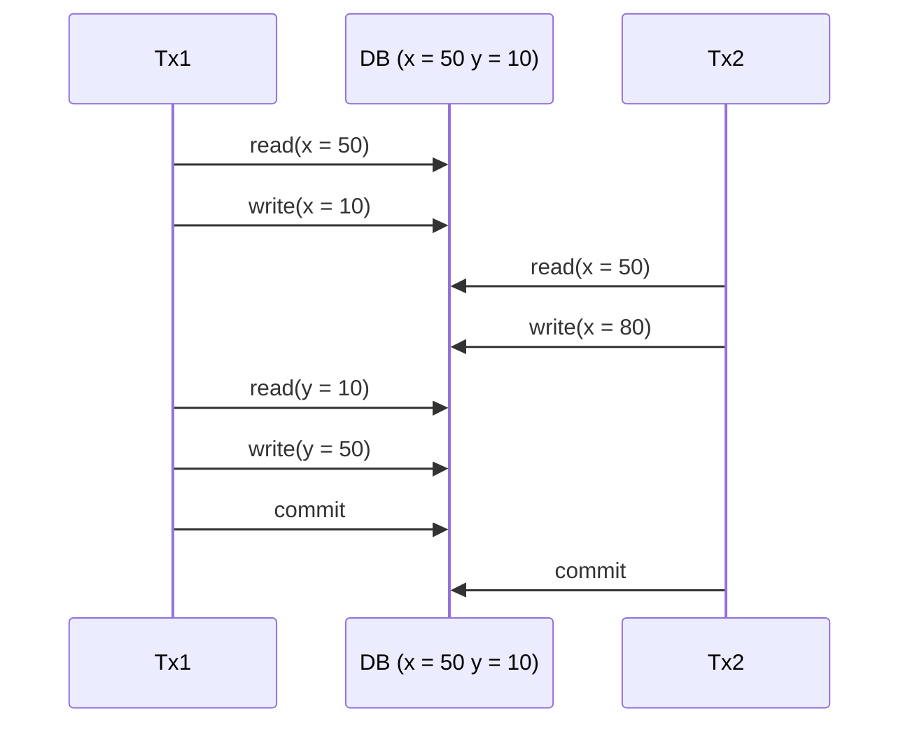
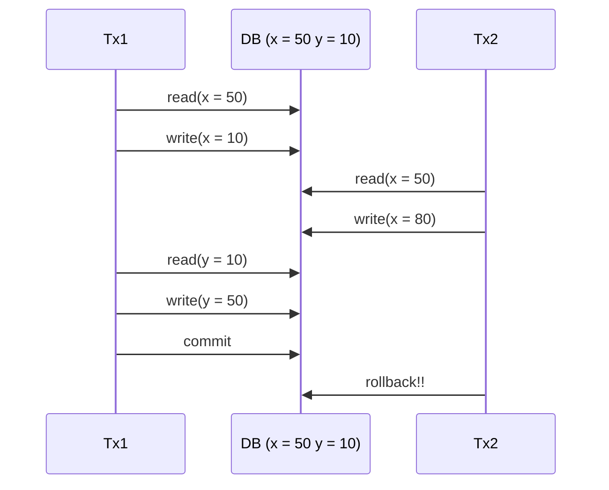

# MVCC (Multi Version Concurrency Control)

MySQL의 InnoDB 엔진은 동시성 및 롤백과 같은 트랜잭션 기능을 지원하기 위해 트랜잭션 진행 중 **별도의 메모리에 해당 로우에 대한 여러가지 버전의 데이터 변화 이력을 저장한다.** 또한 Lock을 사용하지 않고 동시성을 제어한다는 특성이 있다.

## 격리수준에 따른 MVCC 조회 결과


위 시퀀스 다이어그램으로 시작되는 Tx1과 Tx2의 작업은 다음과 같다.

- 가장 처음 x값은 10이다
- Tx1 x를 50으로 수정하는 작업을 수행한다
- 위 그림에서 Tx2은 x를 읽는 작업을 두 번 수행한다

Tx2가 수행하는 첫번째 읽기 작업에서 x의 값은 어떻게 될까?
- **MVCC는 특정 시점 기준으로 가장 최근에 커밋된 데이터만 읽는다.** 따라서 Tx1의 쓰기작업은 아직 커밋 전이므로 Tx2의 첫번째 읽기 작업에서 Tx2가 읽는 x의 값은 10이 된다.

Tx2가 수행하는 두번째 읽기 작업에서 x의 값은 어떻게 될까? 정답은 Tx2의 **트랜잭션 격리수준(isolation level)에 따라 다르다.**

- 격리 수준이 Read Committed 일 때
    - Tx2의 격리 수준이 read committed라면 다른 트랜잭션의 커밋된 변경 내역을 조회할 수 있다. 따라서 Tx2의 두번째 읽기 작업보다 Tx1의 쓰기 작업에 대한 커밋이 먼저 완료되었으므로 **Tx2가 읽는 x의 값은 50이 된다.**

- 격리 수준이 Repeatable Read 일 때
    - Tx2의 격리 수준이 repeatable read라면 MVCC에 의해 Tx2의 트랜잭션 시작 시점에서 그전에 커밋된 x값을 조회하고 별도의 공간에 저장한다. 따라서 Tx2의 트랜잭션 시작 시점에서 아직 Tx1의 쓰기 작업은 아직 커밋 전 단계이므로, **Tx2이 읽는 커밋된 x의 값은 그 전에 커밋된 x의 값인 10이 된다.**

## Mysql vs PostgreSQL

트랜잭션의 격리 수준에 따라 Mysql과 PostgreSQL MVCC가 동작하는 방식이 다르다. 예시를 통해 확인해보자


### 문제점


위 시퀀스 다이어그램으로 시작되는 Tx1과 Tx2의 격리 수준은 Read Committed 이며 작업은 다음과 같다.

- 가장 처음 x값은 50, y값은 10이다
- Tx1은 x가 y에 40을 이체하는 작업을 진행한다
- Tx2는 x에 30을 이체하는 작업을 진행한다
- 두 작업이 모두 수행된다는 x = 40, y = 50의 값을 가진다

실행 순서를 위 시퀀스 다이어그램 순으로 살펴보자

1. Tx1은 x의 40을 차감하기 위해 x의 값을 읽는다
2. Tx1은 읽어들인 x의 값에서 40을 차감한 10의 값을 x에 저장한다
3. Tx2가 x에 30을 이체하기 위해 x의 값을 읽는다
4. Tx2가 읽어들인 x의 값에서 30의 값을 더한 값을 x에 저장한다
5. Tx1은 y에 x가 이체한 40을 더하기 위해 y의 값을 읽는다
6. Tx1은 읽어들인 y에 값에서 40을 더한 값을 y에 저장한다

Tx1, Tx2의 트랜잭션이 각각 커밋되고 나면, 최종적으로 x = 80, y = 50이 되는 결과가 발생한다. 애초에 의도한 x = 40, y = 50의 결과와 맞지 않는다. 이런 현상을 Tx1의 첫번쨰 쓰기 작업인 write(x = 10)에 대한 업데이트를 Tx2가 감지하지 못한 **Lost Update 현상이라고 한다.**

#### PostgreSQL 해결 방법

격리 수준을 **Repeatable Read로 바꾸면** PostgreSQL에서는 위 이상현상이 해결된다. PostgreSQLl에서는 격리수준이 Repeatable Read 일 때, 첫번째 트랜잭션 수행 중간에 다른 트랜잭션이 접근해 첫번째 트랜잭션이 조회한 값을 수정하려고 하면 나중 트랜잭션이 롤백되는 **First Updater Win이라는 원칙이 적용된다.** 

따라서 Tx2가 롤백된 후 재시도를 하게 되면 정상적으로 x = 40, y = 50의 값을 가질 수 있다.

#### MySQL 해결 방법

MySQL에서는 격리 수준을 Repeatable Read로 바꾸는 것만으로는 First Updater Win이라는 원칙이 적용되지 않기 때문에 해당 현상을 해결 할 수 없다. 따라서 MySQL을 사용할 경우 격리 수준을 동일하게 Repeatable Read로 바꾸되, **Lock을 사용해서 위에서 발생한 이상현상을 해결해야 한다.**

```sql
select ... for update; -- 베타락
select ... for share; -- 공유락
```

## Undo Log
이 정보는 undo log라고 불리는 공간에 저장되고 커밋 후 삭제된다. 만약 트랜잭셔 실행도중 롤백이 발생하면 undo log에 있는 정보로 복원한다. 

출처 : 쉬운코드 (https://www.youtube.com/watch?v=wiVvVanI3p4&list=PLcXyemr8ZeoREWGhhZi5FZs6cvymjIBVe&index=19)