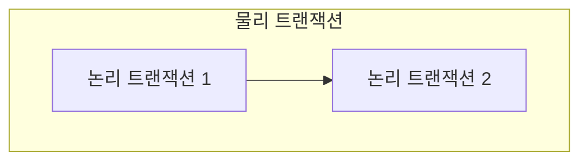
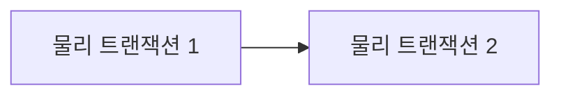

# Propagation

하나의 트랜잭션 내부에서 여러개의 트랜잭션이 실행될때 서로간의 트랜잭션에 대한 영향도 처리를 트랜잭션 전파속성(Transaction Propagation)을 통해 결정할 수 있다.


## 스프링의 물리 & 논리 트랜잭션
스프링에서는 로직에서 최초로 실행되는 트랜잭션을 물리 트랜잭션(physical transaction)이라고 한다. 물리 트랜잭션 실행이후 발생하는 트랜잭션을 논리 트랜잭션(logical transaction)이라고 한다.

가장 처음으로 실행된 물리 트랜잭션 내부에서 논리 트랜잭션이 실행되어, **물리 트랜잭션은 외부 트랜잭션, 논리 트랜잭션은 내부 트랜잭션**이라고 할 수 있다.  아래와 같은 구조라고 볼 수 있다.



물리 트랜잭션을 실제 데이터베이스의 커넥션을 가지고 있다. 따라서 상황에 따라 데이터베이스에 커밋이나 롤백을 직접 할 수 있다. 반면에 논리 트랜잭션은 실제로 커밋이나 롤백 작업을 수행하지 않는다.

### 롤백 마킹
스프링에서는 모든 논리 트랜잭션이 커밋되어야 물리 트랜잭션이 커밋될 수 있다는 원칙을 가지고 있다. 반대로 말하면 단 하나의 논리 트랜잭션에서 롤백이 발생할 경우, 기본적으로 물리 트랜잭션을 포함한 모든 트랜잭션은 롤백된다.

만약 논리 트랜잭션에서 롤백이 발생한 경우에는 해당 논리 트랜잭션에서 롤백 마킹(rollbackOnly = true)을 한다. 맨 마지막의 물리 트랜잭션은 내부에 있는 논리 트랜잭션을 조사하여 만약 롤백 마킹이 되어있는 경우 UnexpectedRollbackException을 발생시켜 전체 트랜잭션을 롤백한다.

#### 내부 트랜잭션에서 발생하는 RuntimeException을 catch하면 정상 커밋이 될까?
```java
public class MemberService {
    @Transactional
    public void joinV2(String username) {
        Member member = new Member(username);
        Log logEntity = new Log(username);

        memberRepository.save(member);

        // 로그 저장 시 발생하는 예외는 여기서 처리
        try {
            logRepository.save(logEntity);
        } catch (RuntimeException e) {
            log.info("log 저장 실패", e);
        }
    }
}
```

```java
public class MemberRepository {
    @Transactional
    public void save(Member member) {
        em.persist(member);
    }
}
```

```java
public class LogRepository {
    @Transactional
    public void save(Log logEntity) {
        em.persist(logEntity);
    }
}
```

MemberService의 joinV2 메소드부터 시작되는 트랜잭션이 MemberRepository, LogRepository의 save 메소드를 순차적으로 호출한다. 

참고로 세개의 메소드 모두 @Transactional 어노테이션이 적용되어 있으며 기본 전파레벨인 REQUIRED로 되어 있어 Service 메소드가 시작한 트랜잭션에 나머지 Repository 메소드가 참여하여 하나의 트랜잭션으로 묶인다.

이 때 LogRepository의 save 메소드에서 런타임 예외가 발생하고 MemberService의 joinV2 메소드에서 해당 예외를 catch 하여 처리하면 정상 처리로 간주되어 LogRepository를 제외한 나머지 트랜잭션이 제대로 커밋될까?

**정답은 "모두 롤백된다" 이다.**  

위 예시의 모든 메소드는 동일한 커넥션을 사용하는 트랜잭션에 속해있으며 PlatformTransactionManager를 통해 관리된다. LogRepository의 내부 트랜잭션에서 예외가 발생하면 rollbackOnly 마킹이 적용되어. 최초로 실행된 외부 트랜잭션에서 이 롤백 마킹이 있으면 UnexpectedRollbackException 예외를 던져 트랜잭션을 롤백시킨다. 

참고 : https://techblog.woowahan.com/2606/

기본적으로 위와 같이 동작하지만, 트랜잭션의 전파 옵션을 통해 내부 트랜잭션에 롤백이 발생해도 외부 트랜잭션에서 롤백을 하지 않게 설정할 수 있다. 

## 스프링 트랜잭션의 전파 옵션
스프링은 다양한 트랜잭션 전파 옵션을 제공한다. 대부분 REQUIRED나 REQUIRES_NEW 옵션을 사용한다.

#### REQUIRED
스프링 트랜잭션의 기본 전파 옵션이다. 한개의 트랜잭션 필수(Required)이기 때문에 기존 트랜잭션이 있으면 참여하고 없으면 새로운 트랜잭션을 생성한다.

#### REQUIRES_NEW

REQUIRES_NEW 전파속성을 사용하면 기존 물리 트랜잭션이 존재해도 새로운 커넥션을 가져와 새로운 물리 트랜잭션을 생성한다. 즉, 외부 트랜잭션과 내부 트랜잭션이 서로간에 전혀 영향을 주지 않는다

만약 tx1, tx2가 같은 스레드에서 전파속성이 REQUIRES_NEW로 실행된다면, 실행 과정은 다음과 같다.
1. tx1를 사용한 로직이 실행된다
2. tx2가 실행된 차례가 왔다. tx1은 잠시 실행을 멈춘다. TransactionManager는 datasource에서 **새로운 커넥션을 가져와** tx2에게 부여하고 새로운 물리 트랜잭션을 실행한다
3. tx2를 사용한 로직이 종료된다. 별도의 물리 트랜잭션으로 동작하기 때문에 tx2에서 커밋이나 롤백이 발생해도 tx1에 영향을 주지 않는다
4. tx1의 실행이 다시 재개된다

#### SUPPORT
기존 트랜잭션이 없으면 없는대로 진행하고 있으면 참여(지원) 한다.

#### NOT_SUPPORT
기존 트랜잭션이 없으면 없는대로 진행하고 있어도 없는대로 진행한다. 즉, 트랜잭션을 지원하지 않는다.

#### MANDATORY
트랜잭션의 의무적으로 있어야 한다는 의미를 가진다. 기존 트랜잭션이 없으면 IllegalTransactionStateException 예외가 발생한다

#### NEVER
트랜잭션을 사용하지 않는다는 의미이다. 기존 트랜잭션이 있으면 IllegalTransactionStateException 예외가 발생한다

#### NESTED
기존 트랜잭션이 없으면 새로운 트랜잭션을 생성한다. 기존 트랜잭션이 있으면 중첩 트랜잭션을 생성한다. 이 중첩 트랜잭션은 외부 트랜잭션에 영향을 받지만 중첩 트랜잭션 자신은 외부 트랜잭션에 영향을 주지 않는다. 즉,
- 외부 트랜잭션이 롤백되면 중첩 트랜잭션 자신도 함께 롤백된다
- 중첩 트랜잭션이 롤백되어도 외부 트랜잭션은 롤백되지 않는다

참고로 JPA는 해당 전파 옵션을 지원하지 않는다.