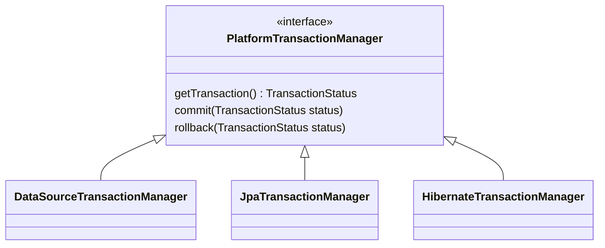
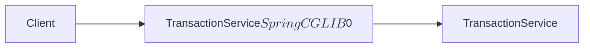

# Transaction

트랜잭션 (Transaction)은 DB에서 실행되는 최소 작업 단위를 의미한다. DB 작업에 필요한 쿼리는 한개이거나, 여러개가 있을 수 있다. 구성된 쿼리가 전부 다 실행되거나 중간에 오류가 발생했을때 원래의 상태로 복구되는 기능을 트랜잭션을 활용해 구현할 수 있다.

## ACID
트랜잭션의 다음과 같은 4개의 특성을 만족해야 한다. 각각의 영어 철자를 따 ACID라고 부른다.

**원자성 (Atomicity) :** 트랜잭션을 구성하는 모든 쿼리가 성공하거나, 모두 실패해야 한다. 즉, 일부만 성공하거나 일부만 실패하는 경우는 발생하지 않는다
**일관성 (Consistency) :** 트랜잭션이 시작되기 전과 후의 데이터베이스는 같은 일관성을 유지해야 한다. 즉, 데이터베이스에서 정한 무결성 제약 조건을 항상 만족해야 한다
**격리성 (Isolation) :** 각각의 트랜잭션을 서로 간섭할 수 없도록 격리된 상태로 실행되어야 한다. 격리성은 트랜잭션 격리 수준(Isolation Level)을 통해 선택할 수 있다
**지속성 (Durability) :** 트랜잭션이 처리된 결과는 데이터베이스에 영구적으로 반영되어야 한다

### 무결성 제약 조건
무결성 제약 조건이란 데이터 베이스의 상태를 일관되게 유지하기 위해 정해둔 조건을 뜻한다.

**개체 무결성 :**  각 테이블의 기본키를 구성하는 속성은 null이나 중복값을 가질 수 없다
**참조 무결성 :**  각 테이블의 외래키는 null이거나 참조하는 테이블의 기본키 값이어야 한다
**도메인 무결성 :**  속성들의 값은 도메인에 속한 값이어야 한다. ex) 성별이라는 속성에서 '남', '여'를 제외한 데이터를 가질 수 없다
**고유 무결성 :**  특정 속성에 대해서 고유한 값을 가지는 조건이 있는 경우, 해당 속성의 값은 중복될 수 없다
**null 무결성 :**  특정 속성이 not null하다면 null값이 있어서는 안된다

### 트랜잭션 격리 수준 (Transaction Isolation Level)
트랜잭션에 대한 격리 수준은 다음과 같다. 아래로 갈 수록 강한 격리수준을 가지며 강한 격리수준을 가질수록 데이터의 정합성은 보장되지만 성능이 저하된다.

#### Read Uncommitted (커밋되지 않은 읽기)
#### Read Committed (커밋된 읽기)
#### Repeatable Read(반복 가능한 읽기)
#### Serializable(직렬화)

## JDBC Transaction
JDBC에서 트랜잭션을 적용하는 방법은 다음과 같다.

```java
Connection conn = DriverManager.getConnection(..);
conn.setAutoCommit(false); // 오토 커밋 모드 해제

try {
    // 로직 수행
    conn.commit();
} catch(Exception e) {
    // 예외 발생 시 롤백
    conn.rollback();
} finally {
    // 커넥션 해제
    if(conn != null) conn.close();
}
```

1. 데이터베이스 커넥션 객체를 생성한다
2. 커넥션 객체로부터 auto commit mode를 false로 설정한다
3. 서비스 코드의 마지막에 커넥션 객체의 commit 메소드를 호출해 데이터베이스에 결과를 반영한다
4. 중간에 예외 발생 시 catch문 내부에서 커넥션 객체의 rollback 메소드를 호출한다
5. finally 구문에서 사용한 자원을 해제한다

## Spring Transaction

스프링이 제공하는 트랜잭션 추상화는 JDBC 트랜잭션을 사용하면서 발생하는 트랜잭션 관련 코드에 대한 중복, 커넥션 객체의 공유등의 문제를 해결하기 위해 추상화된 트랜잭션 인터페이스를 제공한다.

### PlatformTransactionManager
PlatformTransactionManager는 스프링에서 트랜잭션을 지원하는 핵심적인 인터페이스이다. 트랜잭션을 시작하거나 기존 트랜잭션에 참여하는 getTransaction, 쿼리 실행 결과를 커밋하는 commit, 예외발생 시 롤백을 수행하는 rollback 메소드로 구성되어 있다.



또한 PlatformTransactionManager는는 트랜잭션에 사용하는 커넥션 객체에 대한 관리를 담당한다. 

DB 사용기술에 따라 DataSourceTransactionManager, JpaTransactionManager, HibernateTransactionManager등의 구현체가 있다. 스프링 내부에서 설치된 DB 라이브러리를 참고해 적합한 구현체를 지정한다.

### TransactionSynchronizationManager
트랜잭션을 유지하러면 반드시 한개의 커넥션 객체를 트랜잭션의 시작부터 끝까지 유지해야 한다. 따라서 비즈니스 로직간에 동일한 커넥션 객체를 항상 공유해야 하는데, 이 역할을 스프링의 TransactionSynchronizationManager가 수행해준다. TransactionSynchronizationManager는 내부적으로 ThreadLocal을 사용해 트랜잭션에 사용하는 커넥션 객체를 관리하게 된다. 

### @Transactional
```java

public void myMethod() {
    TransactionStatus status = txManager.getTransaction(def);

    try {
        doSomething();

        txManager.commit(status);
    } catch (MyException ex) {
        txManager.rollback(status);
        throw ex;
    }
}
```
개별적인 트랜잭션 코드를 직접 repository나 service에 구현하는 방법을 프로그래밍적 트랜잭션(programmatic transaction)이라고 한다. 프로그래밍적 트랜잭션 관리 방법은 중복된 try (commit) - catch (rollback)에 대한 코드가 비즈니스 로직 곳곳에 중복되어 있다는 치명적인 단점을 가진다.

```java
@Transactional
public void myMethod() {
    doSomething();
}
```
스프링에서는 @Transaction 어노테이션을 메소드나, 클래스에 활용해 트랜잭션에 활용하는 중복코드를 없애고 순수 비즈니스 로직만 남길 수 있다. 이를 **선언적 트랜잭션 프로그래밍 기법이라고 한다.**

#### @Transaction의 동작 구조



스프링의 선언적 트랜잭션은 Spring AOP 기반으로 동작한다. @Transactional 어노테이션이 적용된 클래스를 기반으로 PlatformTransactionManager의 트랜잭션 관련 코드와 TransactionSynchronizationManager를 활용한 커넥션 객체 관리가 적용된 프록시 클래스를 대신 스프링 컨테이너에 빈으로 등록한다.

- 등록된 프록시 빈은 원본 객체를 상속받아 만들어지기 때문에 다형성을 통한 원본 객체 타입의 빈 주입이 가능하다

- 등록된 프록시 빈은 내부적으로 원본 객체를 멤버로 가지고 있으며 원본 객체의 메소드를 호출할 수 있다

- 클라이언트는 등록된 프록시 빈을 호출한다

- @Transactional 어노테이션이 특정 메소드에만 적용되었다면 어노테이션이 적용된 메소드만 프록시 메소드를 호출하고 나머지 메소드는 원본 객체의 메소드를 위임하여 호출한다

- 원래 @Transactional은 public 접근제한자에만 적용이 가능했지만 스프링 6.0부터 default, protected 접근제한자에도 적용이 가능해졌다
    - 관련 커밋 : https://github.com/spring-projects/spring-framework/commit/37bebeaaaf294ef350ec646604124b5b78c6e690   

#### @Transaction의 우선 순위
@Transaction 어노테이션의 우선 순위는 항상 **더 구체적이고 자세한 것이 높은 우선순위를 가진다.** 

예를들어 메소드와 클래스에 @Transactional이 둘 다 적용되어 있다면, 더 구체적인 메소드가 더 높은 우선순위를 가진다. 또한 클래스와 인터페이스 사이에서는 추상적인 인터페이스보다 더 구체적인 클래스가 높은 우선순위를 가진다.


### Spring Transaction의 예외
```java
@Target({ElementType.TYPE, ElementType.METHOD})
@Retention(RetentionPolicy.RUNTIME)
@Inherited
@Documented
@Reflective
public @interface Transactional {
	/**
	 * Defines zero (0) or more exception {@linkplain Class types}, which must be
	 * subclasses of {@link Throwable}, indicating which exception types must cause
	 * a transaction rollback.
	 * <p>By default, a transaction will be rolled back on {@link RuntimeException}
	 * and {@link Error} but not on checked exceptions (business exceptions). See
	 * {@link org.springframework.transaction.interceptor.DefaultTransactionAttribute#rollbackOn(Throwable)}
	 * for a detailed explanation.
	 * <p>This is the preferred way to construct a rollback rule (in contrast to
	 * {@link #rollbackForClassName}), matching the exception type and its subclasses
	 * in a type-safe manner. See the {@linkplain Transactional class-level javadocs}
	 * for further details on rollback rule semantics.
	 * @see #rollbackForClassName
	 * @see org.springframework.transaction.interceptor.RollbackRuleAttribute#RollbackRuleAttribute(Class)
	 * @see org.springframework.transaction.interceptor.DefaultTransactionAttribute#rollbackOn(Throwable)
	 */
	Class<? extends Throwable>[] rollbackFor() default {};

    Class<? extends Throwable>[] noRollbackFor() default {};

    // 나머지 생략
}
```
스프링 트랜잭션은 **기본적으로 Unchecked 예외 발생 시 롤백 하고 Checked 예뵈 발생 시 롤백을 하지 않는다**. 

```java
// 체크 에외 rollbackFor -> MyException 예외 발생 시 롤백되지 않고 커밋된다
@Transactional(noRollbackFor = MyException.class)
void throwCheckedExceptionRollbackFor() throws MyException {
    log.info("call checkedException noRollbackFor");
    throw new MyException();
        }
```
하지만 @Transactional 어노테이션의 rollbackFor, noRollbackFor 옵션을 사용해 발생한 예외에 대한 롤백처리를 커스텀 할 수 있다.

