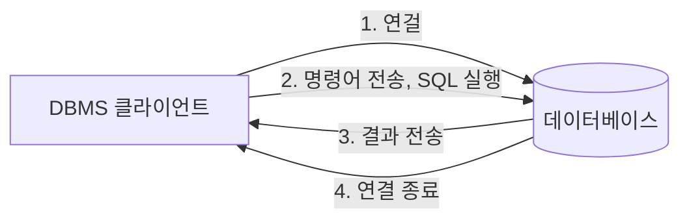
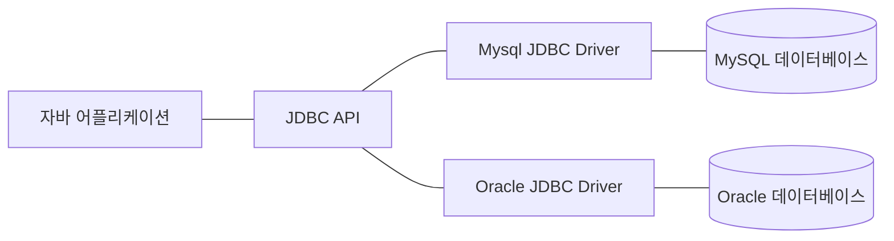
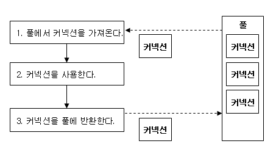

# 데이터베이스 프로그래밍

## DB
데이터베이스(Database)란 전자적으로 저장되고 사용되는 관련있는 데이터들의 조직화된 집합을 의미한다. 예를들어 소셜 네트워크 서비스와 관련된 데이터의 집합은 다음과 같다고 할 수 있다.
- 사용자의 개인 정보
- 사진
- 게시글 
- 댓글

## DBMS
DBMS(Database Management System)는 사용자에게 DB를 정의하고 데이터를 안정적으로 보관할 수 있는 다양한 기능을 제공하는 소프트웨어 시스템이다. 대표적으로 MySQL, PostgreSQL, Oracle등이 있다

DBMS의 몇 가지 중요한 기능들을 정리하자면 다음과 같다.
- 데이터의 CRUD
- 데이터의 무결성 유지
- 트랜잭션 관리
- 데이터의 백업 및 복원
- 데이터 보안

웹 어플리케이션을 구현할때는 주로 관계형 데이터베이스를 사용한다. 관계형 DBMS의 대표적인 종류로써는 MySQL, Oracle, MSSQL 등이 있다.

### DBMS의 사용 순서는 다음과 같다.


1. 주로 TCP/IP 연결을 통해 데이터베이스와 커넥션을 연결한다
2. SQL을 연결된 커넥션을 통해 데이터베이스에 전달한다
3. 전달된 SQL을 수행하고 결과를 반환한다
4. 연결을 종료한다

## JDBC
자바에서 데이터베이스 프로그래밍을 할 때는 JDBC(Java Database Connectivity)를 사용한다. JDBC를 사용하기 이전의 문제점은 DBMS마다 커넥션을 연결하고, SQL을 전달하여 응답을 받는 방법이 각각 달랐다. 따라서 개발자들은 새로운 DBMS를 다룰때마다 새롭게 공부하고 코드를 작성해야 했는데, 이를 해결하기 위해 **JDBC**라는 자바 표준이 등장했다.

모든 DBMS를 하나의 JDBC API로 처리할 수 있다는 특징이 있다. 

### JDBC 인터페이스의 실행 순서
JDBC 인터페이스의 전형적인 실행 순서는 다음과 같다.
1. JDBC 드라이버 로딩
2. 데이터베이스 커넥션 구하기
3. 쿼리 실행을 위한 Statement 작성
4. 쿼리 실행
5. 쿼리 실행 결과 (ResultSet) 사용
6. Statement 종료
7. 데이터베이스 커넥션 종료

### JDBC 드라이버
JDBC는 DBMS별 JDBC 드라이버를 통해 해당 데이터베이스와 통신한다. JDBC 드라이버는 DBMS와 통신을 담당하는 클래스로써 각각의 DBMS마다 다른 드라이버를 사용한다. 각각의 DB 벤더(회사)에서 JDBC 인터페이스에 맞게 구현체를 작성해서 라이브러리로 제공한다.

주요 데이터베이스에 대한 JDBC 드라이버의 구현체는 다음과 같다.
- Mysql : com.mysql.jdbc.Driver
- Oracle : oracle.jdbc.driver.OracleDriver



#### JDBC 드라이버 로딩
```java
try {
    Class.forName("com.mysql.cj.jdbc.Driver");
} catch (ClassNotFoundException e) {
    throw new RuntimeException(e);
}
```
예시로 JSP 프로그래밍을 할때 JDBC 드라이버는 Class.forName 메소드를 호출하면 자동으로 등록된다. 해당 드라이버를 찾을 수 없을 때 ClassNotFoundException 예외를 발생시킨다.

#### JDBC URL
JDBC URL을 통해 사용하고자 하는 데이터베이스에 연결할 수 있다. 일반적인 JDBC URL의 형식은 다음과 같다.
```
jdbc:<DBMS>:<데이터베이스 식별자>
```

예를들어 MySQL DBMS를 사용하는 데이터베이스에 연결하려면 다음과 같은 JDBC URL을 사용한다.
```
jdbc:mysql://localhost:3306/db_name
```

JDBC 드라이버와 MySQL 서버와 데이터를 주고받을때 올바른 캐릭터셋을 맞춰주기 위해서 다음과 같은 추가 파라미터를 사용한다.
```
jdbc:mysql//localhost:3306/db_name?useUnicode=true&characterEncoding=utf-8
```

#### 데이터베이스 커넥션
JDBC를 이용해서 데이터베이스를 사용하려면 데이터베이스와 연결된 커넥션을 사용해야 한다. `java.sql` 패키지의 Connection 클래스가 데이터베이스의 커넥션을 담는 클래스이고 DriverManager 클래스의 getConnection 메소드를 사용하면 연결된 커넥션 객체를 반환한다. 커넥션 객체를 생성하지 못하면 SQLException 예외를 발생시킨다.

```java
try {
    Connection conn = DriverManager.getConnection(DB_URL, USER, PASSWORD);
} catch (SQLException e) {
    throw new RuntimeExceptione(e);
}
```

#### Statement & ResultSet
커넥션을 생성하고 쿼리를 작성했으면 이제 Statement를 생성하여 쿼리를 실행시킨다. Statement는 SQL 쿼리를 데이터베이스에 보내기 위한 인터페이스이다. 
연결된 커넥션 객체를 통해 Statement를 가져올 수 있다. Statment는 select 쿼리와 나머지 update, insert, delete 쿼리 여부에 따라 호출하는 메소드와 쿼리의 결과를 저장하는 타입이 구분되어 있다. 예시는 다음과 같다.

- select 쿼리는 executeQuery 메소드를 사용하고 결과를 ResultSet 타입 변수에 저장한다
```java
    String query = "select * from member order by member_id";

    Statement stmt = conn.createStatement();
    ResultSet rs = stmt.executeQuery(query);

    while(rs.next) {
        // 한 행씩 반복 처리
    }
```
ResultSet은 JDBC API에서 쿼리의 조회 쿼리의 결과를 가져오는데 사용된다. 결과의 대한 순회(next) 데이터 읽기(getString, getInt, getLong, getDouble 등등), 행과 열의 이동(커서), 결과에 대한 메타데이터에 대한 정보를 가지고 있다.

- update, insert, delete 쿼리는 executeUpdate 메소드를 사용하고 결과를 int 타입 변수에 저장된다. 
```java
    String updateName = "'steve'";
    String updateQuery = "update member set name = " + updateName + " where member_id = 1";

    Statement stmt = conn.createStatement();
    int updateCount = stmt.executeUpdate(updateQuery); // 변경된 (삽입된) 레코드의 개수를 반환한다
```

### PreparedStatement
쿼리를 실행할 때 Statement 인터페이스 외에 PreparedStatement 인터페이스를 사용할 수 있다. PreparedStatement는 미리 컴파일된 SQL문에 매개 변수롤 바인딩하는 방식을 사용한다.

```java
String insertQuery = "insert into member(member_id, name, password, email) values (?,?,?,?)";
PreparedStatement psmt = conn.prepareStatement(insertQuery);

String name = request.getParameter("name");
String password = request.getParameter("password");
String email = request.getParameter("email");

// 물음표를 대체할 파라미터를 바인딩한다.
psmt.setLong(1, 2);
psmt.setString(2, name);
psmt.setString(3, password);
psmt.setString(4, email);

int insertRowCount = psmt.executeUpdate();
```

 값이 필요한 부분을 모두 (?)로 대치한 쿼리를 미리 작성하고 PreparedStatement 인터페이스의 set 메소드를 통해 파라미터를 바인딩한다. PreparedStatment를 사용하면 코드가 간결해지고 쿼리 내부의 값을 쉽게 변경할 수 있다는 장점이 있다. 

 #### Statement vs PreparedStatement
 Statement는 미리 컴파일된 SQL 쿼리를 그대로 데이터베이스에서 실행킨다. 반면 PreparedStatement는 미리 컴파일된 SQL 쿼리에 매개변수를 지정할 수 있다. SQL 쿼리에 매개변수를 사용할 부분을 ?로 작성하고 setString, setLong 등과 같은 메소드를 사용하여 매개변수의 위치와 값을 바인딩 할 수 있다. 또한 PreparedStatement를 사용하면 SQL Injection 공격을 방지할 수 있다.

 ### JDBC의 트랜잭션
트랜잭션이란 데이터베이스에서 실행되는 최소 작업 단위이다. 우선 JDBC에서 트랜잭션을 구현하려면 **오토 커밋 모드를 false**로 지정해야 한다.

오토 커밋 모드를 false로 지정하면 아무리 SQL이 여러번 실행되어도 명시적으로 connection.commit 메소드가 호출되기 전에 db는 commit을 하지 않는다. 

```java
Connection conn = DriverManager.getConnection(..);
conn.setAutoCommit(false);
```

일반적으로 JDBC를 사용한 트랜잭션 구조는 다음과 같다.
```java
Connection conn = DriverManager.getConnection(..);
conn.setAutoCommit(false); // 오토 커밋 모드 해제

try {
    // 로직 수행
    conn.commit();
} catch(Exception e) {
    // 예외 발생 시 롤백
    conn.rollback();
} finally {
    // 커넥션 해제
    if(conn != null) conn.close();
}
```

## 커넥션 풀 (DBCP)
동시 접속자가 많은 웹 사이트에서는 데이터 작업이 필요할때 마다 커넥션을 생성하고 닫는 방식을 사용하면 전체적인 성능이 낮아진다. 일반적으로 커넥션 풀을 획득하는 과정은 다음과 같은 복잡한 과정을 거친다.

1. 어플리케이션에 설치된 DB 드라이버를 조회하여 커넥션을 가져온다
2. TCP/IP 연결을 통해 DBMS와 연결한다. 이 과정에서 3-way-handshake와 같은 네트워크 동작이 발생한다
3. ID, PASWWORD, 권한과 같은 인증 정보를 DB에 전달하여 내부 인증을 완료하고 세션을 생성한다
4. DB 드라이버는 커넥션 객체를 생성하고 반환한다

이때 사용하는 기법이 커넥션 풀이다. 커넥션을 미리 만들어서 풀(pool)속에 저장해 두고 있다가 필요할때 커넥션 풀에서 커넥션을 가져와 사용하고 반납하는 기법을 의미한다.


커넥션 풀을 사용하면 커넥션을 일정 개수 미리 생성해놓고 재사용하기 때문에 커넥션을 생성하고 닫는데 드는 시간을 없앨 수 있다. 또한 요청마다 커넥션을 생성하지 않아 서버에 과부하를 주지 않고 일정한 커넥션 개수를 유지할 수 있다. 커넥션의 개수는 일반적인 경우에는 보통 10개로 유지되지만 적절한 커넥션 사이즈는 성능 테스트를 통해 정해야 한다.

대표적인 커넥션 풀 오픈소스는 `common-dbcp2`, `tomcat-jdbc-pool`, `HikariCp` 등이 있다. 이 중에서 Spring Boot 2.0부터 지정된 기본 커넥션 풀인 `HikariCp`를 대부분 사용한다.

### 커넥션 풀의 단점
커넥션 풀을 사용하게되면 일정량의 데이터베이스 커넥션이 생성되어 메모리를 계속 점유하게 된다. 따라서 필요량의 비해 과도한 커넥션 풀을 어플리케이션이 가지고 있을 경우 메모리의 낭비가 발생한다. 또한 커넥션 풀에 대한 검사 주기, 최대 커넥션 개수, 유효 시간과 같은 적절한 초기 설정 값을 찾기 위해 추가 모니터링과 테스트가 필요하다.

## SQL Injection
SQL Injection이란 클라이언트에서 입력값을 조작하여 의도치 않은 SQL 쿼리를 실행하기 하여 서버의 데이터베이스를 공격할 수 있는 공격방식이다. 

예를 들어 사용자의 아이디와 비밀번호를 입력값으로 받아 DB에 조회해서 일치하는 행이 있으면 로그인에 성공하는 프로그램이 있다고 하자. 쿼리는 다음과 같다

```sql
SELECT * FROM users WHERE username={사용자 이름} and password={비밀번호}
```

이 때 유저네임에 'admin', 비밀번호에 'password' OR 1=1 --'를 입력하면 쿼리는 다음과 같이 실행된다.

```sql
SELECT * FROM users WHERE username='admin' and password='password' OR 1=1
```

`1=1`은 항상 참이 되므로 공격자는 아이디와 비밀번호를 몰라도 로그인 할 수 있게 된다.

#### 예방책
SQL 인젝션을 예방하는 방법은 다음과 같다.
- 입력값 검증 : `'`, `#`, `--`, `=`과 같은 특수문자를 필터링한다, 또한 입력길이의 제한을 둔다
- DB 권한 분리 : 데이터 베이스의 권한을 두어 DDL, DML에 대한 실행 권한을 제한한다
- PreparedStatement : PreparedStatement를 사용하면 파라미터에 바인딩되는 값이 단순한 데이터로 처리되므로 SQL 쿼리로 해석되는 것을 방지할 수 있다. 따라서 악의적인 SQL이 입력값으로 들어오더라도 SQL 인젝션 공격을 통한 데이터베이스 침입을 막을 수 있다.