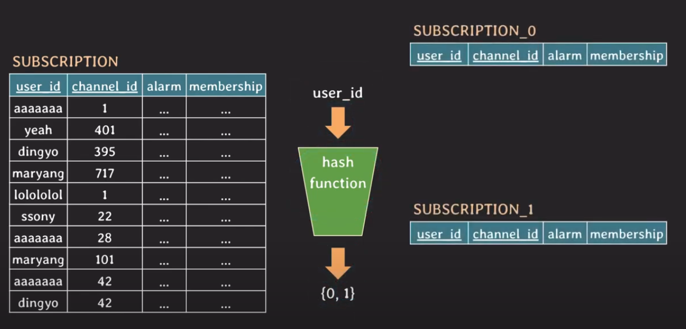
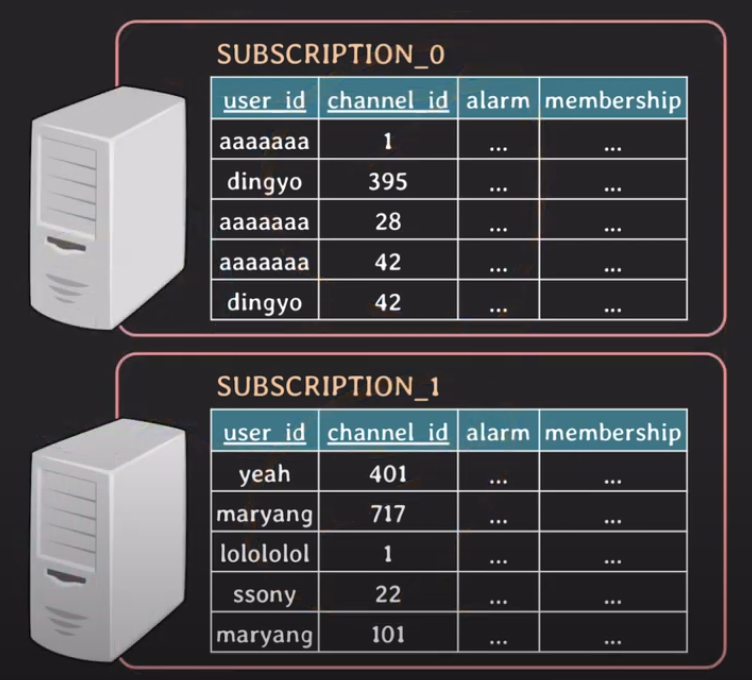
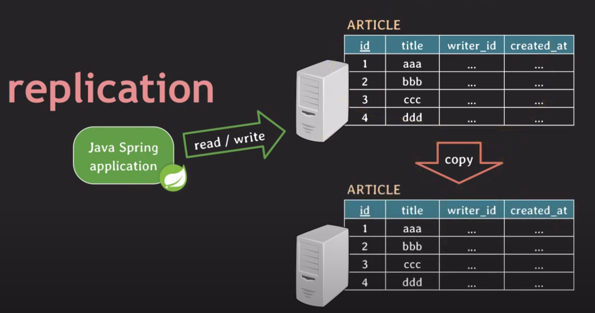

## 파티셔닝 & 샤딩 & 레플리케이션

## 파티셔닝 (Partitioning)

파티셔닝은 데이터베이스의 테이블을 더 작게 나누는 것을 의미한다. 파티션의 종류는 다음 두 가지가 있다.

- 수직 분할 (vertical partitioning) : 컬럼을 기준으로 테이블을 나누는 방식
- 수평 분할 (horizontal partitioning) : 로우를 기준으로 테이블을 나누는 방식

### 수직 분할 (Vertical Partitioning)
수직 분할을 예시는 크게 정규화 과정과 특정 컬럼의 분리가 있다.

#### 정규화
테이블의 중복된 데이터나 삽입, 삭제, 갱신 연산의 이상 현상을 해결하기 위해 각 단계별의 규칙으로 테이블을 분리하는 방법을 의미한다.

#### 특정 컬럼의 분리

게시판 테이블을 예시를 들어보자. 

| <u>id</u> | title | writer_id | read_cnt | comment_cnt | content |
| --- | --- | --- | --- | --- | --- |

게시판 리스트 조회하는 API를 구현하는 경우, 게시판의 내용을 저장하는 content 컬럼은 사용하지 않지만 위 테이블에 같이 구성되도록 설계가 되어 있다. 따라서 불필요한 데이터를 메모리에 올려야 하는데, 만약 이 과정에서 성능이 나오지 않는다면 수직 분할을 사용해 content 컬럼을 아래와 같이 따로 분리할 수 있다.

| <u>id</u>  | title | writer_id | read_cnt | comment_cnt |
| --- | --- | --- | --- | --- |

| <u>id</u>  | content |
| --- | --- |


위 예시 외에도 민감한 정보에 대한 분리, 자주 사용하는 컬럼들을 따로 분리하는 등의 여러가지 목적으로 수직 분할 기법을 사용할 수 있다.

### 수평 분할 (Horiziontal Partitioning)

특정 테이블의 로우가 계속 늘어나는 경우에는 로우 뿐만 아니라 해당 테이블의 인덱스의 크기도 같이 커진다. 따라서 테이블에 읽기, 쓰기 작업이 수행될때 마다 인덱스에서 처리되는 시간도 늘어날 수 있다. 

#### 해시 분할 (Hash Partitioning)

수평 분할에서 대표적으로 사용하는 기법이다. user_id 컬럼을 기준으로 해시 함수를 사용하여 반환된 해시 값으로 분할된 테이블에 각각 저장하는 방식이다. 위 예시에서는 해시 함수에서 0이 나오면 subscription_0, 1이 나오면 subscription_1에 저장되고 partition key는 user_id가 된다.

**해시 분할 파티션 테이블의 조회**
- user_id가 dingyo라는 구독 채널 정보를 조회해야 한다면 다음과 같은 쿼리가 발생할 것이다.
    ```sql
    select *
    from subscription
    where user_id = 'dingyo';
    ```
    위 쿼리의 경우 partiton key인 user_id를 해시 함수를 사용해서 반환된 결과에 따른 파티션 테이블을 조회해서 가져온다.

- channel_id가 1인 채널의 구독자 user_id를 모두 가져오고 싶다면 다음과 같은 쿼리가 발생할 것이다.
    ```sql
    select user_id
    from subscription
    where channel_id = 1;
    ```

    위 쿼리의 경우 channel_id 값은 partiton key가 아니므로 파티셔닝된 테이블 전체를 조회하게 된다.

**해시 분할 파티션의 유의점**
해시 분할 파티션을 사용하는 경우 유의해야할 점은 다음과 같다.
- 적절한 partition key를 선정해야 한다
- 적절한 해시 함수를 구현해 균등한 파티션 분배를 할 수 있도록 해야한다
- 한번 데이터가 쌓이기 시작한 파티션 테이블은 새로운 파티션을 추가하기 어렵다

해시 분할 기법 외에도 범위 분할 기법등 다양한 수평 분할 기법들이 사용된다.

## 샤딩 (Sharding)

샤딩은 위에 수평 분할이랑 동일하지만 **파티션들이 다른 서버에 저장된다는 특징이 있다.** 파티션별로 DB 서버의 요청을 분산시켜 부하를 낮추는 효과가 있다.

각 파티션을 샤드(Shard)라고 부르고 파티션키는 샤드키(Shard Key)라고 부른다.

## 레플리케이션 (Replication)

데이터를 복사본을 각각의 서버에 저장하는 방식이다. 어느 한 서버가 다운되었을 경우 가용성을 확보하기 위해서 사용하는 기법이다. 각 노드는 주기적인 데이터의 복사를 통해 데이터 싱크를 맞춘다.

- 원본이 되는 DB 서버를 master, primary, leader 복제가 된 DB 서버를 slave, secondary, replica라고 부른다.
- 쓰기 전용, 읽기 전용 DB를 나눠서 서로 부하를 줄이는 목적으로 사용하기도 한다.

출처 : 쉬운코드 (https://www.youtube.com/watch?v=P7LqaEO-nGU&list=PLcXyemr8ZeoREWGhhZi5FZs6cvymjIBVe&index=29)