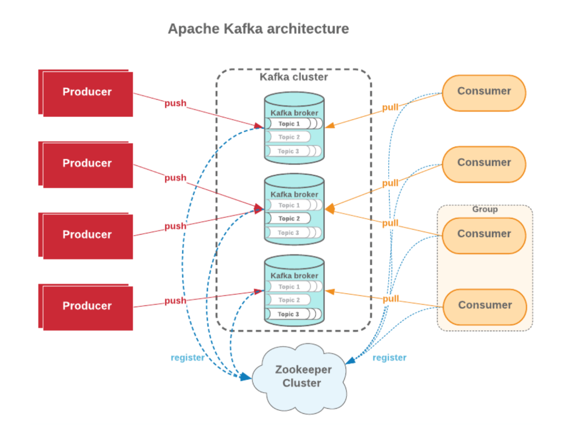
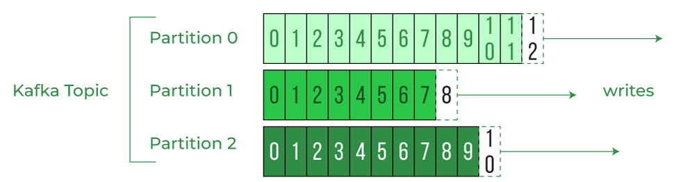
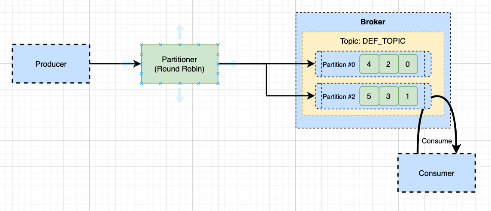
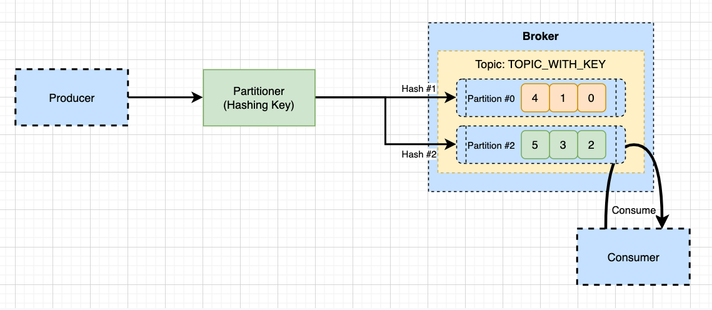

# Kafka
링크드인에서 개발한 대용량 **이벤트 브로커이며**, MQTT, AMQP를 구현하는 프로토콜이 아닌, 독립적인 데이터 스트리밍 플랫폼이다

## 특징
- 비교적 복잡한 개념들을 가지고 있지만 성능 (메세지 처리량)은 압도적이다
- 고성능, 고용량 메세지를 사용해 처리한다
- JVM과의 좋은 궁합을 가진다
- 러닝 커브는 높은 편이다

## 구성

### Topic
토픽은 카프카에서 취급하는 데이터가 들어가는 공간이다. 카프카에서는 토픽을 여러개 생성할 수 있다. Producer는 토픽에 데이터를 생성하고 Consumer는 데이터를 가져가게 된다.

### Producer
Kafka Cluster에 존재하는 특정 Topic에 메세지를 발행하는 대상이다. 메세지를 전송할때 전송 성공여부를 알 수 있고 실패 시 재시도를 할 수 있다.

### Consumer
Kafka Cluster에 존재하는 Topic의 파티션에서 메세지를 폴링(polling)하여 처리하는 주체이다. 파티션의 offset 위치를 기록하고 consumer group 설정을 통해 병렬 처리가 가능하다. 

컨슈머의 offset number는 컨슈머가 파티션의 데이터를 처리한 위치를 나타낸다. 이 정보는 카프카의 `__consumer_offset` 토픽에 별도로 저장되며, 만약 컨슈머가 갑자기 다운됐을 경우 저장된 consumer offset을 통해 중지되었던 시점부터 다시 메세지를 폴링할 수 있다.

### Partition

파티션에는 하나의 토픽에 포함된 메세지들을 물리적으로 분할하여 저장하는 저장소이며, 수 많은 설정 값들이 존재한다. 커스텀 Partitioner 또한 직접 개발자가 구현할 수 있다.

하나의 토픽은 여러개의 파티션으로 구성된다. 파티션의 번호는 0번 offset부터 시작하며 큐와 같이 내부에 데이터가 순서대로 쌓이게 된다. Consumer는 파티션의 ***데이터를 가장 오래된 순서부터** 차례대로 가져가게 된다. 

#### 여러개의 컨슈머로 파티션 데이터 가져오기
여러개의 컨슈머로 파티션의 데이터를 가져오려면 다음과 같은 조건을 만족시켜야 한다.
- 컨슈머 그룹을 다르게 분리한다
- `auto.offset.reset = earliest` 옵션을 사용한다.

위 설정으로 한 컨슈머가 파티션 내부에서 데이터를 가져가도 데이터는 삭제되지 않는다. 따라서 다른 그룹의 컨슈머가 파티션의 데이터를 다시 가져와 처리할 수 있다. 이는 하나의 데이터로 다양한 컨슈머를 가질 수 있는 카프카를 장점 중 하나다.

#### 메세지 키에 의한 파티션 데이터 생성과정
- 키가 없는 경우
    
    기본적으로 카프카에서 메세지 키가 지정되지 않으면 **라운드로빈 방식으로** 파티션에 데이터가 적절하게 분배된다. 

- 키가 있는 경우
    
    키를 지정해주게 되면 해당 키의 해시 값을 구하고 **특정 파티션에 데이터가 할당된다.** 따라서 지정된 키에 해당하는 파티션에 데이터를 생성하면 데이터의 **순서가 보장** 된다는 특징이 있다.
    
### Broker
브로커는 카프카가 설치되어 있는 서버 단위를 의미한다. 보통 3개 이상의 브로커를 구성하여 사용하는것이 권장된다. 

#### 파티션의 Replication
고가용성을 확보하기 위해 replication 옵션을 통해 여러개의 카프카 브로커에 최대 브로커의 개수 만큼의 파티션을 복제할 수 있다. 원본 파티션을 Leader Partition, 복제 파티션을 Follwer Partition이라고 한다. 그리고 이 둘을 합쳐서 ISR(In-Sync-Replication)이라고 한다.

#### ack 옵션
프로듀서의 ack 옵션을 통해 몇개의 replica 파티션에 데이터가 복제되었는지 알 수 있다. 적용 가능한 옵션은 다음과 같다.
- 0 : 프로듀서가 데이터를 전송하고 ack를 확인하지 않는다. 가장 빠르지만 데이터가 유실될 수 있다.
- 1 : 프로듀서가 데이터를 전송하고 leader partition에만 데이터가 제대로 전송되었는지 확인한다. 나머지 파티션은 확인하지 않는다.
- all : 프로듀서가 데이터를 전송하고 leader partition과 모든 follower partition에 데이터가 전송되었는지 확인한다. 속도는 가장 느리지만 데이터는 모든 파티션에 확실하게 저장된다.

### Zookeeper
Kafka 클러스터의 메타데이터를 관리한다.  
