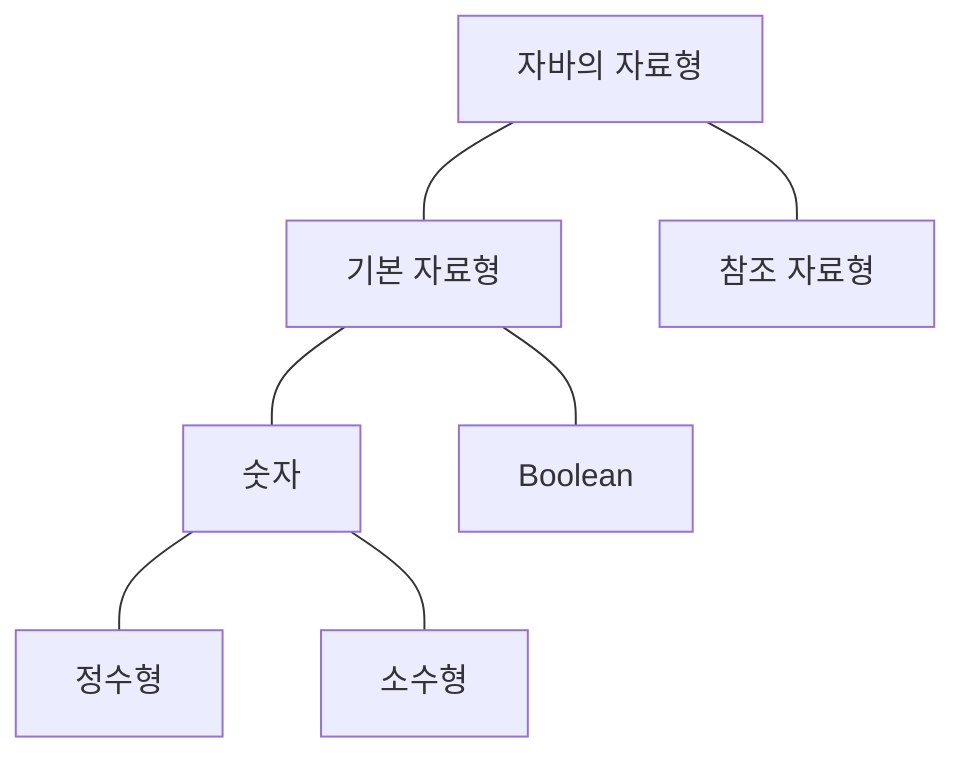
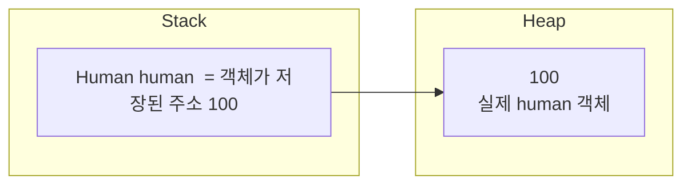

# 자료형

자바에서 자료형은 <strong>기본 자료형(Primitive Type)</strong>과 <strong>참조 자료형(Reference Type)</strong>이 있다.



## 기본 자료형 (Primitive Type)

기본 자료형은 총 8가지가 있다. 아래와 같이 각 자료형이 표현할 수 있는 범위의 값 자체가 변수에 직접 저장된다. JVM의 스택 영역에 저장되며 빠른 연산이 가능하다.

| 자료형     | 설명            | 범위                                   |
|---------|---------------|--------------------------------------|
| byte    | 8 bit 정수형     | -2<sup>7</sup> ~ 2<sup>7</sup> - 1   |
| short   | 16 bit 정수형    | -2<sup>15</sup> ~ 2<sup>15</sup> - 1 |
| int     | 32 bit 정수형    | -2<sup>31</sup> ~ 2<sup>31</sup> - 1 |
| long    | 64 bit 정수형    | -2<sup>63</sup> ~ 2<sup>63</sup> - 1 |
| float   | 32 bit 부동 소수점 | 1.4E-45 ~ 3.4028235E38                |
| double  | 64 bit 부동 소수점 | 4.9E-324 ~ 1.7976931348623157E308               |
| char    | 8 bit 유니코드    | 0 ~ 2<sup>16</sup> - 1               |
| boolean | 1 bit 논리형     | 0 or 1                               |

```java
byte b = 1;
short s = 2;
int i = 3;
long l = 4;
float f = 5.0f;
double d = 6.0;
char c = 'c';
boolean bool = false;

System.out.println("byte : " + b);
System.out.println("short : " + s);
System.out.println("int : " + i);
System.out.println("long : " + l);
System.out.println("float : " + f);
System.out.println("double : " + d);
System.out.println("char : " + c);
System.out.println("bool : " + bool);
```

```
byte : 1
short : 2
int : 3
long : 4
float : 5.0
double : 6.0
char : c
bool : false
```


### 부호가 있는 정수형의 표현
정수형의 기본 자료형은 byte, short, int, long, char 이다. 우선 char를 제외하고 나머지는 자바에서 모두 부호가 있는 (signed) 정수형으로 표현한다.

가장 작은 byte로 예를 들었을 때, 1 byte = 8 bit 이므로 0과 1로 표현할 수 있는 공간은 총 8칸이다.

가장 첫번째 자리는 부호를 표현한다. <strong>(모든 칸을 1로 채워도 표현할 수 있는 범위가 255이 아닌 -128 ~ 127 사이인 이유다) </strong> 첫번째 자리가 0이면 양수, 1이면 음수다. 

예를들어 최대값인 127은 다음과 같다
| 2<sup>7</sup> | 2<sup>6</sup> | 2<sup>5</sup> | 2<sup>4</sup> | 2<sup>3</sup> | 2<sup>2</sup> | 2<sup>1</sup> | 2<sup>0</sup> |
| --- | --- | --- | --- | --- | --- | --- | --- |
| 0 | 1 | 1 | 1 | 1 | 1 | 1 | 1 |

최솟값인 -128은 다음과 같다. 첫번째 칸은 부호를 위한 용도니까 사용하면 안되는것 아니냐라고 하지만 음수를 표현하기 위해 컴퓨터는 2의 보수법을 사용하므로 -128까지의 범위가 가능하다. (2의 보수법은 별도로 정리)
| 2<sup>7</sup> | 2<sup>6</sup> | 2<sup>5</sup> | 2<sup>4</sup> | 2<sup>3</sup> | 2<sup>2</sup> | 2<sup>1</sup> | 2<sup>0</sup> |
| --- | --- | --- | --- | --- | --- | --- | --- |
| 1 | 0 | 0 | 0 | 0 | 0 | 0 | 0 |

### 정수 언더플로우 & 오버플로우
위 처럼 자료형마다 표현할 수 있는 숫자형의 범위가 제한되다 보니, 이 범위를 초과하는 연산을 하면 오버플로우가 발생하여 원하지 않는 값이 나올 수 있다.

- byte형의 최솟값인 -128에서 -1 빼기
    ```java
    byte byteMin = -128;
    byteMin = (byte)(byteMin - 1);
        
    System.out.println(byteMin); // 127 출력
    ```

    위에 예시 처럼, -128은 1000 000이다. 여기서 1을 빼면 0111 1111이 되는데 이 값을 정수로 표현하면 127이다.
    <br>

- byte형의 최댓값인 127에서 +1 더하기
    ```java
    byte byteMax = 127;
    byteMax = (byte)(byteMax + 1);

    System.out.println(byteMax); // -128 출력
    ```

    127은 0111 1111이다. 여기서 1을 더하면 1000 0000이 되는데 이 값을 정수로 표현하면 -128이다.

### 소수형
float, double 모두 부동 소수점 표현 방식을 사용한다. 부동 소수점이란 실수를 컴퓨터상에서 근사하여 표현할 때 소수점의 위치를 고정하지 않고 그 위치를 나타내는 수를 따로 적는 것으로, 유효숫자를 나타내는 <strong>가수</strong>와 소수점의 위치를 풀이하는 <strong>지수</strong>로 나누어 표현하는 방식이다. 표현하는 방식은 <a>여길 참고하자<a href="https://ko.wikipedia.org/wiki/%EB%B6%80%EB%8F%99%EC%86%8C%EC%88%98%EC%A0%90#:~:text=%EB%B6%80%EB%8F%99%EC%86%8C%EC%88%98%EC%A0%90(%E6%B5%AE%E5%8B%95%E5%B0%8F%E6%95%B8%E9%BB%9E,%E6%8C%87%E6%95%B8)%EB%A1%9C%20%EB%82%98%EB%88%84%EC%96%B4%20%ED%91%9C%ED%98%84%ED%95%9C%EB%8B%A4."></a>

float, double이 나타낼 수 있는 소수를 표현할 수 있는 자릿수는 다음과 같다
- float : 부호(1자리) + 지수(8자리) + 가수(23자리) = 32 bit
- double: 부호(1자리) + 지수(11자리) + 가수(52자리) = 64 bit

두 타입 모두 정수형과 마찬가지로 제공할 수 있는 범위를 넘어서게 되면 값의 정확도를 보장하지 못한다. 그래서 돈 계산과 같이 정확한 값이 필요한 자료형에 `java.math.BigDecimal` 클래스를 사용한다. 


## 참조 자료형 (Reference Type)
참조 자료형은 기본 자료형을 제외한 나머지다. 배열, 문자열, 인터페이스, 열거형, 객체등이 있다. 

참조 자료형의 변수는 실제 값이 아닌, 값이 저장된 메모리 주소(참조)가 저장된다. 실제 값은 jvm의 힙 영역에 저장되고 스택 영역에는 주소(참조)가 저장된다. 변수는 저장된 주소를 통해 실제 값에 접근한다.


간단하게 Human 클래스를 작성해서 예를 들어보자.
```java
public class Human {
    private String name;

    public Human(String name) {
        this.name = name;
    }

    public String getName() {
        return this.name;
    }
}
```

```java
Human human = new Human("James");
```

참조형 타입인 Human 클래스의 객체를 생성하고 human 변수에 초기화 한다. 이 때 스택 영역에서는 human 변수에 객체가 저장된 힙 영역의 메모리 주소를 저장하고. 힙 영역에서는 실제 객체를 저장한다.

아래 그림 처럼 객체가 실제로 힙 영역의 100번지 주소에 저장되어 있다면, 스택 영역의 참조형 변수는 100이라는 주소값을 가지고 힙 영역에 있는 실제 객체를 찾는다.



## Pass By Value & Pass By Reference
기본 자료형과 참조 자료형의 매개변수는 메소드를 호출할 때 내부에서 처리되는 과정의 차이가 있다.

### Pass By Value
먼저 Pass By Value는 복사된 데이터를 전달해서 값을 수정해도 원본의 데이터는 영향을 주지 않는 방식이다. 예를 들어 passByValue라는 메소드 내부에서 인자로 넘어온 기본형 타입인 정수 a, 소수 b를 수정하는 코드를 다음과 같이 구현했다.
```java
public class ReferencePass {
    public void passByValue(int a, float b) {
        a = 10;
        b = 5.0f;

        System.out.println("In Pass By Value");
        System.out.println("a : " + a);
        System.out.println("b : " + b);
    }
}
```

main 메소드에서 인자로 넘겨줄 변수를 각각 선언하고 passByValue를 호출해서 원본 변수들의 전과 후를 비교해보자.
```java
public static void main(String[] args) {
    ReferencePass referencePass = new ReferencePass();

    int a = 0;
    float b = 0.0f;

    System.out.println("Before Pass By Value");
    System.out.println("a : " + a); // 10
    System.out.println("b : " + b); // b

    referencePass.passByValue(a, b);

    System.out.println("After Pass By Value");
    System.out.println("a : " + a); // 10
    System.out.println("b : " + b); // b
}
```

결과는 다음과 같다. main 메소드에서 초기화한 정수 a, 문자열 b 변수를 passByValue 메소드의 인자로 넘겨 내부에서 값을 수정해도 원본에는 영향을 주지 않는 것을 확인할 수 있다.
```
Before Pass By Value
a : 0
b : 0.0
In Pass By Value
a : 10
b : 5.0
After Pass By Value
a : 0
b : 0.0
```

결론적으로 자바에서 기본형 타입의 매개변수를 넘겨줄때는 Pass By Value로 데이터를 전달한다.

### Pass By Reference

위에서 작성한 Human 클래스를 활용해서 예시를 들어보자.
```java
public class Human {
    private String name;

    public Human(String name) {
        this.name = name;
    }

    public String getName() {
        return this.name;
    }
}
```


