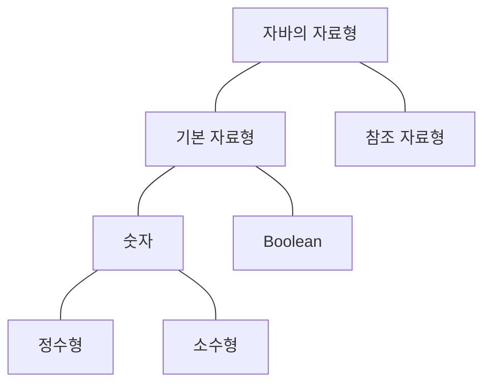

# 자료형

자바에서 자료형은 <strong>기본 자료형(Primitive Type)</strong>과 <strong>참조 자료형(Reference Type)</strong>이 있다.



## 기본 자료형 (Primitive Type)

제공하는 기본 자료형은 총 8가지다.

| 자료형     | 설명            | 범위                                   |
|---------|---------------|--------------------------------------|
| byte    | 8 bit 정수형     | -2<sup>7</sup> ~ 2<sup>7</sup> - 1   |
| short   | 16 bit 정수형    | -2<sup>15</sup> ~ 2<sup>15</sup> - 1 |
| int     | 32 bit 정수형    | -2<sup>31</sup> ~ 2<sup>31</sup> - 1 |
| long    | 64 bit 정수형    | -2<sup>63</sup> ~ 2<sup>63</sup> - 1 |
| float   | 32 bit 부동 소수점 | -3.40E+38 ~ 3.40E+38                 |
| double  | 64 bit 부동 소수점 | 1.79E+308 ~ 1.79E+308                |
| char    | 8 bit 유니코드    | 0 ~ 2<sup>16</sup> - 1               |
| boolean | 1 bit 논리형     | 0 or 1                               |

### 부호가 있는 정수형의 표현
정수형의 기본 자료형은 byte, short, int, long, char 이다. 우선 char를 제외하고 나머지는 자바에서 모두 부호가 있는 (signed) 정수형으로 표현한다.

가장 작은 byte로 예를 들었을 때, 1 byte = 8 bit 이므로 0과 1로 표현할 수 있는 공간은 총 8칸이다.

가장 첫번째 자리는 부호를 표현한다. <strong>(모든 칸을 1로 채워도 표현할 수 있는 범위가 255이 아닌 -128 ~ 127 사이인 이유다) </strong> 첫번째 자리가 0이면 양수, 1이면 음수다. 

예를들어 최대값인 127은 다음과 같다
| 2<sup>7</sup> | 2<sup>6</sup> | 2<sup>5</sup> | 2<sup>4</sup> | 2<sup>3</sup> | 2<sup>2</sup> | 2<sup>1</sup> | 2<sup>0</sup> |
| --- | --- | --- | --- | --- | --- | --- | --- |
| 0 | 1 | 1 | 1 | 1 | 1 | 1 | 1 |

최솟값인 -128은 다음과 같다. 첫번째 칸은 부호를 위한 용도니까 사용하면 안되는것 아니냐라고 하지만 음수를 표현하기 위해 컴퓨터는 2의 보수법을 사용하므로 -128까지의 범위가 가능하다. (2의 보수법은 별도로 정리)
| 2<sup>7</sup> | 2<sup>6</sup> | 2<sup>5</sup> | 2<sup>4</sup> | 2<sup>3</sup> | 2<sup>2</sup> | 2<sup>1</sup> | 2<sup>0</sup> |
| --- | --- | --- | --- | --- | --- | --- | --- |
| 1 | 0 | 0 | 0 | 0 | 0 | 0 | 0 |

### 정수 언더플로우 & 오버플로우
위 처럼 자료형마다 표현할 수 있는 숫자형의 범위가 제한되다 보니, 이 범위를 초과하는 연산을 하면 오버플로우가 발생하여 원하지 않는 값이 나올 수 있다.

- byte형의 최솟값인 -128에서 -1 빼기
    ```java
    byte byteMin = -128;
    byteMin = (byte)(byteMin - 1);
        
    System.out.println(byteMin); // 127 출력
    ```

    위에 예시 처럼, -128은 1000 000이다. 여기서 1을 빼면 0111 1111이 되는데 이 값을 정수로 표현하면 127이다.
    <br>

- byte형의 최댓값인 127에서 +1 더하기
    ```java
    byte byteMax = 127;
    byteMax = (byte)(byteMax + 1);

    System.out.println(byteMax); // -128 출력
    ```

    127은 0111 1111이다. 여기서 1을 더하면 1000 0000이 되는데 이 값을 정수로 표현하면 -128이다.

