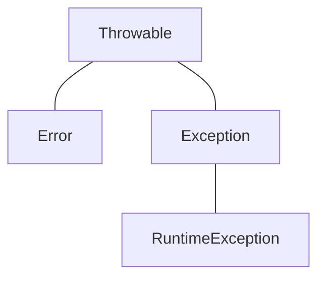

# Exception

“우리가 예상한, 혹은 예상치 못한 일이 발생하는 것을 미리 예견하고 안전장치를 하는 것”

프로그램의 실행 도중 발생할 수 있는 상황에 대해서 개발자가 처리할 수 있는 오류 상황을 이야기 한다.

## JVM 환경에서 도는 프로그램의 예외를 전혀 처리(catch) 하지 않았을 경우

프로그램의 실행도중 발생하는 예외를 처리해주지 않고 메인 메소드까지 예외가 전달되면 메인 메소드는 예외를 JVM까지 던진다. 이후 JVM은 오류 메세지를 보여주고 프로그램을 종료시킨다.

배열의 크기보다 큰 인덱스로 배열에 접근하면 발생하는 ArrayIndexOutOfBoundsException을 예시로 테스트 해보자.

```java
public static void main(String[] args) {
    int num = 5;
    int result = num / 0;
}
```
실행 결과
```
Exception in thread "main" java.lang.ArrayIndexOutOfBoundsException: Index 5 out of bounds for length 5
```

## 예외 처리

### try-catch
자바에서 예외를 처리하기 위해선 try-catch 구문을 사용한다. try 블록 내부에 예외가 발생할 수 있는 코드를 작성하고, catch 괄호안에 예외가 발생했을때 catch 블록 내부의 코드가 실행된다.
```java
public static void main(String[] args) {
    try {
        int[] array = new int[5];
        System.out.println(array[5]);
        System.out.println("예외 발생 이후");
    } catch (ArrayIndexOutOfBoundsException e) {
        System.out.println("예외 발생");
    }
}
```

실행 결과
```
예외 발생
```

위 실행 결과를 보면 알 수 있듯이, try-catch 블록을 사용할 때 try 블록 내부에서 예외가 발생하면 예외가 발생한 코드 이후에 있는 코드들은 실행되지 않고 바로 catch 블록의 코드가 실행된다.

## try-catch-finally
try-catch 구문의 마지막에 사용할 수 있는 finally 블록 내부의 코드는 try-catch 블록에서 예외가 발생하지 않아서 try 블록만 실행됬건, 예외가 발생해서 catch 구문이 실했된건간에 무조건 맨 마지막에 실행된다. 주로 try-catch 각각의 블록에 중복된 코드를 처리할 때 사용하거나 파일 시스템에서 파일 시스템 객체를 닫을 때 사용한다.

**예외가 발생하지 않았을 때**
```java
public static void main(String[] args) {
    try {
        int[] array = new int[5];
        System.out.println(array[4]);
    } catch (ArrayIndexOutOfBoundsException e) {
        System.out.println("예외 발생");
    } finally {
        System.out.println("Finally 블록 실행");
    }
}
```
실행 결과
```
> Task :Java.main()
0
Finally 블록 실행
```

**예외가 발생했을 때**
```java
public static void main(String[] args) {
    try {
        int[] array = new int[5];
        System.out.println(array[5]); // 배열의 초과 인덱스 접근
    } catch (ArrayIndexOutOfBoundsException e) {
        System.out.println("예외 발생");
    } finally {
        System.out.println("Finally 블록 실행");
    }
}
```
실행 결과
```
> Task :Java.main()
예외 발생
Finally 블록 실행
```

### 두 개 이상의 catch
catch 블록은 여러개를 작성할 수 있다. try 블록에서 예외가 발생했을 때, 예외를 처리해줄 catch 블록은 위에서부터 아래로 차례대로 검색된다. 따라서 상위 클래스의 예외를 처리하는 catch 블록이 하위 클래스의 예외를 처리하는 catch 블록보다 위에 있다면 하위 클래스의 catch 블록은 실행되지 않는다.

```java
public static void main(String[] args) {
    try {
        int[] array = new int[5];
        System.out.println(array[5]);
    } catch (Exception e) {
        System.out.println("예외 발생");
    } catch (ArrayIndexOutOfBoundsException e) {
        System.out.println("예외 발생");
    }
}
```
실행 결과
```
error: exception ArrayIndexOutOfBoundsException has already been caught
```
ArrayIndexOutOfBoundsException의 상위 클래스인 Exception을 맨 위에 작성했다. 이 경우 Exception을 상속받고 있는 ArrayIndexOutOfBoundsException의 catch 블록이 실행될 일이 없다. 따라서 컴파일에러가 발생한다.

## throw & throws
### throw
throw 키워드를 사용해 예외를 직접 발생시킬 수 있다. 1년에 열두 달을 처리하는 로직이 있을 때, 매개변수에 13월이 넘어왔다면 다음과 같이 예외를 발생할 수 있다.
```java
public void month(int month) {
    if (month > 12) {
        throw new RuntimeException("Number is over than 12");
    }

    // 나머지 로직 생략
}
```

### throws
throws 키워드는 예외가 발생했을 때 호출한 메소드로 예외가 전달된다. 메소드에서 두가지 이상의 예외가 발생할 수 있을 경우에는 콤마(,)로 메소드에서 발생한 예외를 구분해준다.
```java
public void getMonth(int month) throws Exception {
    if (month > 12) {
        throw new Exception("Number is over than 12");
    }

    // 나머지 로직 생략
}
```

위 경우에는 만약 호출한 메소드에서 try-catch 블록을 통해 전달받은 예외를 처리해주지 않으면 컴파일 에러가 발생한다. 물론 호출한 메소드에서 throws 키워드를 사용해 전달받은 에러를 그대로 다시 전달할 수 있지만 권장되진 않는다.


## 에외의 종류
자바에서 존재하는 예외의 종류는 총 3가지이다.

### Error
에러는 자바 프로그램 밖에서 발생한 예외를 말한다. 예를들어 서버의 디스크 고장, 메인보드 에러 등이 있다. 따라서 Error와 Exception의 가장 큰 차이는 자바 프로그램 안에서 발생했는지, 밖에서 발생했는지 여부이다 (에러는 프로세스, 예외는 쓰레드에 영향을 준다). 대표적으로 JVM에서 Heap 메모리가 부족할때 발생하는 OutOfMemoryError가 있다.

### Checked Exception

자바에서 있는 예외, 컴파일러가 예외처리를 제대로 하는지 확인(check) 해준다. 예외가 발생하는 코드에서 `try-catch` 블록을 사용해 처리를 해주거나, 처리를 안 할 경우 그 사실을 메소드 시그니처 옆에 표기해야 한다.

Exception 클래스를 상속받아서 커스텀한 Checked 예외를 만들어보자.

```java
package com.study.sj.exception;

public class UserNotFoundException extends Exception {
    public UserNotFoundException() {
        super();
    }

    public UserNotFoundException(String message) {
        super(message);
    }

    public UserNotFoundException(String message, Throwable cause) {
        super(message, cause);
    }

}
```

아래 처럼 Checked 예외를 사용하는 메소드 내부에서 별도로 `try-catch` 블록을 통해 예외처리를 해주지 않으면 메소드 시그니처 옆에 throws와 함께 명시를 해줘야 한다.

```java
class MemberService {
    public void findUser(String userName) throws UserNotFoundException {
        throw new UserNotFoundException();
    }
}
```

메인 메소드에서 사용하려면 컴파일러가 예외를 처리하는지 검사하고 핸들링 로직이 없는 경우에는 컴파일 오류를 낸다.

```java
public static void main(String[] args) {
        MemberService memberService = new MemberService();
        memberService.findUser("username");
    }
```
실행 결과
```
error: unreported exception UserNotFoundException; must be caught or declared to be thrown
```

예시처럼 Checked 예외는 메소드별로 발생할 수 있는 예외를 프로그래머가 쉽게 특정할 수 있다는 장점이 있다.

대표적인 종류는 다음과 같다

- IOException
- SQLException
- TimeoutException
- 등등

### Unchecked Exception

RuntimeException을 상속받고 컴파일러가 예외에 대한 처리를 검사해주지 않는다. 런타임 예외 (Runtime Exception)이라고도 한다.

대표적인 종류는 다음과 같다

- ArithmeticException
- BufferOverflowException
- ClassCastException
- 등등

## Throwable
Exception과 Error 클래스는 모든 Throwable 클래스를 상속받는다. Exception과 Error 클래스의 성격은 다르지만 예외 처리에 사용하는 공통된 메소드를 둘 다 사용하기 위함이다.

Throwable 클래스가 제공하는 대표 메소드들은 다음과 같다.
- getMessage: 예외 메세지를 문자열로 반환한다. 
- toString: getMessage 메소드보다 더 자세한 예외 메세지를 문자열로 반환한다.
- printStackTrace: 첫 줄에는 예외 메세지를 출력하고, 두 번째 줄부터는 예외가 발생하게 된 메소드들의 호출 관계(스택 트레이스)를 출력해준다.

## 나만의 예외 만들기

프로그래머가 정의하는 커스텀한 예외는 Exception과 RuntimeException을 상속받아 만들 수 있다. 아래는 RuntimeException을 상속받은 예시를 들어보자.
```java
package com.study.sj.exception;

public class UserNotFoundException extends RuntimeException {
    public UserNotFoundException() {
        super();
    }

    public UserNotFoundException(String message) {
        super(message);
    }

    public UserNotFoundException(String message, Throwable cause) {
        super(message, cause);
    }
}
```

- RuntimeException의 생성자를 호출해줘야 한다.
- 생성자는 여러가지의 매개변수로 오버로딩 되어있으나, 가급적이면 보편적인 예외 형식을 유지하기 위해 message, cause를 커스텀 예외에서 받아서 부모 생성자로 넘겨주는것이 좋다.
- 만든 예외의 message는 getMessage(), cause는 getCause로 확인 가능하다.