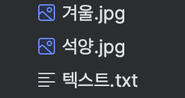

# File

## I/O
I/O란 입력과 출력을 통칭하는 용어이다. JVM을 기준으로 프로그램에 있는 어떤 내용을,
- 파일을 읽거나 저장할 일이 있을 때
- 다른 서버나 디바이스로 보내거나 받을 일이 있을 때

사용한다. 

JDK 1.4 이전에는 InputStream, OutputStream 클래스 처럼 스트림이라는 클래스를 사용해 외부 데이터를 처리했다. 스트림은 끊기지 않고 연속적인 데이터를 표현하는 용어이다. JDK 1.4 이후에는 스트림이 아닌 채널과 버퍼 기반으로 데이터를 처리하는 NIO가 추가되었다. 마지막으로 JDK 7에서는 NIO2 라는것이 추가되었다. 

## File
자바가 제공하는 File 클래스는 파일과 디렉터리를 다루고 파일의 경로 정보를 통제하는 클래스이다. JDK 7 이전에 파일 시스템을 다루기 위해 사용한 클래스이다 JDK 7 이후는 java.nio.file 패키지의 Files 클래스를 사용한다.

File 클래스의 생성자는 다음과 같다. 
| 생성자 | 설명 |
| --- | --- |
| File(File parent, String child) | 이미 생성되어 있는 File 객체(parent)와 그 경로의 하위 경로 이름으로 새로운 File 객체를 생성한다 |
| File(String pathname) | 지정한 경로 이름으로 File 객체를 생성한다 |
| File(String parent, String child) | 상위 경로(parent)와 하위 경로(child)로 File 객체를 생성한다 |
| File(URI uri) | URI에 따른 File 객체를 생성한다 |

### 파일의 경로와 디렉터리 다루기
File 클래스의 exists 메소드를 사용하면 해당 파일 객체의 경로가 존재 여부를 반환한다.
```java
public class Files {
    public void checkPath(String pathName) {
        File file = new File(pathName);
        System.out.println(file.exists());
    }
}
```

File 클래스를 활용하여 디렉터리를 생성해보자. 디렉터리는 mkdir, mkdirs 메소드를 사용해 생성할 수 있다. mkdir는 하위 디렉터리를 한개만, mkdirs는 하위 디렉터리를 여러개 생성한다. 아래는 mkdir 메소드를 사용한 예시이다. 
```java
public class Files {
    public void mkDir(String pathName) {
        File file = new File(pathName);
        boolean result = file.mkdir();
    }
}
```

### 파일 생성하기
createNewFile 메소드를 사용해 파일을 생성해보자. createNewFile 메소드는 IOException을 throw 하기 때문에 별도의 try-catch 블록으로 감싸줘야 한다.
```java
public void createFile(String pathName, String fileName) {
    File file = new File(pathName, fileName);

    try {
        boolean result = file.createNewFile();
        System.out.println(result);
    } catch (IOException e) {
        throw new RuntimeException(e);
    }
}
```

### 파일과 디렉터리의 정보 가져오기
파일과 디렉터리에 대한 정보를 반환하는 주요 메소드의 목록은 다음과 같다.
```java
public class Files {
    public void checkFileMethods(String pathName) {
        File file = new File(pathName);

        System.out.println(file.isDirectory()); // 디렉터리 여부
        System.out.println(file.isFile()); // 파일 여부
        System.out.println(file.isHidden()); // 숨겨진 파일 여부

        System.out.println(file.canRead()); // 읽는 권한
        System.out.println(file.canWrite()); // 쓰는 권한

        System.out.println(file.getPath()); // 경로
        System.out.println(file.getName()); // 파일명
        System.out.println(file.getAbsolutePath()); // 절대 경로
        System.out.println(file.getParent()); // 파일명을 제외한 경로

        
        System.out.println(new Date(file.lastModified())); // 최종수정일
    }
}
```

### 디렉터리에 있는 목록을 살펴보기 위한 메소드
디렉터리에 있는 파일의 목록을 확인하기 위한 메소드 목록을 아래와 같다.
| 메소드 | 설명 |
| --- | --- |
| static File[] listRoots() | JVM이 수행되는 OS에서 사용중인 파일 시스템의 루트(root) 디렉터리 목록을 File 배열로 리턴한다. static 메소드이므로, File 객체를 별도로 생성할 필요는 없다|
| String[] list() | 현재 디렉터리의 하위에 있는 목록을 String 배열로 리턴한다|
| String[] list(FilenameFIlter filter) | 현재 디렉터리의 하위에 있는 목록 중, 매개 변수로 넘어온 filter의 조건에 맞는 목록을 String 배열로 리턴한다|
| File[] listFiles() | 현재 디렉터리의 하위에 있는 목록 File 배열로 리턴한다|
| File[] listFiles(FileFilter filter) | 현재 디렉터리의 하위에 있는 목록 중 매개 변수로 넘어온 filter의 조건에 맞는 목록을 File 배열로 리턴한다|
| File[] listFiles(FilenameFilter filter) | 현재 디렉터리의 하위에 있는 목록 중 매개 변수로 넘어온 filter의 조건에 맞는 목록을 File 배열로 리턴한다|

#### FileFilter, FilenameFiler
FileFilter와 FilenameFilter는 특정 조건에 맞는 파일들의 목록을 걸러내기 위한 인터페이스이다. 각각 인터페이스에 선언되어 있는 accept 메소드를 구현한 내용에 따라서 list와 관련된 메소드를 실행할때 accept 메소드가 자동으로 실행되어 조건에 맞는 파일 리스트를 필터링한다. 

**FileFilter 인터페이스**
| 메소드 | 설명 |
| --- | --- |
| boolean accept(File pathname) | 매개 변수로 넘어온 File 객체가 조건에 맞는지 확인한다 |

구현 예시는 다음과 같다.
```java
public class JPGFileFilter implements FileFilter {
    @Override
    public boolean accept(File file) {
        if(file.isFile()) {
            String fileName = file.getName();

            if(fileName.endsWith(".jpg")) {
                return true;
            }
        }

        return false;
    }
}
```

**FilenameFilter 인터페이스**
| 메소드 | 설명 |
| --- | --- |
| boolean accept(File dir, String name) | 매개 변수로 넘어온 디렉터리(dir)에 있는 경로나 파일 이름(name)이 조건에 맞는지 확인한다 |

구현 예시는 다음과 같다.
```java
public class JPGFilenameFilter implements FilenameFilter {
    @Override
    public boolean accept(File dir, String name) {
        if(name.endsWith(".jpg")) {
            return true;
        }

        return false;
    }
}
```

특정 디렉토리에 ".jpg" 확장자로 끝나는 파일명 리스트를 출력하기 위해 listFiles 메소드에 위에서 구현한 JPGFileFilter와 JPGFilenameFilter를 매개변수로 넘겨주면 된다.
```java
public class Files{
    public void getJpgFileList(String pathName) {
        File file = new File(pathName);

        File[] files = file.listFiles(new JPGFileFilter());

        for(File f: files) {
            System.out.println(f.getName());
        }
    }

    public void getJpgFileNameList(String pathName) {
        File file = new File(pathName);

        File[] files = file.listFiles(new JPGFilenameFilter());

        for(File f: files) {
            System.out.println(f.getName());
        }
    }
}
```

아래와 같이 디렉토리에 파일의 목록이 있다면, 위 메소드를 각각 실행했을때 결과는 다음과 같다.



실행 결과
```
> Task :Java.main()
석양.jpg
겨울.jpg
```

## InputStream, OutputStream
자바의 I/O는 추상 클래스인 InputStream, OutputStream에 의해 제공된다. 각각의 추상 클래스를 상속받은 자식 클래스로 데이터를 읽고 쓴다.

### InputStream

InputStream 클래스의 선언문은 다음과 같다.
```java
public abstract class InputStream implements Closeable
```

여기서 Closeable 인터페이스는 자바에서 어떤 자원(파일, 네트워크 연결)등을 사용한 후에 안전하게 닫을 수 있는 메소드인 close 메소드를 가지고 있다. 해당 인터페이스를 구현하면 리소스의 사용이 끝난 후 close 메소드로 반드시 닫아줘야 프로그램이 메모리 리소스를 오랫동안 점유하는 리소스 누수 현상이 발생하지 않는다.

InputStream을 상속한 클래스는 매우 많지만 자주 사용하는 스트림은 다음과 같다.
| 클래스 | 설명 |
| --- | --- |
| FileInputStream | 파일을 읽는데 사용한다. 주로 우리가 쉽게 읽을 수 있는 텍스트 파일을 읽기 위한 용도라기보다 이미지와 같이 바이트 코드로 된 데이터를 읽을 때 사용한다 |
| FilterInputStream | 다른 입력 스트림을 포괄하며, 단순히 InputStream 클래스가 Override 되어있다 |
| ObjectInputStream | ObjectOutputStream으로 저장한 데이터를 읽는데 사용한다 |

이 중에서 FilterInputStream의 생성자는 protected로 되어있다. 따라서 FilterInputStream의 기능을 확장한 자식 클래스가 객체를 생성하여 사용한다. 

```java
public class FilterInputStream extends InputStream {
    // 나머지 생략
    protected FilterInputStream(InputStream in) {
            this.in = in;
        }
}
```


자식 클래스의 종류는 입력 스트림에 버퍼링을 제공하는 BufferedInputStream, int, double과 같은 기본 데이터 형식을 읽을 수 있는 DataInputStream, 데이터를 암호화된 상태로 읽을 수 있는 CipherInputStream 등이 있다.

### OutputStream
OutputStream 클래스의 선언문은 다음과 같다.
```java
public abstract class OutputStream implements Closeable, Flushable
```

InputStream과 마찬가지로 Closeable 인터페이스를 확장한다. Flushable 인터페이스는 OutputStream 버퍼에 저장된 데이터를 바로 write할 수 있는 메소드인 flush 메소드를 가지고 있다.

OutputStream에 구현된 메소드들은 다음과 같다.
| 메소드 | 설명 |
| --- | --- |
| void write(byte[] b) | 매개 변수로 받은 byte 배열을 저장한다 |
| void write(byte[] b, int off, int len) | 매개 변수로 받은 byte 배열을 특정 위치(off) 부터 특정 길이 (len) 만큼 저장한다  |
| abstract void write(int b) | 매개 변수로 받은 바이트를 저장한다. 타입은 int이지만 실제 저장되는 타입은 byte이다 |
| void flush()  | 버퍼에 대기하고 있는 데이터를 강제로 저장한다 |
| void close() | 쓰기 위해 열어둔 스트림을 해제한다 |


## Reader & Writer
Reader와 Writer는 일반적으로 텍스트 에디터에서 볼 수 있는 char 기반의 문자열을 처리하기 위한 추상 클래스다. 

### Writer
Writer 클래스의 선언부는 다음과 같다.

```java
public abstract class Writer implements Appendable, Closeable, Flushable
```
Appendable 인터페이스는 매개 변수로 넘어온 문자열을 추가하는 역할을 담당하는 메소드들이 선언되어 있다. Writer 클래스는 append, write 메소드를 사용해 매개변수로 넘어온 문자나 문자열을 파일에 쓴다.

자바에서 텍스트를 파일로 쓰기 위해서는 Writer 클래스를 확장한 FileWriter나 BufferedWriter 클래스를 사용한다. FileWriter를 쓰게되면 append, writer 메소드를 호출할때마다 파일에 저장하게 되는데 이보다 효율적인 저장방식을 구현한 BufferedWriter 클래스를 사용하면 문자열을 버퍼라는 공간에 저장해두었다가 버퍼가 다 차게되면 파일에 저장한다.

WriterTest 클래스 내부에 numCount 만큼의 숫자를 파일에 쓰는 writeFile 메소드를 구현해보자.
```java
public class WriterTest {

    public void writeFile(String fileName, int numCount) {
        FileWriter fileWriter = null;
        BufferedWriter bufferedWriter = null;

        try {
            fileWriter = new FileWriter(fileName);
            bufferedWriter = new BufferedWriter(fileWriter);

            for (int i = 0; i < numCount; i++) {
                bufferedWriter.write(String.valueOf(i));
                bufferedWriter.newLine();
            }
        } catch (IOException e) {
            throw new RuntimeException(e);
        } finally {
            try {
                if (bufferedWriter != null) bufferedWriter.close();
            } catch (IOException e) {
                e.printStackTrace();
            }

            try {
                if (fileWriter != null) fileWriter.close();
            } catch (IOException e) {
                e.printStackTrace();
            }
        }
    }
}
```


numCount = 5를 주고 메소드를 실행한 결과 저장된 파일은 다음과 같다
```
0
1
2
3
4
```

### Reader
Reader 클래스의 선언부는 다음과 같다
```java
public abstract class Reader implements Readable, Closeable
```

Reader 클래스를 구현한 주요 클래스들은 BufferedReader, CharArrayReader, FilterReader, InputStreamReader, StringReader 등등이 있다. 이 중에 자주 사용하는 클래스는 BufferedReader와 InputStreamReader 이다.


간단하게 ReaderTest 클래스 내부에 위 Writer 예제에서 저장한 파일을 읽어오는 readFile 메소드를 구현해보자.
```java
public class ReaderTest {

    public void readFile(String fileName) {
        FileReader fileReader = null;
        BufferedReader bufferedReader = null;

        String data;

        try {
            fileReader = new FileReader(fileName);
            bufferedReader = new BufferedReader(fileReader);

            while ((data = bufferedReader.readLine()) != null) {
                System.out.println(data);
            }

        } catch (IOException e) {
            e.printStackTrace();
        } finally {
            try {
                if (bufferedReader != null) bufferedReader.close();
            } catch (IOException e) {
                e.printStackTrace();
            }

            try {
                if (fileReader != null) fileReader.close();
            } catch (IOException e) {
                e.printStackTrace();
            }
        }
    }
}
```

readFile 메소드 실행 결과
```
> Task :Java.main()
01234
```

텍스트 기반의 자료형을 처리하는 클래스인 Scanner를 활용해 아래와 같이 좀 더 간결하게 구현할 수 있다.
```java
public class ReaderTest {
    public void readFile(String fileName) {
        File file = new File(fileName);
        Scanner scanner = null;

        try {
            scanner = new Scanner(file);

            while (scanner.hasNextLine() != false) {
                System.out.println(scanner.nextLine());
            }

        } catch (IOException e) {
            e.printStackTrace();
        } finally {
            if (scanner != null) scanner.close();
        }
    }
}
```

### try-catch-finally

#### 리소스 담당 변수 선언 위치
FileReader, BufferedReader, FileWriter, BufferedWriter 객체들은 입출력 리소스를 사용하기 때문에 finally 블록에서 반드시 close 메소드를 호출해 자원을 해제하지 않으면 리소스 누수가 발생한다. Try 블록 내부에서 해당 변수들을 선언할 경우 try 블록의 스코프에서만 유효한 지역 변수가 되기 때문에 finally 블록에서 접근하려면 try 블록 외부에 변수를 선언해햐 한다.

아니면 아래와 같이 try-with-resource 구문을 활용할 수 있다

#### close 호출 순서
finally 블록 내부에서 close 메소드를 호출할 객체의 순서는 가장 마지막에 open 한 객체부터 닫아줘야 정상적인 처리가 가능하다. 예를들어 FileWriter -> BufferedWriter 순으로 객체를 생성했다면 BufferedWriter -> FileWriter 순으로 객체를 close 해줘야 한다.


