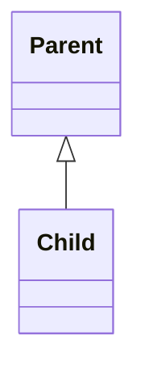

# Inheritance

상속은 이미 존재하는 클래스를 기반으로 새로운 클래스를 만드는 방법이다. 새로운 클래스는 기존 클래스의 동작을 그대로 물려받아 코드의 불필요한 중복을 방지할 수 있고, 새로운 동작이나 상태를 추가할 수 있다.

## 부모 클래스와 자식 클래스
이미 존재하는 클래스를 부모 클래스 (Parent Class), 혹은 기반 클래스 (Base Class)라고 한다.
```java
public class Parent {
    public void printName() {
        System.out.println("Parent's Name is");
    }
}
```

새로운 클래스를 자식 클래스(Child Class) 혹은 파생 클래스 (Derived Class)라고 한다. 클래스를 상속받을 땐 자바의 `extends` 키워드를 사용한다. "부모 클래스를 확장한다" 라는 표현을 사용하기도 한다. 자바는 다중상속이 불가능하므로 extends 키워드는 옆에 단 한개의 클래스만 받을 수 있다.
```java
public class Child extends Parent {
}

```

UML로 상속 관계의 객체를 표현할때는 속이 빈 삼각형 화살표를 사용한다.


부모 클래스를 상속받으면 자식 클래스는 부모 클래스의 기능을 그대로 사용할 수 있다. 아래를 예시로 자식 클래스에서 printName 메소드가 없어도 부모 클래스가 구현해놓은 printName 메소드를 그대로 사용할 수 있다.
```java
public static void main(String[] args) {
    Child child = new Child();
    child.printName();
}
```
실행 결과
```
> Task :Java.main()
Parent's Name is
```

## 상속 객체의 초기화 순서와 super

상속 관계에 있는 객체가 초기화 될 때는 다음과 같은 순서를 따른다
1. 메모리에 객체 생성
2. 부모 클래스의 생성자 호출
3. 자식 클래스의 생성자 호출

예시를 들어보자. 부모 클래스와 자식 클래스에 생성자가 호출된걸 알 수 있는 출력문을 각각 넣어주자.
```java
public class Parent {
    public Parent() {
        System.out.println("Parent Constructor");
    }
}
``` 
```java
public class Child extends Parent {
    public Child() {
        System.out.println("Child Constructor");
    }
}
```

메인 메소드에서 실행시켜보자.
```java
public static void main(String[] args) {
    Child child = new Child();
}
```
실행 결과
```
> Task :Java.main()
Parent Constructor
Child Constructor
```

실행 결과를 보면 부모 클래스의 생성자가 먼저 호출되고 나서 자식 클래스의 생성자가 호출되는 것을 확인할 수 있다. 자식 생성자 호출 시 부모 클래스에 별도로 정의된 생성자가 없으면 자동적으로 부모 클래스의 기본 생성자를 호출한다.

**만약 부모 클래스에 기본 생성자 외에 별도의 생성자가 정의되어 있다면 기본 생성자 호출이 불가능하다**.
```java
public class Parent {
    private String name;

    public Parent(String name) {
        this.name = name;
    }
}
```
메인 메소드에서 똑같이 자식 객체를 생성해보면 다음과 같은 컴파일 에러가 발생한다.
```
error: constructor Parent in class Parent cannot be applied to given types;
    public Child() {
```

이런 경우에는 자식 객체에서 별도로 정의되어 있는 부모 클래스의 생성자를 호출해줘야 한다. 자식 클래스에서 부모 클래스에 접근할 수 있는 자바의 키워드는 `super` 이다. 이 키워드를 사용해 부모 객체의 멤버 변수나 메소드에 접근이 가능하다. `super()`는 부모 클래스 생성자의 호출을 의미한다.
```java
public class Child extends Parent {
    public Child(String name) {
        super(name);
        System.out.println("Parent's name : " + super.getName());
    }
}
```

메인 메소드에서 실행해보면 결과는 다음과 같다
```java
public static void main(String[] args) {
    String name = "Parent";
    Child child = new Child(name);
}
```
실행 결과
```
> Task :Java.main()
Parent's name : Parent
```

## Override
상속은 부모 클래스를 기반으로 자식 클래스가 기능을 확장해 나가는 개념이다. 

부모 클래스에 정의되어 있는 <strong>동일한 메소드 시그니처 (접근 제한자, 리턴 타입, 메소드명 매개 변수 타입 및 개수)</strong>의 메소드를 자식 클래스에서 더 적합한 기능을 하도록 확장 할 수 있다. 이를 Overriding 이라고 한다.

부모 클래스에 name이라는 멤버 변수를 출력해주는 printName 메소드를 작성해보자.
```java
public class Parent {
    private String name;

    public Parent(String name) {
        this.name = name;
    }

    public void printName() {
        System.out.println("Parent's Name is " + this.name);
    }

    protected String getName() {
        return this.name;
    }
}
```

자식 클래스에서 동일한 메소드 시그니처를 가지는 printName 메소드를 출력 문구를 자식 클래스에 맞게 수정하도록 메소드를 Overriding 해보자.
```java
public class Child extends Parent {
    public Child(String name) {
        super(name);
    }

    public void printName() {
        System.out.println("Child's Name is " + this.getName());
    }
}
```

```java
public static void main(String[] args) {
    String name = "Child";

    Child child = new Child(name);
    child.printName();
}
```
메인 메소드에서 실행해보면 자식 클래스의 Overriding한 메소드가 실행이 되는 것을 확인 할 수 있다.
```
> Task :Java.main()
Child's Name is Child
```

### Overriding과 접근 제한자
자식 클래스에서 부모 클래스의 메소드를 Overriding 할 때 접근 제어자를 확장할 수 있다.

부모 클래스의 printName 메소드의 접근 제어자를 private으로 변경해보자.
```java
public class Parent {
    private String name;
    public Parent(String name) {
        this.name = name;
    }

    private void printName() {
        System.out.println("Parent's Name is " + this.name);
    }

    protected String getName() {
        return this.name;
    }
}
```

자식 클래스에서 Overriding한 printName 메소드의 접근 제한자는 public 이다.
```java
public class Child extends Parent {
    public Child(String name) {
        super(name);
    }

    public void printName() {
        System.out.println("Child's Name is " + this.getName());
    }
}
```

컴파일 후 실행해보면 문제없이 실행된다. (메인 메소드 호출 부분 생략)
```
> Task :Java.main()
Child's Name is Child
```

반대로 자식 클래스에서 부모 클래스의 메소드의 접근 제한자를 축소하려고 하면 컴파일 오류가 발생한다. 다시 부모 클래스의 printName의 접근 제한자를 public으로 원복하고 자식 클래스에서 private으로 overriding 해준다.
```java
public class Parent {
    private String name;
    public Parent(String name) {
        this.name = name;
    }

    public void printName() {
        System.out.println("Parent's Name is " + this.name);
    }

    protected String getName() {
        return this.name;
    }
}
```

```java
public class Child extends Parent {
    public Child(String name) {
        super(name);
    }

    private void printName() {
        System.out.println("Child's Name is " + this.getName());
    }
}
```

실행 결과 (메인 메소드 호출 부분 생략)
```
error: printName() in Child cannot override printName() in Parent
    private void printName() {
                 ^
  attempting to assign weaker access privileges; was public
```

자식 클래스에서 부모 클래스의 메소드를 오버라이딩 할 때 접근 제한자를 확장하는 것은 가능하지만, 접근 제한자를 축소하는 것은 불가능하다. 이런 특성은 상속 관계에서 자식 클래스에게 다형성을 지원하고, 더 많은 권한을 가질 수 있게 한다.

## 참조 자료형의 형 변환과 instanceof 연산자
상속 관계가 성립되면 부모 클래스 타입 변수에 자식 객체를 할당할 수 있다. (간략한 예시를 위해 Parent 클래스 멤버 변수인 name을 잠시 제거했다)
```java
Parent parent = new Child();
```

자식 클래스는 부모 클래스의 기능을 그대로 물려받았기 때문에 부모 클래스의 모든 기능을 사용할 수 있다. 따라서 위와 같이 부모 클래스 타입의 변수에 자식 객체를 할당했을 경우에는 컴파일러가 암시적으로 형변환을 해준다. 이를 묵시적 형변환 (implicit type casting)이라고 한다.

```java
Parent parent = (Parent) new Child();
```

반대로 자식 클래스 타입의 변수에 부모 객체를 할당하는 것은 케바케이다. 일반적으로 불가능하지만 프로그래머가 명시적 형변 (explicit type casting)환을 해주면 가능하다. 

**이 때 부모 타입의 실제 객체의 자식 타입이어야만 한다.**
```java
Child child = new Child();
Parent parent2 = child;

Child child2 = (Child) parent2;
```

이런 형변환은 상속 관계에 있는 객체들이 저장되어 있는 배열을 처리할 때 유용하다. 먼저 부모, 자식 클래스의 상속 관계에 있는 랜덤한 객체들을 생성해보자.
```java
Parent parent = new Parent();
Child child = new Child();
Parent parent1 = new Parent();
Child child1 = new Child();
Child child2 = new Child();

Parent[] array = new Parent[5];

array[0] = parent;
array[1] = child;
array[2] = parent1;
array[3] = child1;
array[4] = child2;
```

객체들을 부모 클래스 타입의 배열에 할당해준다. 위에서 알다시피 부모 클래스 타입 변수에 자식 객체를 할당하는것은 컴파일러가 알아서 부모 클래스 타입으로 캐스팅을 해준다. 따라서 각각의 타입에 따른 배열을 생성해 줄 필요 없이 부모 클래스 타입 배열에 모두 수용이 가능하다.

배열을 돌면서 자바에서 제공하는 instanceof 연산자를 사용해 객체가 특정 클래스에 인스턴스인지 판단한다. 사용법은 다음과 같다.
`<변수명> instanceof <클래스명>`

```java
    public static void main(String[] args) {
        // 배열 생성 생략

        for(Parent p: array) {
            if(p instanceof Child) {
                // Child 타입 객체
                Child tempChild = (Child) p;
                tempChild.printName();
            } else if (p instanceof Parent) {
                // Parent 타입 객체
                Parent tempParent = p;
                p.printName();
            }
        }
    }
```

실행 결과
```
> Task :Java.main()
Parent's Name is
Child's Name is
Parent's Name is
Child's Name is
Child's Name is
```

여기서 주의해야 할 점은 instanceof 연산자는 부모 클래스와 비교해도 결과는 true가 나온다. 따라서 첫번째 if-else 구문에 부모 객체와 instanceof 비교를 해버리면 전부 결과 true가 되어 전부 부모 클래스 타입의 분기문을 타게 된다.
```java
public static void main(String[] args) {
    // 배열 생성 생략

    for(Parent p: array) {
        if(p instanceof Parent) {
            System.out.println("Parent 타입");
        } else if (p instanceof Child) {
            System.out.println("Child 타입");
        }
    }
}
```

실행 결과
```
> Task :Java.main()
Parent 타입
Parent 타입
Parent 타입
Parent 타입
Parent 타입
```