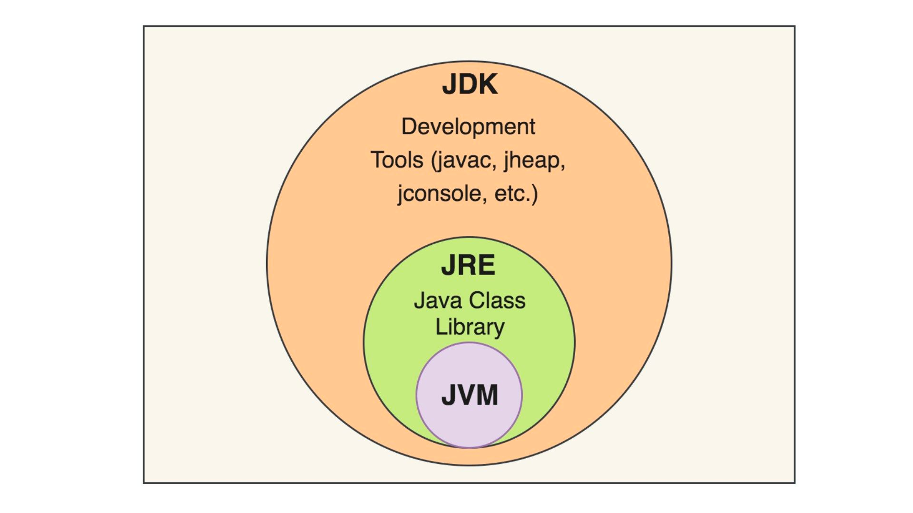

# JDK, JRE, JVM의 차이점

## JDK(JAVA Developing Kit)

JRE + 개발에 필요한 툴(javac, apt, javap, javadoc…)로 구성되어 있다.

JAVA 11부터는 오라클은 더이상 JRE을 제공하지 않고 JDK만 제공한다.

## JRE (Java Runtime Environment)

자바 애플리케이션을 **실행할 수 있도록 구성된 환경**이다.

JVM + 핵심 라이브러리 (Math, JDBC, Serialization, lang, util, I/O와 같은 핵심 라이브러리들과 자바를 실행하는데 필요한 프로퍼티 세팅, 리소스 파일로 구성)로 구성되어 있다.

## JVM (Java Virtual Machine)

자바 프로그램이 실행되는 절차는 다음과 같다.

JVM은 자바 가상 머신으로 바이트 코드(.class 파일)를 **인터프리터**와 **JIT 컴파일러**를 활용해 OS에 특화된 코드로 변환하여 실행한다.

특정 OS에 특화된 코드로 변환되어 실행시켜야 하기 때문에 특정 플랫폼에 종속적이다. 즉, 운영체제별로 설치되는 JVM이 각각 따로 있다.