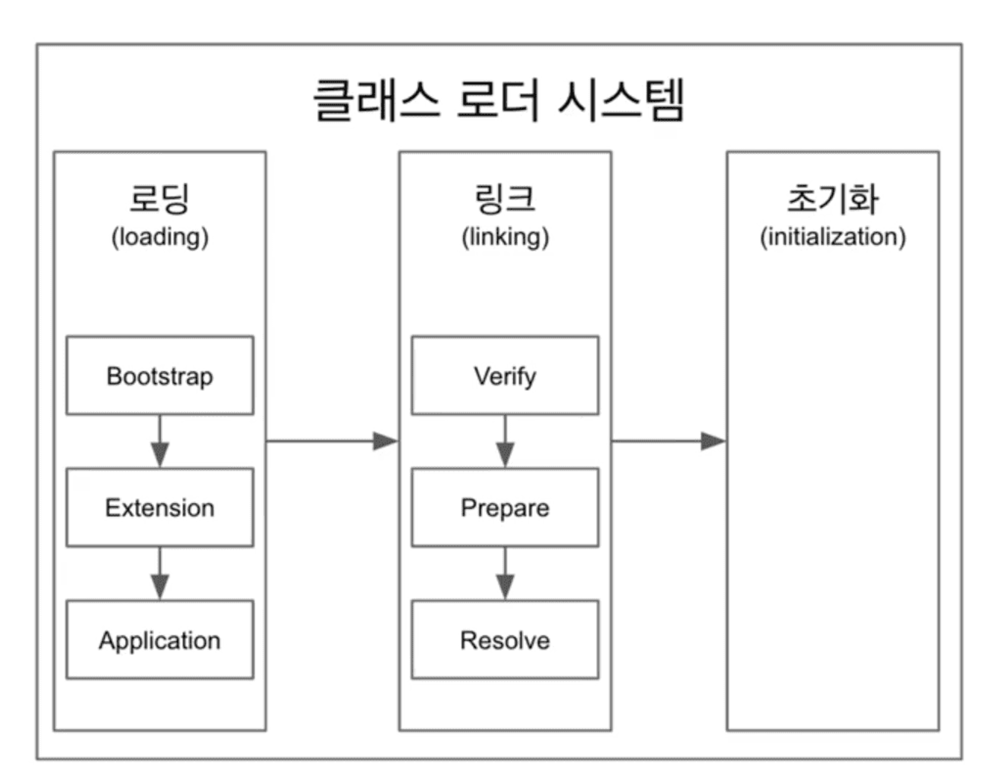
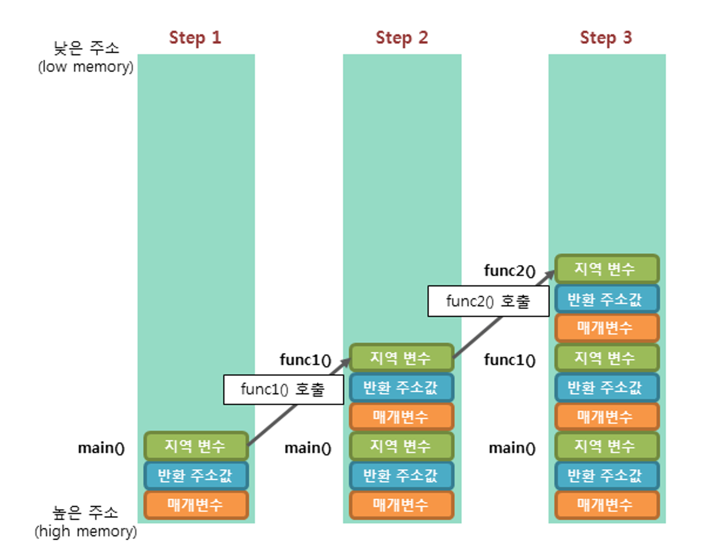

# JVM

JVM의 구조는 크게 클래스 로더, 메모리, 실행 영역으로 나뉜다.

{: width="700" height="500"}

## Class Loader

{: width="700" height="500"}

클래스 로더는 컴파일된 .class 파일을 읽고 JVM의 메모리 영역에 저장하는 역할을 담당한다. 

자원을 효율적으로 사용하기 위해 필요한 클래스만 메모리에 동적으로 로딩한다. 즉, 해당 클래스를 참조하거나 사용하지 않는 경우에는 클래스 로딩이 발생하지 않는다. 클래스가 메모리에 로딩되는 시점은 다음과 같다.

- 클래스의 인스턴스 생성 시
- 클래스 변수에 접근 시
- 클래스 이름을 사용한 참조 시 → `Class.forName()`

클래스 로딩의 과정은 **로딩, 링크, 초기화** 순으로 진행된다.

**로딩 :**  .class 파일을 읽어 바이너리 데이터를 만들고 메소드 영역에 저장한다

- 이때 메소드 영역에 저장하는 데이터는 다음과 같다.
    - FQCN (Full Qualified Class Name) → 풀 패키지 경로까지 포함한 클래스 이름
    - 클래스, 인터페이스, 열거형 타입에 대한 정보
    - 메소드와 변수
- 로딩이 끝나면 해당 클래스 타입의 **Class 객체**를 생성해서 **힙** 영역에 저장한다
    - Class 객체란 클래스들의 정보를 담은 메타 클래스이다.

**링크 :** 참조를 연결하는 작업이다. 과정은 다음과 같다

- Verify: 작성된 .class 파일의 유효성을 검증한다
- Prepare: 클래스 변수와 기본값에 필요한 메모리를 할당한다
- Resolve(Optional): 심볼릭 메모리 레퍼런스를 메소드 영역의 실제 레퍼런스로 교체한다

**초기화 :** static 변수의 값을 할당한다. static 블럭이 있다면 이때 실행된다

## 메모리 영역

### Method 영역

클래스 수준의 정보들을 저장하고 공유하는 영역이다.

- 클래스 명
- 부모 클래스 명
- 메소드
- 변수

### Heap

객체를 저장하고 공유하는 영역이다. GC의 대상이 된다.

### Stack

실행 환경에서 생성된 스레드별로 스택을 생성한다. 스택 안에는 호출된 메소드의 정보가 담긴 스택 프레임이 저장된다. 스레드가 종료되면 스택도 사라진다.

{: width="700" height="500"}

### PC(Program Counter) Register

스레드별로 생성된다. 스레드 내부에서 현재 실행할 스택 프레임을 가르키는 주소를 저장하여 가르키는 포인터가 생성된다.

### 네이티브 메소드 인터페이스 (JNI, Java Native Interface)

자바 애플리케이션에서 C, C++, 혹은 어셈블리 언어로 작성된 함수를 호출하는 인터페이스이다.

- ex) Thread.currentThread() 를 보면 native 메소드이다. 이는 JNI를 통해 호출되는 것

### 네이티브 메소드 스택

마찬가지로 스레드별로 생성된다. 네이티브 메소드의 호출과 관련한 스택 프레임을 담고 있다.

## 실행 엔진 영역

### 인터프리터

바이트 코드를 한줄 씩 해석하고 기계어로 변환하여 실행한다. 

### JIT 컴파일러

JIT은 Just-In-Time의 약자이다. 인터프리터가 바이트 코드를 한줄 씩 실행하게되면 속도가 느려지는 단점을 보완하기 위해 사용한다. 자주 사용하는 바이트코드를 미리 컴파일 해서 가지고 있다가 해당 바이트코드가 또 다시 나타나면 인터프리터를 거치지 않고 미리 컴파일된 코드를 바로 사용한다.

### Garbage Collector

더 이상 참조되지 않는 객체의 메모리 영역을 해제하는 역할을 한다. [자세한 내용은 추후 작성]