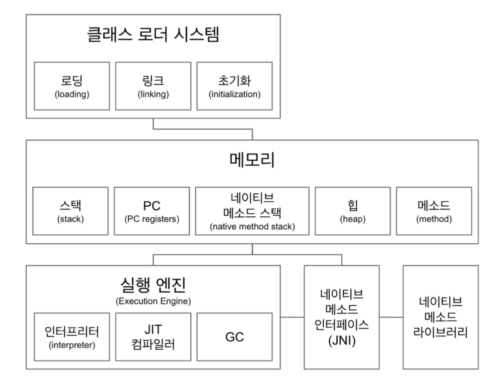

# JVM
JVM은 자바 가상머신(Java Virtual Machine)의 약자이다. 자바 바이트코드를 실행할 수 있는 주체이다.

JVM의 구조는 크게 클래스 로더 시스템, 메모리, 실행 영역으로 나뉜다.

## Class Loader
클래스 로더는 컴파일된 .class 파일을 읽고 JVM의 메모리 영역에 저장하는 역할을 담당한다. 

자원을 효율적으로 사용하기 위해 필요한 클래스만 메모리에 동적으로 로딩한다. 즉, 해당 클래스를 참조하거나 사용하지 않는 경우에는 클래스 로딩이 발생하지 않는다. 클래스가 메모리에 로딩되는 시점은 다음과 같다.

- 클래스의 인스턴스 생성 시
- 클래스 변수에 접근 시
- 클래스 이름을 사용한 참조 시 → `Class.forName()`

클래스 로딩의 과정은 **로딩, 링크, 초기화** 순으로 진행된다.

**로딩 :**  .class 파일을 읽어 바이너리 데이터를 만들고 메소드 영역에 저장한다

 이때 메소드 영역에 저장하는 데이터는 다음과 같다.
- 풀 패키지 경로까지 포함한 클래스 이름
- 클래스, 인터페이스, 열거형 타입 여부
- 메소드와 변수에 대한 정보

로딩이 끝나면 해당 클래스 타입의 정보를 담은 **Class 타입의 객체**를 생성해서 **힙** 영역에 저장한다

**링크 :** 참조를 연결하는 작업이다. 과정은 다음과 같다

- Verify: 작성된 .class 파일의 유효성을 검증한다
- Prepare: 클래스 변수와 기본값에 필요한 메모리를 할당한다
- Resolve(Optional): 심볼릭 메모리 레퍼런스를 메소드 영역의 실제 레퍼런스로 교체한다

**초기화 :** static 변수의 값을 할당한다. static 블럭이 있다면 이때 실행된다

## 메모리 영역
자바 어플리케이션을 실행할 때 사용되는 데이터를 적재하는 영역이다. 모든 쓰레드가 공유하는 Method, Heap 영역이 있고, 각 스레드별로 생성되는 스택, 네이티브 스택, PC Register 영역이 있다.

### Method 영역 
클래스 수준의 정보들을 저장하고 공유하는 영역이다. 클래스 영역(Class 영역)이라고도 한다. JVM이 시작될 때 생성되는 공간으로 프로그램이 종료될 떄까지 유지된다. 저장되는 정보들은 다음과 같다.

### Heap
객체를 저장하고 공유하는 영역이다. 힙 영역에 생성된 객체들은 참조형 타입이므로 JVM의 스택영역에서 메모리 주소로 저장되어 접근한다. 참조가 해제되어 쓸모없는 객체들은 GC의 대상이 된다.

### Stack

실행 환경에서 생성된 스레드별로 스택을 생성한다. 스택 안에는 호출된 지역변수, 매개변수 리턴 값과 같은 메소드의 정보가 담긴 스택 프레임이 저장된다. 메소드 수행이 끝나면 스택 프레임이 삭제되고 스레드가 종료되면 스택도 사라진다.

### PC(Program Counter) Register

스레드별로 생성된다. 스레드 내부에서 현재 실행할 JVM의 명령어 주소를 저장하여 가르키는 포인터가 생성된다. 실행할 명령어의 주소를 가르켜 CPU에게 전달하는 역할을 한다.

### 네이티브 메소드 인터페이스 (JNI, Java Native Interface)

자바 애플리케이션에서 C, C++, 혹은 어셈블리 언어로 작성된 함수를 호출하는 인터페이스이다.
- ex) Thread.currentThread() 를 보면 native 메소드이다. 이는 JNI를 통해 호출되는 것

### 네이티브 메소드 스택

마찬가지로 스레드별로 생성된다. 네이티브 메소드의 호출과 관련한 스택 프레임을 담고 있다. JIT Compiler로 실행된 네이티브 코드에 대한 호출정보도 여기 저장된다. 스택 영역에서 실행한 메소드가 native 메소드라면 해당 메소드는 네이티브 스택에 쌓이고 리턴 값이 있으면 스택 영역에 저장된다.

## 실행 엔진 영역

실행 엔진은 컴파일된 바이트 코드를 명령어 단위로 읽어서 OS에 특화된 네이티브 코드 변환하여 실행한다. 이 과정에서 인터프리터와 JIT 컴파일러를 사용한다.

### 인터프리터
컴파일된 바이트 코드를 한줄 씩 해석하고 네이티브 코드로 변환하여 실행한다. 

### JIT 컴파일러
JIT은 Just-In-Time의 약자이다. 인터프리터가 바이트 코드를 한줄 씩 실행하게되면 속도가 느려지는 단점을 보완하기 위해 사용한다. 자주 사용하는 바이트코드를 미리 네이티브 코드로 컴파일 해서 가지고 있다가 해당 바이트코드가 또 다시 나타나면 인터프리터를 거치지 않고 미리 컴파일된 코드를 바로 사용한다.

### Garbage Collector
C의 free 함수와 같이, 자바에서는 프로그래머가 명시적으로 참조하지 않는 객체에 대한 메모리를 해제할 필요가 없다. JVM에서 힙 영역의 참조하지 않는 객체들에 대한 메모리를 자동으로 해제해주는데 이를 Garbage Collection이라고 한다. 

#### GC의 대상
가비지 컬렉션은 특정 객체가 GC의 대상이 되는지에 대한 판단을 하기 위해 객체를 Reachable, Unreachable 상태로 분류한다.
- Reachable: Stack, Method와 같은 영역에서 객체를 참조하고 있는 상태
- Unreachable: 메소드 종료 등의 이유로 객체가 더이상 참조되고 있지 않는 상태 -> **GC의 대상이 된다**

#### Mark And Sweep(Compaction)

가비지 컬렉션이 Unreachable한 객체를 식별하고 메모리를 해제하는 과정을 Mark And Sweep이라고 한다.
- Mark : 가비지 컬렉션이 생성된 객체마다 참조여부를 확인해 Reachable, Unreachable 여부를 판단하고 식별한다.
- Sweep : Unreachable로 마킹된 객체들의 메모리를 해제한다.
- Compaction : Sweep 단계에서 Unreachable한 객체들의 메모리를 해제한 후 파편화된 메모리 영역을 정렬한다. (일부 GC에서는 수행되지 않는다)

일반적으로 JVM 힙 영역의 구조는 다음과 같다.

**1. Young(New) 영역**
- 새로 생성된 객체들은 Young 영역의 Eden에 저장된다
- Eden 영역이 가득차게 되면 참조되지 않는 객체들의 메모리를 해제하고 살아남은 객체들은 Survivor 영역으로 옮겨진다. 이 과정을 Minor GC라고 한다
- 다음 Minor GC가 발생할 때, Eden, Survivor 영역에서 살아남은 객체들은 옆에 있는 Survivor 영역으로 이동한다. Minor GC가 반복되는 동안 둘 중 하나의 Survivor 영역은 빈 상태가 된다

**2. Old 영역**
- Survivor 영역에서 일정 기간동안 살아남은 객체들은 최종적으로 Old 영역에 저장된다. 이를 Promotion이라고 한다.
- Old 영역에 가득차게 되면 JVM은 잠시 실행을 멈추고 Old 영역에 참조가 해제된 객체들을 찾아 메모리를 해제한다. 이 과정을 Major GC라고 한다.

#### Stop The World
Major GC(Full GC)가 실행되면 GC와 연관있는 쓰레드 외에 다른 쓰레드들이 동작을 멈추는 현상이다. 자바 어플리케이션의 성능을 결정짓는 주요 원인 중 하나이다. 개발자들은 Stop The World가 발생하는 시간을 줄이기 위해 GC 튜닝을 한다.

#### GC 알고리즘
**Serial GC** : 싱글 스레드로 GC를 처리한다. Mark And Sweep이 순차적으로 진행된다. 싱글 쓰레드 기반을 동작하기 때문에 때문에 Stop The World를 수행하는 시간이 길다. 일반 WAS에서는 절대 사용하면 안되는 GC이다. 

**Parellel GC** : Serial GC와 동작방식은 같다. Minor GC를 멀티 쓰레드로, Major GC를 싱글 쓰레드로 수행한다. JAVA 8의 default GC였다.

**CMS(Concurrent Mark Sweep) GC** : 어플리케이션 쓰레드가 GC 쓰레드가 동시에 실행된다. 이 때부터 Mark And Sweep이 병렬로 진행된다. 복잡해진 GC 과정이 수행된 만큼 CPU 사용량이 높고 결정적으로 Sweep 단계에서 메모리 Compaction 과정을 수행하지 않아 Java 14에서 deprecated 처리 되었다.

**G1 (Garbage First) GC** : 기존의 리니어한 Young, Old 영역을 사용하지 않고 힙 영역을 Region 이라는 동적인 영역으로 나누어 사용한다. Eden, Survivor, Old 영역을 고정이 아닌 동적으로 부여한다. Java 9 이후로 default GC이다.

         

## Hotspot JVM
Java 1.3부터 공식적으로 오라클에서 제공하는 가장 기본적인 JVM이다. 말 그대로 hotspot을 찾아내서 해당 바이트코드에 JIT 컴파일러를 사용하는 방식이다. 내부적으로 프로파일링을 통해 hotspot을 찾아내고 해당 부분을 네이티브 코드로 미리 컴파일 한다. 

hotspot jvm에서는 다음 두 가지 방법으로 네이티브 코드를 생성한다. 
- 클라이언트 컴파일러 : 어플리케이션의 시작 속도에 집중한다
- 서버 컴파일러 : 어플리케이션의 전체적인 성능 최적화에 집중한다

Hotspot JVM은 기본적으로 자바 어플리케이션을 실행할때 알아서 클라이언트, 서버 컴파일러를 사용할 지 판단한다. 판단의 기준은 다음과 같다
- 2대 이상의 물리적 프로세서 -> 서버 컴파일러
- 2GB 이상의 물리적 메모리 -> 서버 컴파일러
