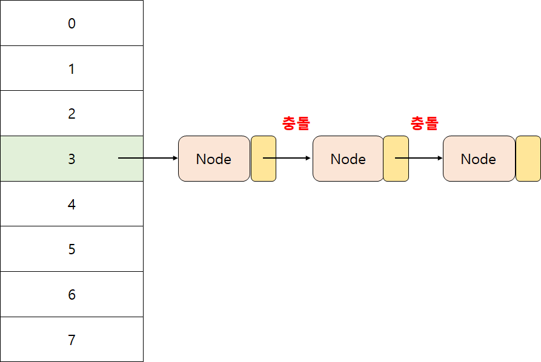

# Map
Map은 key-value 쌍으로 데이터를 저장하는 자료구조이다. key 값은 해당 Map에 대해서 고유하다. 이 특성을 활용해서 데이터를 조회할 때, key 값을 활용해 바로 value를 빠르게 조회할 수 있다는 장점이 있다. value는 Map 안에서 중복이여도 상관 없다.

자바에서 Map 인터페이스를 구현한 대표적인 구현체의 특징은 다음과 같다
- HashMap : 가장 많이 사용되는 클래스이다. hashCode 메소드를 사용한다
- LinkedHashMap: 순서를 보장한다
- HashTable: 컬렉션이 등장하기 전부터 만들어져 사용된 클래스이다. Thread safe하다
- TreeMap: key를 기준으로 데이터를 정렬한다

## HashMap
HashMap은 Map 인터페이스를 구현한 클래스중에서 가장 많이 사용되는 구현체이다. HashMap은 내부 자료구조로 배열을 사용한다. 객체의 hashCode 메소드를 통해 배열에 사용할 인덱스를 산출한다.

## HashMap 의 생성자와 주요 메소드

### 생성자
HashMap이 제공하는 생성자는 총 4개로써 종류는 다음과 같다.
| HashMap() | 내부에 16만큼의 기본 용량(capacity)의 저장공간을 가지는 HashMap 객체를 생성한다 |
| --- | --- |
| HashMap(int initialCapacity) | 내부에  매개 변수로 넘어온 initialCapacity만큼의 저장공간을 가진 HashMap 객체를 생성한다 |
| HashMap(int initialCapacity, float loadFactor) | 내부에  매개 변수로 넘어온 initialCapacity만큼의 저장공간과 매개 변수로 넘어온 loadFactor만큼의 HashMap 객체를 생성한다 |
| HashMap(Map<? extends K, ? extends V> m) | 매개 변수로 넘어온 컬렉션을 저장한 HashMap 객체를 생성한다 |


### HashMap에 데이터 넣고 조회하기
HashMap에 데이터는 put 메소드를 사용해 추가할 수 있다. 조회는 get 메소드로 조회하고자 하는 key 객체를 넣어주면 된다.
```java
public static void main(String[] args) {
    HashMap<Car, String> map = new HashMap<>();

    Car car = new Car("Ferrari");
    map.put(car, car.getName());

    String value = map.get(car);
    System.out.println(value);
}
```

```실행 결과
> Task :Java.main()
Ferrari
```

### Key, Value 목록 조회하기
HashMap에 저장되어 있는 key의 목록은 keySet 메소드를 사용해 가져올 수 있다. 해시맵에 저장되어 있는 value들에 대한 목록은 values 메소드를 사용해 가져올 수 있다.

```java
public class Car {
    private String name;

    // 생성자, getter 생략

    @Override
    public String toString() {
        return "Car name = " + this.name;
    }
}
```

```java
public static void main(String[] args) {
    HashMap<Car, String> map = new HashMap<>();

    Car car = new Car("Ferrari");
    Car car2 = new Car("Hyundai");

    map.put(car, car.getName());
    map.put(car2, car2.getName());

    Set<Car> keySet = map.keySet();
    System.out.println(keySet);

    Collection<String> values = map.values();
    System.out.println(values);
}
```

실행 결과
```
> Task :Java.main()
[Car name = Ferrari, Car name = Hyundai]
[Ferrari, Hyundai]
```

이 외에 key가 존재하는지에 대한 여부를 반환하는 containsKey, 값이 존재하는지에 대한 여부를 반환하는 containsValue, 데이터를 삭제하기 위한 remove등의 주요 메소드가 있다.

## TreeMap
HashMap은 Key의 순서를 보장하지 않는다. Key의 순서를 정렬하고 싶을때는  SortedMap 인터페이스를 구현한 TreeMap 구현체를 사용하면 된다. 정렬된 키를 바탕으로 가장 앞뒤에 있는 키와 특정 키를 기준으로 앞뒤로 있는 key를 반환하는 메소드도 제공한다.

Key를 정렬하는 작업이 데이터를 처리하는 연산에 포함되어 HashMap보다 성능은 느리지만, 소량의 데이터중에서 key를 정렬하고 싶을 때 사용하면 유용하다.

## 해시 충돌
위에서 언급했듯이 HashMap은 key 객체의 hashCode 메소드를 이용해 내부에 데이터를 저장하는 인덱스로 활용한다. 해시를 인덱스로 사용하는 HashMap 내부의 배열은 버킷이라고 한다. 내부 코드를 살펴보면 Node<K, V> 배열 타입으로 선언된 table이 HashMap의 버킷이다. 

```java
public class HashMap<K,V> extends AbstractMap<K,V>
    implements Map<K,V>, Cloneable, Serializable {
        // 생략

        transient Node<K,V>[] table;

        static class Node<K,V> implements Map.Entry<K,V> {
                final int hash;
                final K key;
                V value;
                Node<K,V> next;
        }

        // 생략
    }
```

하지만 key가 다른 객체임에도 불구하고 hashCode 메소드가 같은 값을 반환하면 내부 배열에 사용할 인덱스가 중복되는 현상이 발생한다. 이를 **해시 충돌**이라고 한다. 해시 충돌이 발생한 경우 HashMap에서는 Seperate Chaining이라는 방법으로 버킷에 데이터를 저장한다.


### Seperate Chaining

#### LinkedList


충돌 초기에는 해시 충돌이 발생한 인덱스에 해당하는 Node의 구조를 LinkedList로 변경한다. Node 객체의 next 멤버를 사용해 추가된 Node를 서로 연결한다. 해당 key로 조회하는 메소드를 호출했을 때 LinkedList를 순회하며 equals 메소드를 사용해 해당하는 노드를 가져온다.

```java
for (int binCount = 0; ; ++binCount) {
    if ((e = p.next) == null) {
        p.next = newNode(hash, key, value, null);
        if (binCount >= TREEIFY_THRESHOLD - 1) // -1 for 1st
            treeifyBin(tab, hash);
        break;
```
위는 HashMap의 데이터를 추가하는 putVal 메소드의 일부이다. 해시 충돌이 발생해 노드가 LinkedList로 저장된 데이터인 경우에는 연결된 노드의 수가 임계점(TREEFY_THRESHOLD - 1)를 넘어가면 조회하고자 노드를 검색하는데 비용이 많이 든다. 이런 경우 HashMap에서는 기존 LinkedList를 Red-Black 트리로 변환해 해시 충돌이 발생한 노드들을 관리한다. 