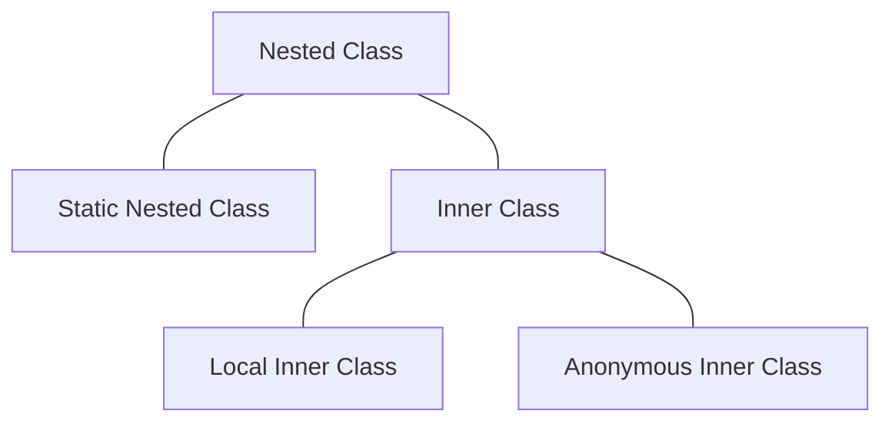

# Nested Class

클래스안에 클래스를 자바에서는 Nested 클래스라고 한다. Nested 클래스는 보통 두 클래스가 서로 긴밀한 관계에 있거나, 하나의 클래스 또는 메소드에서만 사용되는 클래스일때 주로 이용한다.

필요한 용도에 따라서 사용하는 Nested 클래스의 형식도 다르다. Nested 클래스의 종류는 다음과 같다.


## Static Nested Class
Static nested 클래스는 static 키워드가 붙은 내부 클래스이다. 한 곳에서만 사용되는 클래스를 논리적으로 묶을 필요가 있을 때 주로 사용한다. 인스턴스 변수와 static 변수를 둘 다 가질 수 있다.

예를들어 School, University 클래스에 각각 학생들을 관리하기 위해 Student 클래스를 사용하고 싶을 때, Student 클래스를 한개로 관리하면 고등학생과 대학생의 특성이 달라 클래스 설계가 어려워진다. 이럴때 static nested 클래스를 사용할 수 있다.


```java
public class HighSchool {
    public static class Student {
        public static String schoolName = "00고등학교";

        public void doNightStudy() {
            System.out.println("야간 자율학습 하기");
        }
    }
}
```

```java
public class University {
    public static class Student {
        private double grade;

        public void applyForClass() {
            System.out.println("수강신청 하기");
        }

        public double getGrade() {
            return grade;
        }

        public void setGrade(double grade) {
            this.grade = grade;
        }
    }
}
```

사용법은 아래와 같다.
```java
public static void main(String[] args) {
    University.Student univStudent = new University.Student();
    univStudent.setGrade(4.0);
    System.out.println(univStudent.getGrade());

    univStudent.applyForClass();

    HighSchool.Student highSchoolStudent = new HighSchool.Student();
    highSchoolStudent.doNightStudy();
    System.out.println(HighSchool.Student.schoolName);
}
```

실행 결과
```
> Task :Java.main()
4.0
수강신청 하기
야간 자율학습 하기
00고등학교
```

위 예시처럼 겉으로 보기에는 유사하지만, 내부적으로 구현이 달라야 할 때 static nested class를 사용할 수 있다.

### static nested 클래스의 오해
static nested 클래스는 static 변수나 메소드처럼 메모리 상에서 한개만 존재하는 클래스가 아니다. static 키워드가 있어도 일반 객체처럼 동일한 타입의 객체를 여러개 생성하면 각각 다른 객체가 생성된다.

```java
public static void main(String[] args) {
    University.Student univStudent = new University.Student();
    University.Student univStudent1 = new University.Student();

    System.out.println(univStudent == univStudent1);
}
```

실행 결과
```
> Task :Java.main()
false
```


## Inner Class
내부 클래스는 static nested 클래스랑 비슷하지만 static 키워드가 붙지 않은 내부 클래스이다. 외부 클래스의 멤버로 취급되기 때문에 외부 클래스의 객체를 생성해야 내부 클래스의 객체 생성이 가능하다. 

내부 클래스를 사용하면 외부 클래스의 private한 멤버 변수나 메소드 사용이 가능하다. 따라서 주로 외부 클래스의 인스턴스 멤버들과 관련된 작업에 목적으로 사용된다.

```java
public class PocketBall {
    private int price = 1000;

    public class PocketMonster {
        private String name = "이상해씨";

        public void printPocketMonsterInfo() {
            System.out.println(price);
            System.out.println(name);
        }
    }
}
```

```java
public static void main(String[] args) {
    PocketBall pocketBall = new PocketBall();
    PocketBall.PocketMonster pocketMonster = pocketBall.new PocketMonster();

    pocketMonster.printPocketMonsterInfo();
}
```

실행 결과
```
> Task :Java.main()
1000
이상해씨
```

### Inner Class의 외부 클래스 참조
내부 클래스의 객체를 생성하기 위해서는 외부 클래스의 객체를 생성해야 한다. 이 특성 때문에 내부 클래스의 객체를 생성할 때 내부적으로 외부 클래스 객체의 참조를 연결해 가지고 있는다.

내부 클래스를 사용할때의 주의점이 있다. 프로그램이 실행되면서 내부 클래스가 사용하고 있는 외부 클래스의 객체가 더 이상 필요없어도, 여전히 내부 클래스가 참조를 가지고 있으므로 GC의 제거대상이 되지 않는다. 따라서 메모리 누수 문제가 발생할 수 있다.

Intellij IDE에서는 이와 같은 문제를 예방하기 위해 내부 클래스에서 외부 클래스의 private 필드나 메소드에 대한 참조가 없으면 내부 클래스를 static 내부 클래스로 사용하라고 권장하고 있다.

```java
public class PocketBall {
    private int price = 1000;

    public class PocketMonster {
        private String name = "이상해씨";

        public void printPocketMonsterInfo() {
            System.out.println(name);
        }
    }
}
```

Intellij IDE 권장 메세지
```
Inner class 'PocketMonster' may be 'static
```

## Static Nested Class vs Inner Class
Static Nested 클래스와 Inner Class는 둘 다 클래스 내부에 선언되어 있는 클래스라는 점은 같지만. static 키워드의 유무와 외부 클래스의 멤버 변수에 접근 가능 유무도 차이가 난다.

- Static Inner Class는 외부 클래스의 static 변수나 메소드에만 접근이 가능하다.
- Inner Class는 외부 클래스의 모든 변수나 메소드에 접근 할 수 있다.

## Anonymous Inner Class
익명 클래스는 말 그대로 이름이 없는 클래스로 말한다. 주로 프로그램에서 한번만 사용하고 버려지는 객체라고 볼 수 있다. 주로 UI 이벤트 처리, 쓰레드 객체, 단발성 이벤트 처리에 사용된다.


```java
public class Animal {
    public String bark() {
        return "동물이 웁니다.";
    }
}
```

```java
public static void main(String[] args) {
    Animal dog = new Animal() {
        @Override
        public String bark() {
            return "강아지가 짖습니다";
        }
    };

    System.out.println(dog.bark());

    // System.out.println(dog.run()); 호출 불가능
}
```

실행 결과
```
> Task :Java.main()
강아지가 짖습니다
```

위 처럼 클래스와 패키지를 새로 생성하지 않고 바로 코드 내부에서 bark 메소드를 오버라이딩해 사용할 수 있다는 편리함이 있다. 유의해야 할 점은 익명 클래스 내부에서 오버라이딩한 메소드만 외부에서 사용이 가능하다. 

인터페이스도 코드에서 바로 익명 클래스로 구현해 사용할 수 있다.

```java
public interface Animal {
    String bark();
}
```

```java
public static void main(String[] args) {
    Animal dog = new Animal() {
        @Override
        public String bark() {
            return "강아지가 짖습니다";
        }
    };

    System.out.println(dog.bark());
}
```
실행 결과
```
> Task :Java.main()
강아지가 짖습니다
```