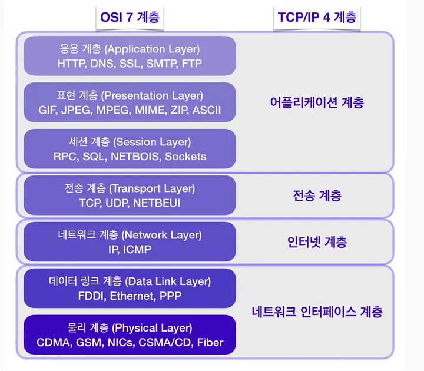

# 네트워크 프로그래밍

디바이스나 서버간에 데이터를 주고받는 작업을 네트워킹 (networking)이라고 한다. 이러한 네트워킹은 다음과 같이 레이어로 구성되어 있다.


## TCP, UDP, 포트

### TCP
어플리케이션에서 가장 많이 활용하는 HTTP, ftp, telnet은 모두 TCP(Transmission Control Protocol) 기반으로 통신을 한다. TCP는 연결 기반 프로토콜로써 패킷 교환 방식을 사용한다. 연걸을 설정하고 해제하는 과정에서 데이터가 전송된다는 보장을 받을 수 있지만 속도가 느리고 비싸다는 단점이 있다.

### 포트
IP 내에서 어플리케이션의 구분을 위해 사용하는 번호이다. 일반적으로 웹 어플리케이션은 80번 포트를 사용한다. 이는 브라우저에 url을 입력하면 자동으로 :80이 붙는 이유다. 또 다른 예로 SSL 프로토콜을 사용하려면 443 포트를 사용한다.

### Socket
자바에서 TCP 통신을 수행하려면 Socket 클래스를 사용한다. Socket 클래스는 클라이언트 서버간의 연결 상태를 보관하는 클래스이다. 클라이언트와 서버가 각각 Socket 객체를 생성하여 상호작용한다.

### ServerSocket
서버에서는 ServerSocket을 사용해 데이터를 클라이언트로부터 받는다. 

ServerSocket 클래스가 제공하는 생성자는 다음과 같다. 생성자가 있지만 별도로 new 키워드를 사용해 객체를 생성하지 않고 클라이언트 요청이 생기면 객체를 전달받는다.

| 생성자 | 설명 |
| --- | --- |
| ServerSocket() | 서버 소켓 객체만 생성한다 |
| ServerSocket(int port) | 지정된 포트를 사용하는 서버 소켓을 생성한다 |
| ServerSocket(int port, int backlog) | 지정된 포트와 backlog 개수를 가지는 소켓을 생성한다 |
| ServerSocket(int port, int backlog, InetAddress bindAddr) | 지정된 포트와 backlog 개수를 가지는 소켓을 생성하며, bindAddr에 있는 주소에서의 접근 만을 허용한다 |

- 생성자 매개변수로 사용되는 backlog는 연결 요청에 대한 큐의 개수이다. 
- InetAddress는 특정 주소에 대한 접근만 허용할때 사용한다.
- 기본 생성자 외에 다른 생성자를 사용하면 객체를 생성하자마자 Socket 연결을 받을 수 있는 상태가 된다. 
    - 기본 생성자를 사용했을 경우 사용자의 요청을 대기하는 accept 메소드와 소켓 연결이 끝난 후 소켓을 닫는 close 메소드를 호출해줘야 한다.

서버 소켓통신의 활용 예시는 다음과 같다.
```java
public class Sockets {

    public void startServer() {
        ServerSocket serverSocket = null;
        Socket client;

        try {
            while (true) {
                System.out.println("Waiting for request");

                // 포트 번호 9999으로 ServerSocket에 객체를 생성하면 클라이언트에서 접근할때 9999번 포트를 이용하면 된다.
                serverSocket = new ServerSocket(9999);

                // accept 메소드를 사용해 소켓 통신을 대기하는 상태가 된다. 연결이 완료되면 Socket 객체가 반환되어 client 변수에 할당된다.
                client = serverSocket.accept();
                System.out.println("Server accepted");

                // getInputStream 메소드를 호출해 소켓 객체의 InputStream 객체를 받는다
                InputStream stream = client.getInputStream();

                BufferedReader in = new BufferedReader(new InputStreamReader(stream));

                String data;
                StringBuilder sb = new StringBuilder();

                while ((data = in.readLine()) != null) {
                    sb.append(data);
                }

                System.out.println("Received Data");

                in.close();
                stream.close();

                // 모든 소켓 통신이 완료된 후 클라이언트 소켓 자원을 닫는다
                client.close();

                if ("EXIT".equals(sb.toString()) && (sb != null)) {
                    System.out.println("Stop Server");
                    break;
                }
            }
        } catch (Exception e) {
            e.printStackTrace();
        } finally {
            try {
                // 더 이상의 소켓 수신이 필요없을 경우 서버 소켓 자원을 닫는다
                if (serverSocket != null) {
                    serverSocket.close();
                }
            } catch (IOException e) {
                throw new RuntimeException(e);
            }
        }

    }
}

```

### Socket
클라이언트는 Socket 객체를 생성해 서버로 전달한다. Socket 클래스의 생성자는 다음과 같다. 크게 소켓 객체만 하는 생성자와 소켓 객체를 생성하고 서버에 접속을 하는 생성자로 구분되어 있다. 클라이언트도 마찬가지로 소켓 통신이 끝나면 close 메소드를 호출해 자원을 닫아줘야 한다.

| 생성자 | 설명 |
| --- | --- |
| Socket() | 소켓 객체만 생성 |
| Socket(Proxy proxy) | 프록시 관련 설정과 함께 소켓 객체만 생성 |
| Socket(SocketImpl impl) | 사용자가 지정한 SocketImpl 객체를 사용하여 소켓 객체만 생성 |
| Socket(InetAddress address, int port) | 소켓 객체 생성 후 address와 port를 사용하는 서버에 연결 |
| Socket(InetAddress address, int port, InetAddress localAddr, int localPort) | 소켓 객체 생성 후 address와 port를 사용하는 서버에 연결하고, 지정한 localAddr와 localPort에 접속 |
| Socket(String host, int port) | 소켓 객체 생성 후 host와 port를 사용하는 서버에 연결 |
| Socket(String host, int port, InetAddress localAddr, int localPort) | 소켓 객체 생성 후 host와 port를 사 |


클라이언트 소켓 통신의 활용 예시는 다음과 같다.
```java
public class Sockets {
    public void sendSocketData(String data) {
        Socket socket = null;

        try {
            System.out.println("Client connecting");

            // localhost의 9999번 포트에 접속
            socket = new Socket("127.0.0.1", 9999);
            System.out.println("Connection status : " + socket.isConnected());

            Thread.sleep(1000);

            // getOutputStream 메소드를 호출해 데이터 전송을 위한 OutputStream 객체 생성
            OutputStream stream = socket.getOutputStream();
            BufferedOutputStream out = new BufferedOutputStream(stream);

            byte[] bytes = data.getBytes();
            out.write(bytes);

            System.out.println("Client Sent data");
            out.close();

        } catch (Exception e) {
            e.printStackTrace();
        } finally {
            if (socket != null) {
                try {
                    // 데이터 전송 후 소켓 연결을 닫는다
                    socket.close();
                } catch (IOException e) {
                    throw new RuntimeException(e);
                }
            }
        }
    }
}
```

### UDP
UDP (User Datagram Protocol)는 비연결 기반 프로토콜이다. 데이터그램 패킷 단위로 데이터가 전송되며 최대 크기는 65535 바이트로 크기를 초과하면 잘라서 전송한다. 각각의 패킷은 독립적인 관계를 가지고 있고 서로 다른 경로로 전송된다. 따라서 가볍고 빠르다라는 장점이 있지만 데이터의 신뢰성을 보장할 수 없다는 단점이 있다. 신뢰성 보다는 연속성이 중요한 스트리밍(streaming)과 같은 서비스에서 사용한다.

#### DatagramSocket
UDP 통신은 DatagramSocket 클래스를 활용하며, 더 이상 제공할 데이터가 없으면 close 메소드를 호출한다. 제공하는 생성자와 주요 메소드는 다음과 같다.
| 생성자 | 설명 |
| --- | --- |
| DatagramSocket() | 소켓 객체 생성 후 사용 가능한 포트로 대기 |
| DatagramSocket(DatagramSocketImpl impl) | 사용자가 지정한 SocketImpl 객체를 사용하여 소켓 객체만 생성 |
| DatagramSocket(int port) | 소켓 객체 생성 후 지정된 port로 대기 |
| DatagramSocket(int port, InetAddress address) | 소켓 객체 생성 후 address와 port를 사용하는 서버에 연결 |
| DatagramSocket(SocketAddress address) | 소켓 객체 생성 후 address에 지정된 서버로 연결 |

| 메소드 | 설명 |
| --- | --- |
| void receive(DatagramPacket packet) | 메소드 호출 시 요청을 대기하고, 만약 데이터를 받았을 때에는 pacekt 객체에 데이터를 저장 |
| void send(DatagramPacket packet) | packet 객체에 있는 데이터 전송 |
| void close() | 더 이상 Socket을 사용할 필요가 없을 때 호출 |

DatagramSocket 클래스는 데이터를 받기 위해 대기할 때는 receive, 데이터를 전송할 때는 send 메소드를 사용한다.

### DatagramPacket
DatagramPacket 클래스는 DataramSocket 클래스의 receive, send 메소드의 매개변수로 활용된다. 데이터를 받기위한 생성자와 데이터를 전송하기 위한 생성자로 구분된다. 구체적인 생성자의 정보는 다음과 같다.

| 생성자 | 설명 |
| --- | --- |
| DatagramPacket(byte[] buf, int length) | length의 크기를 갖는 데이터를 받기위한 객체 생성 |
| DatagramPacket(byte[] buf, int length, InetAddress address, int port) | 지정된 address와 port로 데이터를 전송하기 위한 객체 생성 |
| DatagramPacket(byte[] buf, int offset, int length) | 버퍼의 offset이 할당되어 있는 데이터를 전송하기 위한 객체 생성 |
| DatagramPacket(byte[] buf, int offset, int length, InetAddress address, int port) | 버퍼의 offset이 할당되어 있고, 지정된 address와 port로 데이터를 전송하기 위한 객체 생성 |
| DatagramPacket(byte[] buf, int offset, int length, SocketAddress address) | 버퍼의 offset이 할당되어 있고, 지정된 소켓 address로 데이터를 전송하기 위한 객체 생성 |
| DatagramPacket(byte[] buf, int length, SocketAddress address) | 지정된소켓 address로 데이터를 전송하기 위한 객체 생성 |

UDP 프로토콜을 활용해 데이터를 주고받는 예시는 다음과 같다

```java
public class Sockets {
    public void startServer() {
        // 9999 포트를 지정해 DatagramSocket 객체를 생성한다
        try (DatagramSocket server = new DatagramSocket(9999)) {
            int bufferLength = 256;
            byte[] buffer = new byte[bufferLength];
            // 데이터를 받기 위해 버퍼와 버퍼 길이를 지정하여 DatagramPacket 객체를 생성한다
            DatagramPacket packet = new DatagramPacket(buffer, bufferLength);

            while (true) {
                System.out.println("Waiting for Request");

                // 데이터를 받기 위해 대기하다가 데이터가 들어오면 packet 객체에 데이터를 담는다
                server.receive(packet);

                // 전송받은 데이터의 크기를 확인한다
                int dataLength = packet.getLength();
                String data = new String(packet.getData(), 0, dataLength);
                System.out.println("Data Received, length : " + dataLength);

                if (data.equals("EXIT")) {
                    System.out.println("Stop Server");
                    break;
                }
            }
        } catch (Exception e) {
            e.printStackTrace();
        }
    }

    public void sendDatagram(String data) {
        try {
            // DatagramSocket 객체를 생성한다
            DatagramSocket client = new DatagramSocket();
            // InetAddress 클래스를 활용해 데이터르 받을 서버의 ip를 설정한다
            InetAddress address = InetAddress.getByName("127.0.0.1");

            byte[] buffer = data.getBytes();

            // 데이터를 전송하기 위해 DatagramPacket 객체를 생성한다
            DatagramPacket packet = new DatagramPacket(buffer, buffer.length, address, 9999);
            client.send(packet);

            System.out.println("Client Sent data");
            // 데이터의 전송이 마무리되었으면 소켓을 닫는다
            client.close();

        } catch (Exception e) {
            e.printStackTrace();
        }
    }
}
```

## TCP vs UDP
TCP는 클라이언트와 서버 간 소켓 연결이 실패하면 ConnectionException 예외를 던진다. 반면 UDP로 통신을 할때는 서버에서 데이터를 받을 준비가 되어 있지 않더라도 클라이언트에서는 아무 오류를 내지 않는다. 

TCP와 UDP 프로토콜의 차이를 표로 정리하면 아래와 같다.
| 프로토콜 종류 | TCP | UDP |
| --- | --- | --- |
| 연결 방식 | 연결형 서비스 (패킷 교환 방식) | 비연결형 서비스 (데이터그램 방식) |
| 전송 순서 | 전송 순서 보장 | 전송 순서가 바뀔 수 있다 |
| 수신 여부 확인 | 확인함 | 확인하지 않음 |
| 통신 방식 | 1:1 | 1:1 or 1:N or N:M |
| 신뢰성 | 높다 | 낮다 |
| 속도 | 느리다 | 빠르다 |
