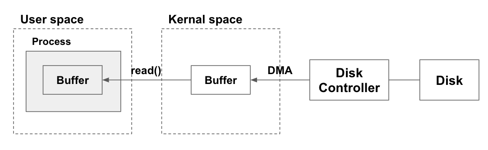

## 자바의 I/O가 느린 이유

어플리케이션의 I/O 과정에는 유저 영역과 커널 영역이 있다. 유저 영역은 커널 영역에 시스템 콜을 보내 드라이버를 통해 하드웨어에 접근할 수 있다. 이 커널 영역을 거치게 되면서 불필요한 버퍼와 데이터의 복사 과정이 추가된다. 여기서 JVM 프로세스에서 사용하는 버퍼는 프로그래머가 별도로 BufferedOutputStream이나 BufferedInputStream 객체를 활용해 I/O를 처리했을때 생성되는 버퍼를 뜻한다. 디스크로부터 파일을 읽는 위 과정을 요약하자면 다음과 같다.
1. 프로세스 (JVM)이 파일을 읽기 위해 커널에 명령을 전달한다
2. 커널은 시스템콜 (read)를 사용한다
3. 디스크 컨트롤러가 물리적 디스크로부터 파일을 읽어 온다
4. DMA를 통해 커널 버퍼로 복사한다
5. 프로세스 (JVM)의 내부 버퍼로 복사한다
6. 프로레스에서 사용이 끝난 버퍼는 GC의 대상이 된다

위 과정에서 커널 버퍼에서 JVM 버퍼로 데이터를 복사하는 연산은 CPU가 담당하게 되며 쓰레드 블록킹이 걸린다 (물론 버퍼를 사용하지 않아도 쓰레드 블록킹이 걸린다). 이 블록킹 구간이 I/O가 느려지는 주요 원인이다. 

## NIO
JDK 1.4부터 NIO (New IO)가 추가되었다. NIO는 커널 버퍼를 직접 접근할 수 있는 등의 확장된 기능과 블록킹, 논블록킹 I/O를 모두 지원하며 논블록킹 I/O를 활용하면 입출력 작업이 완료될때까지 다른 작업을 수행할 수 있어 어플리케이션의 성능을 개선시킬 수 있다. 

NIO는 기존 I/O의 스트림을 사용하지 않고 채널(Channel)과 버퍼(Buffer)를 사용한다. 

### Channel


Channel은 데이터의 입출력을 담당하는 객체이다. 기존 I/O의 스트림과 달리 양방향으로 입출력이 가능하다. NIO의 Selector와 함께 사용되는데 Selector란 여러개의 채널들을 관리하는 싱글 쓰레드 컴포넌트이다. Selector는 입출력 준비가 완료된 채널만 선택해서 작업 쓰레드를 선택하기 때문에 Channel과 Selector를 통해 논블록킹 I/O를 구현할 수 있다.

### Buffer
NIO에서는 데이터를 Buffer를 통해 처리한다. 데이터를 담는 임시 메모리 영역으로 ByteBuffer, CharBuffer, DoubleBuffer, FloatBuffer 등이 존재한다.

버퍼는 데이터를 담거나 읽는 작업을 수행하면 현재의 "위치"가 이동한다. NIO는 데이터를 무조건 버퍼에 저장을 하기 때문에 버퍼를 사용하면 데이터의 위치를 이동해가면서 필요한 부분만 읽고 쓸 수 있다. 

Buffer의 속성이나 상태를 확인하기 위한 메소드의 목록은 다음과 같다.
| 메소드 | 설명 |
| --- | --- |
| int capacity() | 버퍼에 담을 수 있는 크기를 반환한다 |
| int limit() | 버퍼에서 읽거나 쓸 수 없는 첫 위치를 반환한다 |
| int position() | 현재 버퍼의 위치를 반환한다 |


Buffer의 위치를 변경할 수 있는 메소드의 목록은 다음과 같다.
| 메소드 | 설명 |
| --- | --- |
| Buffer flip() | limit 값을 현재 position으로 지정한 후, position을 0(가장 앞)으로 이동 |
| Buffer mark() | 현재 position을 mark |
| Buffer reset() | 버퍼의 position을 mark한 곳으로 이동 |
| Buffer rewind() | 현재 버퍼의 position을 0으로 이동 |
| int remaining() | limit - position 계산 결과를 리턴 |
| boolean hasRemaining() | position 과 limit 값에 차이가 있을 경우 true를 리턴 |
| Buffer clear() | 버퍼를 지우고 현재 position을 0으로 이동하며, limit 값을 버퍼의 크기로 변경 |

```java
public class NIO {
    public void checkBuffer() {
        try {
            IntBuffer buffer = IntBuffer.allocate(1024);

            for(int i=0;i<100;i++) {
                buffer.put(i);
            }

            System.out.println("Buffer capacity : " + buffer.capacity());
            System.out.println("Buffer limit : " + buffer.limit());
            System.out.println("Buffer position : " + buffer.position());

            buffer.flip();
            System.out.println("Buffer Flip ----------- ");

            System.out.println("Buffer capacity : " + buffer.capacity());
            System.out.println("Buffer limit : " + buffer.limit());
            System.out.println("Buffer position : " + buffer.position());

            for(int i=0;i<100;i++) {
                buffer.put(i);
            }

        } catch (Exception e) {
            e.printStackTrace();
        }
    }
}
```

```java
public static void main(String[] args) {
    NIO nio = new NIO();
    nio.checkBuffer();
}
```

실행 결과
```
> Task :Java.main()
Buffer capacity : 1024
Buffer limit : 1024
Buffer position : 100
Buffer Flip ----------- 
Buffer capacity : 1024
Buffer limit : 100
Buffer position : 0
```

### 기본 예제
Channel과 Buffer를 활용해 파일을 읽고 쓰는 예제는 다음과 같다
```java
public class NIO {
    public void write(String data, String fileName) {
        try (
            // FileOutputStream의 getChannel 메소드를 호출해 FileChannel 객체를 가져온다
            FileChannel channel = new FileOutputStream(fileName).getChannel();
        ) {
            // 데이터를 바이트 배열로 변환한다
            byte[] byteData = data.getBytes();

            // ByteBuffer의 wrap 메소드를 활용해 바이트 배열을 Buffer로 저장한다
            ByteBuffer buffer = ByteBuffer.wrap(byteData);

            // 채널의 write 메소드에 buffer 객체를 넘겨주면 buffer에 파일에 쓰게 된다
            channel.write(buffer);

        } catch (IOException e) {
            throw new RuntimeException(e);
        }
    }

    public void read(String fileName) {
        try (
            // FileInputStream의 getChannel 메소드를 호출해 FileChannel 객체를 가져온다
            FileChannel channel = new FileInputStream(fileName).getChannel()
        ) {
            // ByteBuffer의 allocate 메소드는 매개 변수만큼의 데이터가 저장되는 공간을 할당하고 Buffer 객체를 만든다
            ByteBuffer buffer = ByteBuffer.allocate(1024);

            // 채널의 read 메소드에 buffer 객체를 넘겨주면 buffer에 데이터가 담기기 시작한다
            channel.read(buffer);

            // flip 메소드를 호출해 buffer에 맨 앞부분으로 이동한다
            buffer.flip();

            // get 메소드를 사용해 데이터가 남아있는지 확인하면서 한 바이트씩 데이터를 읽어 출력한다
            while (buffer.hasRemaining()) {
                System.out.println((char) buffer.get());
            }
        } catch (IOException e) {
            throw new RuntimeException(e);
        }
    }
}
```
main 메소드에서 간단한 문자열 파일을 저장하고 읽어보자.
```java
public static void main(String[] args) {
    String fileName = "./test";
    String data = "abcdefg";

    NIO nio = new NIO();
    nio.write(data, fileName);

    nio.read(fileName);
}
```

실행 결과
```
> Task :Java.main()
a
b
c
d
e
f
g
```
