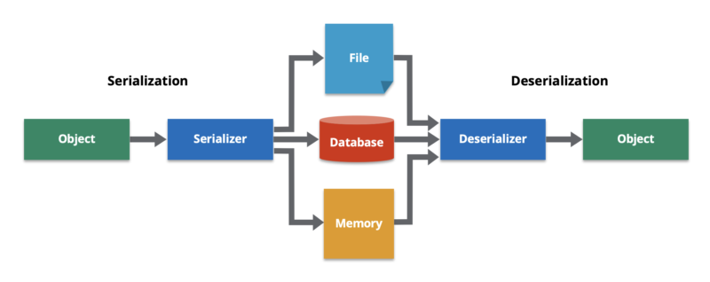

# Serializable

## 직렬화 & 역직렬화

직렬화(Serialization)란 자바의 객체나 데이터를 파일이나 다른 서버에서도 사용할 수 있도록 바이트스트림 형태의 연속적인 데이터로 변환하는 과정이다. 반대로 역직렬화 (Deserialization)란 바이트로 변환된 데이터를 원래대로 자바의 객체 혹은 데이터로 변환시키는 기술이다. 주로 세션, 캐싱, 데이터 영속화, 외부 서버에 전송할때 사용된다.

## Serializable
Serializable 인터페이스는 선언된 변수나 메소드가 없는 마커 인터페이스로써 JVM은 Serializable 인터페이스를 구현한 객체를 다른 서버로 전송하거나 받아와서 저장할 수 있도록 해준다. 객체를 직렬화 하기전에 해당 인터페이스를 구현하지 않으면 NotSerializableException 런타임 예외가 발생한다.

## SerialVersionUID
Serializable 인터페이스를 구현한 클래스는 모두 serialVersionUID(SUID)라는 고유한 식별번호를 가진다. SUID는 객체를 직렬화, 역직렬화 할 때 해당 객체의 버전을 명시하는데 사용된다. 각각의 서버는 SUID를 가지고 보내고 받은 객체가 동일한 버전의 객체인지를 확인할 수 있다. 운영을 하다 내부 클래스 구조가 바뀔때마다 해당 SUID를 변경하고 사용자들에게 전파하여 관리한다.

SUID는 다음과 같이 클래스 내부에 선언해줘야 한다.
```
static final long serialVersionUID = 1L;
```

만약 직렬화된 클래스에 SUID가 도중에 바뀌게 된다면 다음과 같은 예외가 발생한다.
```
java.io.InvalidClassException: com.study.sj.serializes.SerialDTO; local class incompatible: stream classdesc serialVersionUID = -764694635925038621, local class serialVersionUID = 123
```

SUID를 명시해주지 않으면 런타임 환경에서 자동으로 클래스 내부정보를 이용해 해시 함수를 적용해 생성된다. 클래스 내부 구조가 바뀌면 해당 SUID 또한 자동으로 업데이트 된다. 하지만 런타임에 SUID를 생성하는 오버헤드를 피하기 위해 위와 같이 수동으로 관리하는 방법이 권장된다.

## 객체 저장하기
Serializable 인터페이스를 구현한 간단한 dto를 만들어보자. ObjectOutputStream 클래스를 사용하면 직렬화된 객체를 저장할 수 있다. 단, 클래스 필드를 제외한 객체의 인스턴스 필드만 저장이 된다.

```java
public class SerialDTO implements Serializable {
    private static final long serialVersionUID = 123L;

    private String bookName;
    private int bookOrder;
    private boolean bestSeller;
    private long soldPerDay;

    public SerialDTO(String bookName, int bookOrder, boolean bestSeller, long soldPerDay) {
        this.bookName = bookName;
        this.bookOrder = bookOrder;
        this.bestSeller = bestSeller;
        this.soldPerDay = soldPerDay;
    }

    @Override
    public String toString() {
        return "SerialDTO{" +
                "bookName='" + bookName + '\'' +
                ", bookOrder=" + bookOrder +
                ", bestSeller=" + bestSeller +
                ", soldPerDay=" + soldPerDay +
                '}';
    }
}
```

```java
public static void main(String[] args) {
    String fileName = "SerialDTO.ser";
    try (
            FileOutputStream fos = new FileOutputStream(fileName);
            ObjectOutputStream out = new ObjectOutputStream(fos)
    ) {
        SerialDTO serialDTO = new SerialDTO("책 이름", 1, true, 1);
        out.writeObject(serialDTO);

    } catch (IOException e) {
        e.printStackTrace();
    }
}
```

SerialDTO.ser 내부는 바이너리로 저장되어 있다.

전체적인 과정을 요약하자면 다음과 같다.
1. 자바 힙 메모리에 있는 serialDTO를 직렬화
2. FileOutputStream, ObjectOutputStream의 writeObject 메소드 사용
3. 직렬화된 객체를 파일로 저장

## 객체 읽어오기
객체를 저장할때 FileOutputStream, ObjectOutputStream을 사용했다면 객체를 읽어올때는 FileInputStream, ObjectInputStream 클래스를 사용하여 파일에 저장된 객체를 역직렬화 할 수 있다.

```java
public static void main(String[] args) {
    String fileName = "SerialDTO.ser";
    
    try (
            FileInputStream fos = new FileInputStream(fileName);
            ObjectInputStream in = new ObjectInputStream(fos)
    ) {
        SerialDTO object = (SerialDTO) in.readObject();

        System.out.println(object);

    } catch (IOException e) {
        e.printStackTrace();
    } catch (ClassNotFoundException e) {
        throw new RuntimeException(e);
    }
}
```

```실행 결과
> Task :Java.main()
SerialDTO{bookName='책 이름', bookOrder=1, bestSeller=true, soldPerDay=1}
```
역직렬화를 사용하면 생성자를 사용한 초기화 없이 바로 객체를 사용할 수 있다.

전체적인 과정을 요약하자면 다음과 같다.
1. FileInputStream, ObjectInputStream의 readObject 메소드 사용
2. 역직렬화된 객체를 JVM에 힙 메모리에 저장

## transient
Serializable 인터페이스를 구현한 클래스의 멤버 변수에 transient 키워드를 사용하면 직렬화 대상에서 제외된다.

해당 변수는 아래와 같은 값으로 역직렬화 될 때 초기화된다.
- 기본형일 경우 해당 타입의 default 값. 
- 참조형일 경우 null

예를들어 다음과 같이 bookName 멤버 변수에 transient 키워드를 사용하면
```java
public class SerialDTO implements Serializable {
    transient private String bookName;
    private int bookOrder;
    private boolean bestSeller;
    private long soldPerDay;

    // 나머지 생략
}
```

직렬화 했을 때 bookName은 생략되고 역직렬화 했을 때 bookName 필드는 null로 나온다.
```
> Task :Java.main()
SerialDTO{bookName='null', bookOrder=1, bestSeller=true, soldPerDay=1}
``` 