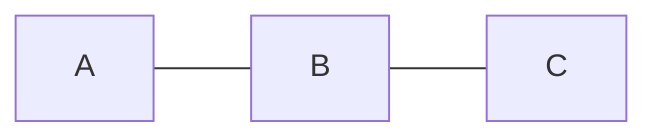

# Set
Set은 데이터의 중복을 허용하지 않고 순서와 사관없이 데이터를 저장할 수 있는 자료구조이다. 주로 어떤 데이터가 존재하는지에 대한 확인의 용도로 사용한다.
## HashSet의 특징
HashSet은 컬렉션의 Set 인터페이스의 구현체중에 가장 성능이 좋다. 해시맵(Hash Map)을 사용해 데이터를 처리한다. 

HashMap의 Key는 객체 그 자체를, Value는 HashSet에서 자체적으로 구현한 더미 객체를 사용한다.
```java
public class HashSet<E>
    extends AbstractSet<E>
    implements Set<E>, Cloneable, java.io.Serializable
{
    // 생략

    // Dummy value to associate with an Object in the backing Map
    private static final Object PRESENT = new Object();
```

HashMap의 Key값은 중복을 허용하지 않는 성질이 있어 HashSet의 내부 객체들의 중복을 피할 수 있다. 심지어 null도 HashSet에서는 단 한번 가질 수 있다.

## HashSet의 생성자와 주요 메소드
### 생성자
HashSet이 제공하는 생성자는 다음과 같다.
| 메소드 | 설명 |
| --- | --- |
| HashSet() | 데이터를 저장할 수 있는 16개의 공간과 0.75의 로드팩터를 갖는 객체를 생성한다 |
| HashSet(Collection<? extends E> c | 매개 변수로 넘어온 컬렉션 객체의 데이터를 저장한다 |
| HashSet(int initialCapacity) | 매개 변수로 넘어온 initialCapacity만큼의 저장공간을 가진 공간과 0.75의 로드팩터를 갖는 객체를 생성한다 |
| HashSet(int initialCapacity, float loadFactor) | 매개 변수로 넘어온 initialCapacity만큼의 저장공간을 가진 공간과 매개 변수로 넘어온 loadFactor만큼의 로드팩터를 갖는 객체를 생성한다 |

여기서 `loadFactor = 총 데이터의 개수 / 저장공간`을 의미한다. 기본값은 0.75f이다. 데이터가 HashSet에 계속 추가되어 loadFactor를 넘어서는 경우에는 저장 공간의 크기를 늘리고 데이터를 다시 배치하는 rehashing 작업이 이루어진다.

### 메소드
HashSet에 제공하는 주요 메소드들은 다음과 같다
| 메소드 | 설명 |
| --- | --- |
| boolean add(E e) | 데이터를 추가한다 |
| void clear() | 데이터를 모두 삭제한다 |
| Object clone() | HashSet 객체를 복사하지만 담겨있는 데이터는 복사하지 않는다 |
| boolean contains(Object o) | 매개 변수로 넘어온 객체의 존재 여부를 반환한다 |
| boolean isEmpty() | 데이터가 있는지 확인한다 |
| Iterator<E> iterator() | Iterator 객체를 반환한다 |
| boolean remove(Object o) | 매개 변수로 넘어온 객체를 삭제한다 |
| int size() | 데이터의 개수를 반환한다 |

# Queue
Queue는 먼저 들어온 데이터가 먼저 나가는 FIFO(First In First Out)의 성질을 가진 데이터 구조이다. 

## LinkedList
LinkedList는 List, Queue 인터페이스의 구현체로써 리스트, 큐의 역할을 둘 다 할 수 있다. 각 노드(객체)끼리의 주소를 서로 가르켜 이어지는 구조를 가진다. 자바 컬렉션에서 사용하는 LinkedList는 양방향 연결 리스트로써 이전 노드와 다음 노드의 정보를 가르키고 있다. 


```java
private static class Node<E> {
    E item; // 데이터
    Node<E> next; // 이전 노드
    Node<E> prev; // 다음 노드
}
```

## LinkedList의 생성자와 주요 메소드
### 생성자
LinkedList가 제공하는 생성자는 다음과 같다. LinkedList는 데이터가 추가될때 마다 노드들이 생성되어 추가되는 구조이기 때문에 초기 저장공간을 따로 확보하지 않는다.
| 메소드 | 설명 |
| --- | --- |
| LinkedList() | 비어 있는 LinkedList 객체를 생성한다 |
| LinkedList(Collection<? extends E> c) | 매개 변수로 받은 컬렉션을 LinkedList에 저장한 객체를 생성한다 |

### LinkedList에 데이터를 생성하고 수정하는 다양한 메소드
LinkedList는 여러 종류의 인터페이스를 구현했기 때문에 중복된 기능을 하는 메소드가 많다. 다음은 LinkedList에서 데이터를 생성, 수정할 수 있는 메소드 목록이다.

| 메소드 | 설명 |
| --- | --- |
| void addFirst(Object), boolean offerFirst(Object), push(Object) | LinkedList 맨 앞에 데이터를 추가한다 |
| boolean add(Object), void addLast(Object), boolean offer(Object), boolean offerLast(Object) | LinkedList 맨 마지막에 데이터를 추가한다 |
| void add(int, Object) | 매개변수로 넘어온 index에 데이터를 추가한다 |
| boolean addAll(Collection) | 매개변수로 넘어온 컬렉션 객체를 LinkedList의 맨 마지막에 추가한다 |
| boolean addAll(int, Collection) | 매개변수로 넘어온 컬렉션 객체를 LinkedList의 index에 추가한다 |
| Object set(int, Object) | 매개변수로 넘어온 index의 객체를 수정하고 기존에 있던 데이터를 반환한다 |

### LinkedList의 조회 관련 메소드
| 메소드 | 설명 |
| --- | --- |
| Object getFirst(), Object peekFirst(), Object peek(), Object element() | LinkedList 맨 앞에 있는 데이터를 반환한다 |
| Object getLast(), Object peekLast() | LinkedList 맨 뒤에 있는 데이터를 반환한다 |
| Object get(int) | 매개변수로 넘어온 index에 해당하는 데이터를 반환한다 |
| boolean contains(Object o) | 매개 변수로 넘어온 객체의 존재 여부를 반환한다 |
| int indexOf(Object) | 매개 변수로 넘어온 객체의 인덱스를 앞에서부터 검색하여 반환한다. 없을 경우 -1을 반환한다 |
| int lastIndexOf(Object) | 매개 변수로 넘어온 객체의 위치를 끝에서부터 검색하여 반환한다. 없을 경우 -1을 반환한다 |

### LinkedList의 삭제 관련 메소드
| 메소드 | 설명 |
| --- | --- |
| Object remove(), Object removeFirst(), Object poll(), Object pollFirst(), Object pop() | LinkedList 맨 앞에 데이터를 삭제한다 |
| Object pollLast(), Object removeLast() | LinkedList 맨 마지막에 데이터를 삭제한다 |
| Object remove(int) | 매개 변수로 넘어온 index의 데이터를 삭제한다 |
| boolean remove(Object), boolean removeFirstOccurence(Object) | 매개 변수로 넘어온 객체와 동일한 데이터중 맨 앞에서부터 가장 처음에 발견된 데이터를 삭제한다 |
| boolean removeLastOccurence(Object) | 매개 변수로 넘어온 객체와 동일한 데이터중 맨 뒤에서부터 가장 처음에 발견된  데이터를 삭제한다 |