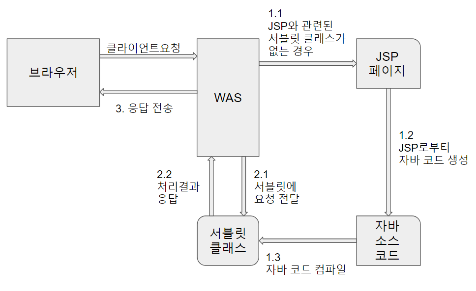
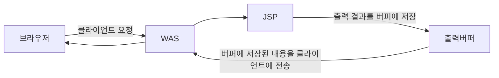

# JSP 처리과정

## JSP 요청 처리 과정


JSP 페이지에 대한 WAS의 처리 과정은 다음과 같다

- JSP에 해당하는 서블릿이 존재하지 않을 경우
    1. JSP 페이지로부터 자바 코드를 생성한다 (1.2)
    2. 자바 코드를 컴파일해서 서블릿 코드를 생성한다 (1.3)
    3. 서블릿에 클라이언트 요청을 전달한다 (2.1)
    4. 서블릿이 요청을 처리한 결과를 응답으로 생성한다 (2.2)
    5. 응답을 웹 브라우저로 전달한다 (3)

- JSP 해당하는 서블릿이 존재할 경우
    1. 해당 서블릿에 요청을 전달한다 (2.1)
    2. 서블릿이 요청을 처리한 결과를 응답으로 생성한다 (2.2)
    3. 응답을 웹 브라우저에 전송한다 (3)


## 출력 버퍼와 응답


JSP 페이지는 응답 결과를 버퍼(buffer)라고 불리는 곳에 임시로 저장했다가 한번에 브라우저에 전송한다. I/O를 다루는 작업에서는 작은 단위로 여러번 데이터를 보내는 것 보다 버퍼를 사용해 큰 단위로 한번에 묶어 보내는 것이 높은 성능을 발휘하게 된다.

또한 JSP 실행 도중에 에러가 발생하면 버퍼를 비우고 새로운 에러 화면을 출력할 수 있다. 마찬가지로 버퍼의 내용을 브라우저에 보내기 전까지 헤더를 변경할 수 있다는 장점이 있다.

### 버퍼 옵션 설정하기
버퍼에 대한 설정은 page 디렉티브를 통해 할 수 있다.

```java
<%@ page buffer = "4kb" %>
```
버퍼는 킬로바이트(kb) 단위로 지정할 수 있다. 별도로 단위를 지정해주지 않으면 8kb 용량의 버퍼가 생성된다.

```java
<%@ page buffer = "none" %>
```
버퍼를 사용하지 않으면 none을 지정하면 된다. 버퍼를 사용하지 않으면 JSP 페이지가 출력하는 내용을 곧 바로 웹 브라우저에 전송하게 된다. 

```java
<%@ page autoFlush = "true" %>
```
버퍼가 다 차게되면 자동으로 브라우저에 응답 결과를 전송(flush) 한다.

```java
<%@ page autoFlush = "false" %>
```
버퍼의 크기보다 응답 데이터가 커지면 예외를 발생시킨다.

## 웹 어플리케이션의 폴더 구성과 URL 매핑

### 폴더 구성
서블릿 / JSP 규약은 웹 어플리케이션이 다음과 같은 폴더 구조를 따르도록 제한하고 있다.

웹 어플리케이션
- WEB-INF : 웹 어플리케이션의 정보를 담고 있는 디렉토리. 대표적으로 web.xml 파일이 있다
    - classes : 웹 어플리케이션에서 사용하는 클래스 파일들을 가지고 있다
    - lib : 웹 어플리케이션에서 사용하는 jar 파일들을 가지고 있다

### URL 매핑
webapps 폴더의 하위 폴더는 자동으로 웹 어플리케이션에 포함된다. 각각의 폴더 이름은 웹 어플리케이션을 실행할떄 사용하는 URL과 동일한 구조를 지닌다.

```
webapps/ROOT.jsp --> http://localhost:8080
webapps/chap02.jsp --> http://localhost:8080/chap02
webapps/chap03.jsp --> http://localhost:8080/chap03
webapps/chap03/member/memberBoard.jsp --> http://localhost:8080/chap03/member/memberBoard
```

## 웹 어플리케이션 배포
웹 어플리케이셔을 WAS에 배포하는 방법은 다음과 같다
- 대상 폴더에 파일을 직접 복사 : 톰캣 서버의 특정 경로에 jsp 파일을 저장한다. 원격 컴퓨터인 경우 FTP를 사용한다.
- war 파일로 묶어서 배포 : jar 명령어를 통해 war(Web Application Archive) 파일을 생성한다. 이 후 톰캣의 webapps 폴더에 복사해주면 배포가 되고 해당 웹 어플리케이션의 URL 경로가 생성된다. 


