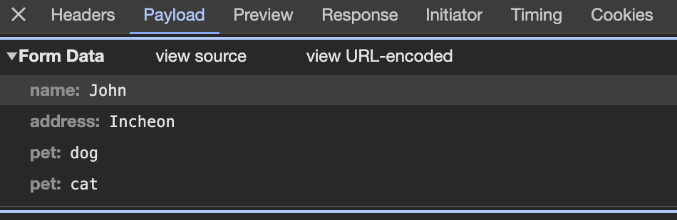

# JSP 페이지의 구성 요소

## 디렉티브
JSP 페이지에 대한 설정 정보를 지정할 때 사용된다. JSP가 제공하는 디렉티브는 다음과 같다.
| 디렉티브 | 설명 |
| --- | --- |
| page | JSP 페이지에 대한 정보를 지정한다. JSP가 생성하는 문서의 타입, 출력 버퍼의 크기, 에러 페이지 등 JSP에서 필요로 하는 정보를 설정한다 |
| taglib | JSP 페이지에서 사용할 태그 라이브러리를 지정한다 |
| include | JSP 페이지에 특정 영역에 다른 문서를 포함시킨다 |

디렉티브의 형식은 다음과 같다
```java
<%@ 디렉티브이름 속성1 = "값" 속성2 = "값"%>
```

예시로 디렉티브 이름은 `page`, 속성은 `contentType`, 속성의 값은 `text/html; charset=UTF-8`인 디렉티브는 다음과 같이 선언할 수 있다
```java
ex) <%@ page contentType="text/html; charset=UTF-8" %>
```

## 스크립트 요소
JSP에서 문서의 내용을 동적으로 생성하기 위해 사용한다. 스크립트 요소는 다음 세 가지가 있다.
- 표현식(Expression) : 값을 출력한다
- 스크립트릿(Scriptlet) : 자바 코드를 실행한다
- 선언부(Declaration) : 자바 메소드를 만든다

### 표현식
어떤 값을 출력 결과에 포함시키고자 사용한다. 구문은 다음과 같다
```java
<%= 값 %>
```

### 스크립트릿
자바 코드를 실행할때 사용한다. 구문은 다음과 같다
```java
<% 자바 코드 %>
```

예시로 1부터 10의 합을 출력해주는 JSP 페이지는 스크립트릿과 표현식을 사용하여 다음과 같이 구현할 수 있다.
```java
<%@ page contentType="text/html; charset=UTF-8"%>
<html>
<head>
    <title>1부터 10까지의 합</title>
</head>
<body>
<%
    int sum = 0;

    for (int i = 1; i < 11; i++) {
        sum += i;
    }
%>

1부터 10까지의 합은 : <%=sum%> 입니다.
</body>
</html>
```

브라우저에는 다음과 같은 값이 출력된다.
```
1부터 10까지의 합은 : 55 입니다.
```

### 선언부
JSP 페이지에서 스크립트릿이나 표현식에서 사용할 수 있는 자바 메소드를 만들때 사용한다. 구문은 다음과 같다.
```java
<%! 메소드 %>
```

위에 1부터 10까지의 합을 구하는 스크립트릿을 메소드로 작성해 선언부로 수정하면 다음과 같다.
```java
<%@ page contentType="text/html; charset=UTF-8"%>
<html>
<head>
    <title>1부터 10까지의 합</title>
</head>
<body>
<%!
    public int getSum() {
        int sum = 0;

        for (int i = 1; i < 11; i++) {
            sum += i;
        }

        return sum;
    }
%>
1부터 10까지의 합은 : <%=getSum()%> 입니다.
</body>
</html>
```

브라우저에는 다음과 같은 값이 출력된다.
```
1부터 10까지의 합은 : 55 입니다.
```

## 기본 객체
JSP는 웹 어플리케이션 프로그래밍을 하는데 필요한 기능을 가진 기본 객체를 제공한다. 종류는 다음과 같다
- request
- response
- session
- application
- page

## Request
Request 기본 객체는 JSP 페이지에서 가장 많이 사용되는 기본 객체이다. Request 객체는 웹 브라우저의 요청 정보를 담고 있으며 제공하는 기능은 다음과 같다.
- 클라이언트 (웹 브라우저) 관련한 정보 제공
- 서버와 관련된 정보 제공
- 클라이언트의 요청 파라미터 조회
- 클라이언트의 요청 헤더 조회
- 클라이언트가 전송한 쿠키 조회
- 속성 처리

Request 객체의 주요 메소드는 아래와 같이 사용할 수 있다.
```java
<%@ page contentType="text/html; charset=UTF-8"%>
<html>
<head>
    <title>Request 객체의 주요 메소드</title>
</head>
<body>
    클라이언트 IP = <%=request.getRemoteAddr()%> <br>
    요청 정보 길이 = <%=request.getContentLength()%> <br>
    요청 정보 인코딩 = <%=request.getCharacterEncoding()%> <br>
    요청 정보 컨텐츠 타입 = <%=request.getContentType()%> <br>
    요청 정보 프로토콜 = <%=request.getProtocol()%> <br>
    요청 정보 전송방식 = <%=request.getMethod()%> <br>
    요청 URI = <%=request.getRequestURI()%> <br>
    컨텍스트 경로 = <%=request.getContextPath()%> <br>
    서버 이름 = <%=request.getServerName()%> <br>
</body>
</html>
```

브라우저에는 다음과 같은 값이 출력된다.
```
클라이언트 IP = 0:0:0:0:0:0:0:1
요청 정보 길이 = -1
요청 정보 인코딩 = null
요청 정보 컨텐츠 타입 = null
요청 정보 프로토콜 = HTTP/1.1
요청 정보 전송방식 = GET
요청 URI = /chap02/time.jsp
컨텍스트 경로 = /chap02
서버 이름 = localhost
```

### Request 파라미터
request 객체의 파라미터는 다음과 같은 메소드를 활용해 읽어올 수 있다.
| 메소드 | 설명 |
| --- | --- |
| String getParameter(String name) | 이름이 name인 파라미터의 값을 반환한다. 존재하지 않을 경우 null을 반환한다 |
| String[] getParameterValues(String name) | 이름이 name인 파라미터의 모든 값을 배열로 반환한다. 존재하지 않을 경우 null을 반환한다 |
| Enumeration getParameterNames() | 웹 브라우저가 전송한 파라미터의 이름 목록을 반환한다 |
| Map getParameterMap() | 웹 브라우저가 전송한 파라미터의 key, value를 반환한다|


JSP 폼 양식을 통해 GET, POST 방식으로 request 객체의 파라티머를 브라우저에 출력해보자.

먼저 폼을 입력받는 JSP 페이지를 작성하자.
```html
<%@ page contentType="text/html; charset=UTF-8" %>

<html>
<head><title>폼 생서</title></head>
    <body>
        <form action="viewParameter.jsp" method="get">
            이름 : <input type="text" name="name">
            주소 : <input type="text" name="address">
            좋아하는 동물 :
            <input type="checkbox" name="pet" value="dog"> 강아지
            <input type="checkbox" name="pet" value="cat"> 고양이
            <br>
            <input type="submit" value="전송">
        </form>
    </body>
</html>
```

다음으로 폼 통해 넘어온 request 객체의 값을 브라우저에 출력하는 JSP 페이지를 만들어보자.
```java
<%@ page contentType="text/html; charset=UTF-8" %>
<%@ page import="java.util.Enumeration" %>
<%@ page import="java.util.Map" %>

<%
    request.setCharacterEncoding("UTF-8");
%>

<html>
<head><title>요청 파라미터 출력</title></head>

    <body>
        요청 메소드 = <%=request.getMethod()%> <br>
        name = <%=request.getParameter("name")%> <br>
        address = <%=request.getParameter("address")%> <br>
        
        request.getParameterValues() 호출
        
        <%
            String[] values = request.getParameterValues("pet");
        
            for (String value : values) {
        %>
        <%=value%>
        <%
            }
        %>
        
        <br> request.getParameterNames() 호출
        <%
            Enumeration enums = request.getParameterNames();
        %>
        
        <%= enums.nextElement()%>
        
        <br> request.getParameterMap() 호출
        <%
            Map parameterMap = request.getParameterMap();
            String[] nameParam = (String[]) parameterMap.get("name");
        %>
        
        <%=nameParam[0]%>
    
    </body>
</html>
```


두 JSP 페이지를 작성하고 폼에 위와 같은 정보를 입력하고 제출해보자.

브라우저의 출력 결과는 다음과 같다.
```
요청 메소드 = GET
name = John
address = Incheon
request.getParameterValues() 호출 dog cat
request.getParameterNames() 호출 name
request.getParameterMap() 호출 John
```

### post vs get
form 태그의 속성값을 get 혹은 post로 지정해서 파라미터 전송 방식을 정할 수 있다.
```java
<form action="viewParameter.jsp" method="get">
<form action="viewParameter.jsp" method="post">
```

get 메소드로 파라미터를 전송하게 되면 url의 쿼리 문자열로 파라미터가 전송된다. 
```
http://localhost:8080/chap03/viewParameter.jsp?name=John&address=Incheon&pet=dog&pet=cat
```

post 메소드로 파라미터를 전송하게 되면 요청 본문(body)을 통해 파라미터가 전송된다.


두 방식에 대한 차이점은 다음과 같다.

GET
- 데이터 전송 방법: 데이터는 URL의 쿼리 문자열로 전송된다
- 보안: GET 방식은 URL에 데이터가 노출되므로 보안에 취약하다
- 데이터 길이 제한: URL에 첨부되는 데이터의 길이에 제한이 있다
- 캐싱: 브라우저는 GET 요청을 캐시할 수 있으므로, 이전에 보낸 동일한 요청에 대해 캐시를 사용할 수 있다

POST
- 데이터 전송 방법: 데이터는 HTTP 요청의 본문(body)에 포함되어 전송된다
- 보안: POST 방식은 데이터가 URL에 노출되지 않으므로 GET 방식에 비해 보안적으로 강력하다 따라서 민감한 정보를 전송하는 데 적합하다
- 데이터 길이 제한: POST는 데이터 길이에 대한 제한이 없다. 따라서 대량의 데이터를 전송할 때 유용하다
- 캐싱: POST 요청은 일반적으로 캐시되지 않는다

### Request 헤더
헤더는 HTTP 요청에서 클라이언트와 서버간의 부가적인 정보를 주고 받는데 사용된다. 예를 들면 인증 토큰에 대한 정보가 담긴 Authorization, 클라이언트의 프로그램이 담긴 User-Agent, 쿠키 값이 담긴 Cookie 등이 있다.

request 기본 객체는 다음과 같이 헤더 정보를 가져올 수 있는 메소드를 사용할 수 있다.
| 메소드 | 설명 |
| --- | --- |
| String getHeader(String name) | 지정한 이름의 헤더 값을 반환한다 |
| Enumeration getHeaders(String name) | 지정한 이름의 헤더 목록을 반환한다 |
| Enumeration getHeaderNames() | 모든 헤더의 이름을 반환한다 |
| int getIntHeader(String name) | 지정한 이름의 헤더 값을 정수로 반환한다|
| long getDateHeader(String name) | 지정한 이름의 헤더 값을 시간으로 반환한다 |

request 객체의 헤더를 가져올 수 있는 JSP 페이지는 다음과 같이 작성할 수 있다.
```java
<%@ page contentType="text/html; charset=UTF-8" %>
<%@ page import="java.util.Enumeration" %>
<html>
<header><title>헤더 목록 출력</title></header>
    <body>
        <%
            Enumeration headerEnums = request.getHeaderNames();
    
            while(headerEnums.hasMoreElements()) {
                String headerName = (String) headerEnums.nextElement();
                String headerValue = request.getHeader(headerName);
        %>
        <%=headerName%> = <%=headerValue%>
        <%
            }
        %>
    </body>
</html>
```

## Response
Response 기본 객체는 웹 브라우저에게 보내는 응답 정보를 가진 객체이다. 제공하는 주요 기능은 다음과 같다.
- 헤더 정보 입력
- 리다이렉트

헤더 정보를 입력할 수 있는 메소드의 종류는 다음과 같다.
| 메소드 | 설명 |
| --- | --- |
| addDateHeader(String name, long date) | name 헤더에 date를 추가한다 |
| addHeader(String name, String value) | name 해더에 value를 값으로 추가한다 |
| addIntHeader(String name, int value)| name 헤더에 정수값 value를 추가한다 |
| setDateHeader(String name, long date)| name 헤더의 값을 date로 지정한다|
| setHeader(String name, String value) | name 헤더의 값을 value로 지정한다 |
| setIntHeader(String name, int value) | name 헤더의 정수 값을 value로 지정한다 |
| containsHeader(String name) | name 헤더의 포함 여부를 반환한다 |

### 웹 브라우저 캐싱
웹 브라우저는 빠른 응답을 제공하기 위해 동일한 요청에 대한 응답을 로컬 캐시에 저장한다. 이후 동일한 URL에 대한 요청이 있으면 WAS에 접근하지 않고 로컬 PC에 저장된 결과를 사용한다. 간혹가다 DB 업데이트를 해도 웹 브라우저에 출력된 내용이 바뀌지 않으면 웹 브라우저 캐싱일 가능성이 크다.

따라서 업데이트 된 리소스를 정확하게 제공하기 위해 브라우저 캐시 정책을 올바르게 구현해야 한다. HTTP는 응답 헤더를 통해 웹 브라우저 캐싱에 대한 설정을 관리할 수 있다. 

#### Cache-Control
HTTP 1.1 버전에서 지원하는 헤더로써 헤더의 값을 "no-cache"로 지정하면 브라우저는 캐시를 사용하지 않는다. 브라우저 마다 간혹 "no-cache"로 설정해도 뒤로가기 버튼을 클릭하면 캐시 저장소에 보관되어 있는 응답을 사용한다. 이 마저도 허용하지 않으려면 헤더의 값을 "no-store"로 지정하면 브라우저는 응답을 캐시 저장소에 저장하지 않는다.
```java
response.setHeader("Cache-Control", "no-cache");
```

```java
response.addHeader("Cache-Control", "no-store");
```

#### Pragma
HTTP 1.0 버전에서 지원하는 헤더로써 "no-cache"로 설정하면 브라우저는 응답 결과를 캐시 저장소에 저장하지 않는다.
```java
response.setHeader("Pragma", "no-cache");
```

### Expires
HTTP 1.0 버전에서 지원하는 헤더로써 응답 결과의 만료일을 지정할 수 있다.
```java
response.setDateHeader("Expires", 1L);
```

### 리다이렉션
리다이렉션은 서버가 웹 브라우저에게 다른 페이지로 이동하라고 응답하는 기능이다. 리다이렉션 응답을 보내면 웹 브라우저는 응답받은 리다이렉션 대상 페이지 요청을 다시 서버로 보낸다. 

Response 객체의 리다이렉션 페이지 지정은 다음과 같이 할 수 있다.
```java
<%@ page contentType="text/html; charset=UTF-8" %>

<html>
<%
    request.setCharacterEncoding("UTF-8");

    String memberId = request.getParameter("memberId");
    String password = request.getParameter("password");

    if (memberId != null && password.equals("정확한 비밀번호")) {
        response.sendRedirect("/chap3/form.jsp");
    } else {
%>
<header>
    <title>로그인 실패</title>
</header>
<body>
잘못된 비밀번호 입니다.
</body>
</html>
<%
    }
%>
```

