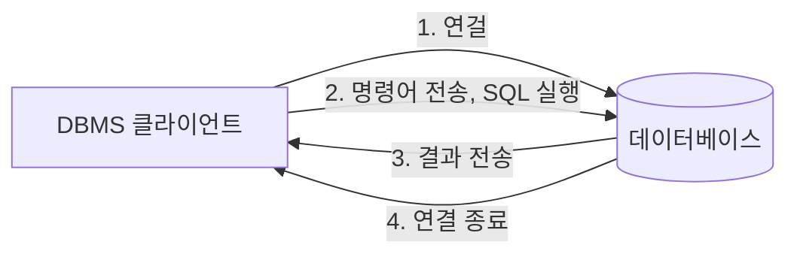
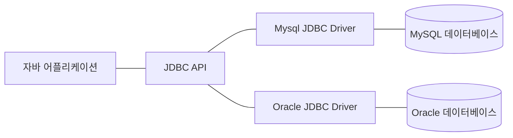

# 데이터베이스 프로그래밍

## DBMS
DBMS(Database Management System)은 데이터를 안정적으로 보관할 수 있는 다양한 기능을 제공한다. 몇 가지 중요한 기능들을 정리하자면 다음과 같다.
- 데이터의 CRUD
- 데이터의 무결성 유지
- 트랜잭션 관리
- 데이터의 백업 및 복원
- 데이터 보안

웹 어플리케이션을 구현할때는 주로 관계형 데이터베이스를 사용한다. 관계형 DBMS의 대표적인 종류로써는 MySQL, Oracle, MSSQL 등이 있다.

### DBMS의 사용 순서는 다음과 같다.


## JDBC
자바에서 데이터베이스 프로그래밍을 할 때는 JDBC(Java Database Connectivity)를 사용한다. 모든 DBMS를 하나의 JDBC API로 처리할 수 있다는 특징이 있다. 

JDBC는 DBMS별 JDBC 드라이버를 통해 해당 데이터베이스와 통신한다. 주요 데이터베이스에 대한 JDBC 드라이버의 클래스는 다음과 같다.
- Mysql : com.mysql.jdbc.Driver
- Oracle : oracle.jdbc.driver.OracleDriver



### JDBC 프로그래밍의 실행 순서
JDBC 프로그래밍의 전형적인 실행 순서는 다음과 같다.
1. JDBC 드라이버 로딩
2. 데이터베이스 커넥션 구하기
3. 쿼리 실행을 위한 Statement 작성
4. 쿼리 실행
5. 쿼리 실행 결과(ResultSet) 사용
6. Statement 종료
7. 데이터베이스 커넥션 종료


#### JDBC 드라이버 로딩
```java
try {
    Class.forName("com.mysql.cj.jdbc.Driver");
} catch (ClassNotFoundException e) {
    throw new RuntimeException(e);
}
```

JDBC 드라이버는 DBMS와 통신을 담당하는 클래스로써 각각의 DBMS마다 다른 드라이버를 사용한다. JDBC 드라이버는 Class.forName 메소드를 호출하면 자동으로 등록된다. 해당 드라이버를 찾을 수 없을 때 ClassNotFoundException 예외를 발생시킨다.

#### JDBC URL
JDBC URL을 통해 사용하고자 하는 데이터베이스에 연결할 수 있다. 일반적인 JDBC URL의 형식은 다음과 같다.
```
jdbc:<DBMS>:<데이터베이스 식별자>
```

예를들어 MySQL DBMS를 사용하는 데이터베이스에 연결하려면 다음과 같은 JDBC URL을 사용한다.
```
jdbc:mysql://localhost:3306/db_name
```

JDBC 드라이버와 MySQL 서버와 데이터를 주고받을때 올바른 캐릭터셋을 맞춰주기 위해서 다음과 같은 추가 파라미터를 사용한다.
```
jdbc:mysql//localhost:3306/db_name?useUnicode=true&characterEncoding=utf-8
```

#### 데이터베이스 커넥션
JDBC를 이용해서 데이터베이스를 사용하려면 데이터베이스와 연결된 커넥션을 사용해야 한다. `java.sql` 패키지의 Connection 클래스가 데이터베이스의 커넥션을 담는 클래스이고 DriverManager 클래스의 getConnection 메소드를 사용하면 연결된 커넥션 객체를 반환한다. 커넥션 객체를 생성하지 못하면 SQLException 예외를 발생시킨다.

```java
try {
    Connection conn = DriverManager.getConnection(DB_URL, USER, PASSWORD);
} catch (SQLException e) {
    throw new RuntimeExceptione(e);
}
```

#### Statement & ResultSet
커넥션을 생성하고 쿼리를 작성했으면 이제 Statement를 생성하여 쿼리를 실행시킨다. Statement는 SQL 쿼리를 데이터베이스에 보내기 위한 인터페이스이다. 
연결된 커넥션 객체를 통해 Statement를 가져올 수 있다. Statment는 select 쿼리와 나머지 update, insert, delete 쿼리 여부에 따라 호출하는 메소드와 쿼리의 결과를 저장하는 타입이 구분되어 있다. 예시는 다음과 같다.

- select 쿼리는 executeQuery 메소드를 사용하고 결과를 ResultSet 타입 변수에 저장한다
```java
    String query = "select * from member order by member_id";

    Statement stmt = conn.createStatement();
    ResultSet rs = stmt.executeQuery(query);

    while(rs.next) {
        // 한 행씩 반복 처리
    }
```
ResultSet은 JDBC API에서 쿼리의 조회 쿼리의 결과를 가져오는데 사용된다. 결과의 대한 순회(next) 데이터 읽기(getString, getInt, getLong, getDouble 등등), 행과 열의 이동(커서), 결과에 대한 메타데이터에 대한 정보를 가지고 있다.

- update, insert, delete 쿼리는 executeUpdate 메소드를 사용하고 결과를 int 타입 변수에 저장된다. 
```java
    String updateName = "'steve'";
    String updateQuery = "update member set name = " + updateName + " where member_id = 1";

    Statement stmt = conn.createStatement();
    int updateCount = stmt.executeUpdate(updateQuery); // 변경된 (삽입된) 레코드의 개수를 반환한다
```

### PreparedStatement
쿼리를 실행할 때 Statement 인터페이스 외에 PreparedStatement 인터페이스를 사용할 수 있다. PreparedStatement는 미리 컴파일된 SQL문에 매개 변수롤 전달하여 주로 동적인 쿼리를 다룰 때 사용한다.

```java
String insertQuery = "insert into member(member_id, name, password, email) values (?,?,?,?)";
PreparedStatement psmt = conn.prepareStatement(insertQuery);

String name = request.getParameter("name");
String password = request.getParameter("password");
String email = request.getParameter("email");

// 물음표를 대체할 값들을 지정해준다
psmt.setLong(1, 2);
psmt.setString(2, name);
psmt.setString(3, password);
psmt.setString(4, email);

int insertRowCount = psmt.executeUpdate();
```

 값이 필요한 부분을 모두 (?)로 대치한 쿼리를 미리 작성하고 PreparedStatement 인터페이스의 set 메소드를 통해 파라미터를 입력한다. PreparedStatment를 사용하면 코드가 간결해지고 쿼리 내부의 값을 쉽게 변경할 수 있다는 장점이 있다. 

 #### Statement vs PreparedStatement
 Statement는 미리 컴파일된 SQL 쿼리를 그대로 데이터베이스에서 실행킨다. 주로 정적인 쿼리를 실행할때 사용한다. 반면 PreparedStatement는 미리 컴파일된 SQL 쿼리에 매개변수를 지정할 수 있다. SQL 쿼리에 매개변수를 사용할 부분을 ?로 작성하고 setString, setLong 등과 같은 메소드를 사용하여 매개변수의 위치와 값을 세팅할 수 있다. 주로 동적인 쿼리를 실행할때 사용한다.

 

 ### JDBC의 트랜잭션
트랜잭션이란 데이터베이스에서 실행되는 최소 작업 단위이다.