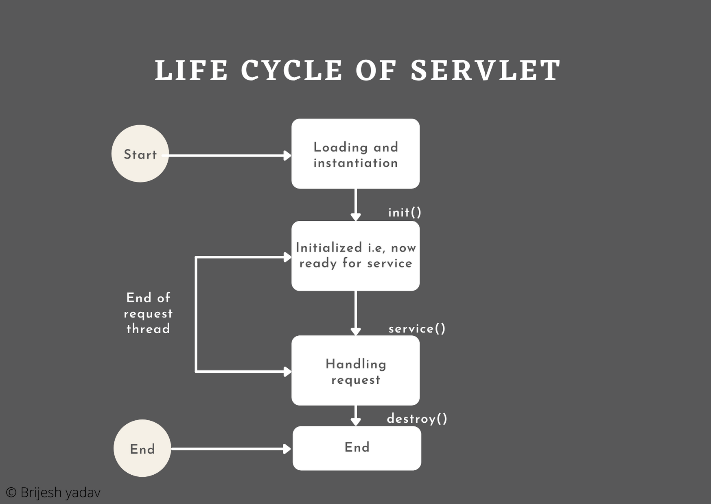
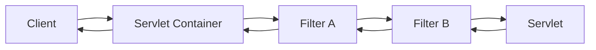

# Servlet
서블릿은 자바를 사용하여 클라이언트의 요청을 처리하고 그 결과를 반환하는 자바로 구현된 CGI이다.

> CGI(Common Gateway Interface)는 웹 서버와 프로그램간의 교환 방식이다. Get or Post 방법으로 클라이언트의 데이터를 전달하고, 프로그램의 동적인 표준 출력 결과를 클라이언트에게 전송하는 것이다. 즉, 자바 어플리케이션 코딩을 하듯 웹 브라우저용 출력 화면을 만드는 방법이다.

서블릿의 특징은 다음과 같다
- 클라이언트의 요청에 대해서 동적으로 응답하는 웹 어플리케이션 컴포넌트이다
- HTML을 사용하여 요청에 응답한다
- Java의 Thread를 사용하여 동작한다 (요청 당 쓰레드를 사용)
- MVC 패턴에서 Controller로 활용된다
- HTML 응답을 수정하려면 Servlet 코드를 재컴파일 해야 한다
- GET 메소드는 doGet(), POST 메소드는 doPost() 메소드를 사용하여 요청을 처리한다


## 서블릿 개발 과정
일반적은 서블릿 개발 과정은 다음과 같다.
1. 서블릿 규약에 따라 자바 코드 작성
2. 자바 코드를 컴파일해서 클래스 파일 생성
3. WEB-INF/classes 폴더에 클래스 파일 저장
4. web.xml 파일에서 서블릿 클래스 설정
5. 톰캣 등의 컨테이너 실행

기본적인 서블릿 예시는 다음과 같다


### 서블릿 클래스 생성하기
```java
public class NowServlet extends HttpServlet {
    @Override
    protected void doGet(HttpServletRequest request, HttpServletResponse response) throws IOException {
        response.setContentType("text/html; charset=utf-8");

        PrintWriter out = response.getWriter();

        out.println("<html>");
        out.println("<head><title>");
        out.println("출력 시간");
        out.println("</title></head>");
        out.println("<body>");
        out.println("지금 시간은 " + new Date() + " 입니다.");
        out.println("</body>");
        out.println("</html>");
    }
}
```

서블릿 클래스는 javax.servlet.http.HttpServlet 클래스를 상속받아야 서블릿으로써 동작한다. 

매개변수로 넘어오는 HttpServletRequest, HttpServletResponse 객체는 각각 JSP의 request, response 기본 객체에 해당하며, 클라이언트의 요청을 전송받은 Servlet Container가 각각 생성한다.

웹 브라우저에 데이터를 전송하려면 response.getWriter 메소드를 통해 반환되는 PrintWriter 객체의 println 메소드를 활용해 html 응답을 작성한다. 

### 서블릿 등록하기
서블릿을 등록하는 방식은 2가지가 있다. 기존에는 web.xml 파일에 서블릿을 매핑하는 방식이 있었으나 서블릿 3.0 버전부터는 @WebServlet 어노테이션을 활용해 서블릿 클래스를 등록할 수 있다

#### web.xml에 매핑하기
```xml
<!DOCTYPE web-app PUBLIC
        "-//Sun Microsystems, Inc.//DTD Web Application 2.3//EN"
        "http://java.sun.com/dtd/web-app_2_3.dtd" >
<web-app>
    <display-name>Servlet Study</display-name>
    
    <servlet>
        <servlet-name>now</servlet-name>
        <servlet-class>NowServlet</servlet-class>
    </servlet>

    <servlet-mapping>
        <servlet-name>now</servlet-name>
        <url-pattern>/now</url-pattern>
    </servlet-mapping>
    
</web-app>
```

생성한 서블릿 클래스를 web.xml 파일에 등록해준다. 

- `<servlet>` 태그 내부에 생성한 서블릿 클래스를 등록하고 name을 매핑한다
- `<servlet-mapping>` 태그 내부에서 등록한 name과 url을 매핑해준다

#### @WebServlet 어노테이션 사용하기
```java
@WebServlet(urlPatterns = "/now")
public class NowServlet extends HttpServlet {
    @Override
    protected void doGet(HttpServletRequest request, HttpServletResponse response) throws IOException {
        response.setContentType("text/html; charset=utf-8");

        PrintWriter out = response.getWriter();

        out.println("<html>");
        out.println("<head><title>");
        out.println("출력 시간");
        out.println("</title></head>");
        out.println("<body>");
        out.println("지금 시간은 " + new Date() + " 입니다.");
        out.println("</body>");
        out.println("</html>");
    }
}
```

@WebServlet 어노테이션의 urlPatterns 속성에 url을 매핑해준다. 

#### web.xml 등록 vs 어노테이션 등록
어노테이션은 서블릿 코드에 포함되므로 url을 수정하려면 서블릿 코드를 재컴파일 해야한다. web.xml를 사용하면 서블릿 코드를 재컴파일하지 않고 web.xml만 수정해주면 된다.

## 서블릿 생명주기


서블릿의 생명주기는 다음과 같다

### Init
클라이언트의 요청이 들어오면 서블릿 컨테이너는 해당 서블릿이 메모리에 있는지 확인하고 없으면 init 메소드를 호출해 초기화한다. 이 과정을 서블릿 로딩이라고 한다.
- 해당 서블릿의 최초 요청이 아닌 웹 컨테이너 구동 시점에 미리 초기화 하려면 web.xml 파일에서 `<load-on-startup>` 태그를 사용하면 된다.
- 서블릿 내용이 변경되면 기존에 메모리에 존재하는 서블릿 객체를 제거하고 init 메소드를 호출하여 새로운 서블릿 객체를 메모리에 저장한다
- init 메소드의 ServletConfig 매개변수를 활용하여 서블릿의 초기화가 가능하다. 초기화 파라미터는 web.xml의 `<init-param>` 태그를 사용하면 된다.
    ```xml
        <servlet>
        <servlet-name>dbcpInit</servlet-name>
        <servlet-class>DBCPInit</servlet-class>
        <init-param>
            <param-name>jdbcDriver</param-name>
            <param-value>com.mysql.cj.jdbc.Driver</param-value>
        </init-param>
    </servlet>
    ```
    ```java
    @Override
    public void init(ServletConfig config) {
        this.jdbcDriver = config.getInitParameter("jdbcDriver");
    }
    ```

- @WebServlet 어노테이션에 @WebInitParam 어노테이션 목록을 전달하여 초기화 파라미터를 지정할 수 있다.

    ```java
    @WebServlet(urlPatterns = "/now", initParams = {
        @WebInitParam(name="jdbcDriver", value = "com.mysql.cj.jdbc.Driver")
    })
    public class DBCPInit extends HttpServlet {
    }
    ```

### Service
클라이언트의 요청에 따라서 service 메소드를 통해 doGet, doPost 등으로 처리를 위임한다. 이때 서블릿 컨테이너는 요청과 응답에 대한 HttpServletRequest, HttpServletResponse 객체를 생성한다.

### Destroy
요청이 처리된 후 서블릿 컨테이너가 서블릿을 메모리에 내려야 할 시점(주로 서블릿 컨테이너를 종료하는 시점)에 destory 메소드를 호출하여 서블릿을 제거한다.

## Servlet Listener
웹 어플리케이션에서 발생한 주요 이벤트를 감지하고 각 이벤트에 특별한 작업이 필요한 경우에 사용할 수 있다. Servlet Context와 세션 수준에서 발생하는 이벤트를 관리하며 각각의 서블릿에서 공통적으로 사용할 수 있는 속성들을 Servlet Context에 key-value 형태로 저장할 수 있다.

사용 예시는 다음과 같다.

```java
public class MyListener implements ServletContextListener {
    @Override
    public void contextInitialized(ServletContextEvent sce) {
        System.out.println("Context Initialized");

        // Servlet Context에 저장
        sce.getServletContext().setAttribute("name", "sj");
    }

    @Override
    public void contextDestroyed(ServletContextEvent sce) {
        System.out.println("Context Destroyed");
    }
}
```
ServletContextListener 인터페이스를 구현한 Listener 클래스를 작성한다. Servlet Context가 초기화, 소멸 시 호출되는 메소드를 구현하여 이벤트 발생 시 부가적인 작업을 처리할 수 있다.

```xml
<!DOCTYPE web-app PUBLIC
 "-//Sun Microsystems, Inc.//DTD Web Application 2.3//EN"
 "http://java.sun.com/dtd/web-app_2_3.dtd" >

<web-app>
  <display-name>Archetype Created Web Application</display-name>
  <listener>
    <listener-class>me.sj.MyListener</listener-class>
  </listener>
</web-app>
```

web.xml에 `<listner>` 태그를 사용해 서블릿 리스너를 등록해준다.


## Servlet Filter
클라이언트의 요청을 서블릿으로 전달하기 전과, 서블릿의 응답을 클라이언트로 보내기전에 특별한 작업을 수행할 수 있는 체인 형태의 영역이다.



```java
public class MyFilter implements Filter {

    @Override
    public void init(FilterConfig filterConfig) throws ServletException {
        System.out.println("Filter Init");
    }

    @Override
    public void doFilter(ServletRequest req, ServletResponse resp, FilterChain filterChain) throws IOException, ServletException {
        System.out.println("Do Filter");

        // 필터 체이닝
        filterChain.doFilter(req, resp);
    }

    @Override
    public void destroy() {
        System.out.println("Filter Destroy");
    }
}
```

javax.servlet 패키지의 Filter 인터페이스를 구현한다. 여기서 주의해줘야 할 점은 필터는 체인 구조로 이루어져있기 때문에 필터 작업을 수행하는 doFilter 메소드의 맨 마지막에 FilterChain의 doFilter 메소드를 request, reponse 매개변수와 함께 호출하여 필터 체이닝을 걸어줘야 정상적으로 동작한다.

```xml
<web-app>
  <display-name>Archetype Created Web Application</display-name>
  <filter>
    <filter-name>myFilter</filter-name>
    <filter-class>me.sj.MyFilter</filter-class>
  </filter>

  <filter-mapping>
    <filter-name>myFilter</filter-name>
    <url-pattern>*</url-pattern>
  </filter-mapping>

</web-app>
```
