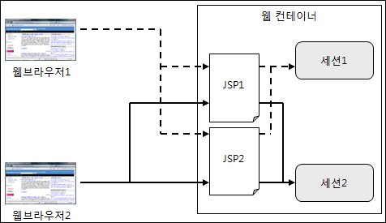

# Session


세션은 브라우저에 정보를 보관하는 쿠키와는 다르게 웹 컨테이너에 정보를 보관한다. 세션은 브라우저마다 각각 저장된다. 

## 세션 생성하기
JSP에서 세션 객체를 생성하는 방법은 두가지가 있다.

#### page 디렉티브 사용하기
page 디렉티브에 session 속성을 true로 지정한다. session 속성의 기본값은 true이다.
```java
<%@ page session="true"%>
```
page 디렉티브에서 session 속성이 true로 지정되면, 최초 브라우저 요청에서 session 기본 객체가 생성되며, 그 이후는 생성된 세션 객체를 사용하게 된다.

#### request.getSession 메소드 사용하기
page 디렉티브의 session 속성을 false로 지정하면 사용할 수 있다. request 기본 객체의 getSession 메소드를 사용하면 현재 요청과 관련된 session 객체를 반환한다. session 객체가 존재하지 않으면 새롭게 session 객체를 생성해서 반환한다.

```java
<%@ page session="false"%>
<%
    HttpSession session = request.getSession();
%>
```

```java
<%@ page session="false"%>
<%
    HttpSession session = request.getSession(false); // 세션 객체가 존재하지 않으면 null
%>
```
getSession 메소드의 인자로 false를 넣어주면 현재 요청과 관련된 session 객체가 없는 경우 null을 반환한다.

### 세션 정보 가져오기
session 기본 객체에 대한 메소드는 다음과 같다.
|메소드|설명|
| --- | --- |
|getId()| 세션의 고유 ID (세션 ID)를 반환한다|
|getCreationTime()| 세션이 생성된 시간을 반환한다|
|getLastAccessedTime()|가장 마지막으로 웹 브라우저가 세션에 접근한 시간을 구한다|

```java
<%@ page import="java.text.SimpleDateFormat" %>
<%@ page contentType="text/html;charset=UTF-8" %>

<%
    SimpleDateFormat sdf = new SimpleDateFormat("yyyy-MM-dd HH:mm:ss");
%>
<html>
<head>
    <title>세션 정보</title>
</head>
<body>
세션 ID : <%=session.getId()%> <br>
세션 생성일시 : <%=sdf.format(session.getCreationTime())%> <br>
세션 최근 접근일시 : <%=sdf.format(session.getLastAccessedTime())%>
</body>
</html>
```

브라우저 출력 결과는 다음과 같다.
```
세션 ID : E39424352D43A42F86F26E71F63D7A4D
세션 생성일시 : 2024-02-07 16:24:00
세션 최근 접근일시 : 2024-02-07 16:24:00
```

### 세션에 속성 사용하기
session 객체의 속성은 settAttribute, getAttribute 메소드로 속성을 활용할 수 있다. 속성에 대한 값은 Object 타입으로 저장된다.

```java
public interface HttpSession {
    // 나머지 메소드 생략
    void setAttribute(String var1, Object var2);
    Object getAttribute(String var1);
}
```

## 세션 종료
세션을 유지할 필요가 없으면 invalidate 메소드를 사용해서 session 객체를 삭제할 수 있다. 세션을 삭제하면 다음 브라우저의 요청부터 새로운 세션 객체가 생성된다.

```java
session.invalidate();
```
## 세션 유효 시간
세션은 최근 접근 시간을 가진다. 최근 접근 시간은 브라우저가 JSP 페이지에 접근할때마다 사용할때 계속 갱신된다. 최근 접근 시간 이후 일정 시간동안 세션을 사용하지 않게 되면 세션이 종료된다. 

예를들어 세션의 유효 시간이 30분이면, 세션의 가장 최근 접근 시간에서 30분이 지나면 세션은 자동으로 소멸된다. 이 후 세션을 요청하면 새로운 세션을 생성한다.

세션의 유효 시간을 설정하는 방법은 다음과 같다.
- web.xml을 통해 설정 (분 단위)
    ```xml
    <session-config>
        <session-timeout>50</session-timeout>
    </session-config>
    ```
- setMaxInactivateInterval 메소드를 통해 설정 (초 단위)
```java
session.setMaxInactivateInterval(60 * 50); // 50분
```

세션의 유효 시간을 0으로 설정하면 세션은 유효 시간을 가지지 않는다. 별도로 삭제를 해주지 않으면 계속 메모리에 남아있으므로 주의해야 한다.