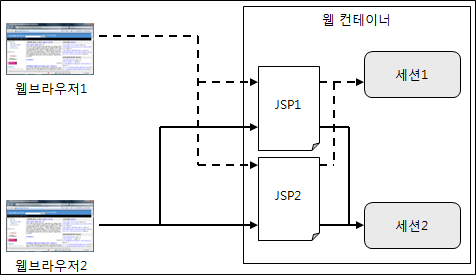

# Cookie

쿠키는 웹 브라우저가 보관하는 key-value 형식의 정보 파일이다. 쿠키는 서버 브라우저 모두 생성할 수 있다. 웹 브라우저는 웹 서버에 요청을 보낼 때 쿠키를 함께 전송하며 브라우저의 사용자 정보를 알 수 있다.

쿠키는 주로 사용자의 로그인 상태를 유지시켜주는 정보를 가지고 있거나, 사용자의 브라우저에 대한 언어, 테마와 같은 환경 설정, 장바구니, 광고와 같은 기능에 사용된다. 

## 쿠키의 동작 방식
쿠키의 동작 방식은 3단계로 구성된다.
1. 쿠키 생성 단계 : 서버에서 생성한 쿠키를 응답의 헤더에 저장하여 웹 브라우저에게 전송한다
2. 쿠키 저장 단계 : 브라우저는 응답으로 받은 쿠키에 대한 정보를 쿠키 저장소에 저장한다
3. 쿠키 전송 단계 : 브라우저는 저장한 쿠키를 요청의 Cookie 헤더에 포함시켜 서버에 전송한다. 서버는 쿠키를 사용해 필요한 작업을 진행한다

## 쿠키의 구성 요소
쿠키를 구성하는 요소는 다음과 같다
- 이름 : 각각의 쿠키를 식별하는데 사용한다
- 값 : 쿠키의 이름과 관련한 값
- 유효시간 : 쿠키의 유효시간. 별도로 지정하지 않으면 브라우저를 종료할 때 쿠키가 삭제된다
- 도메인 : 쿠키를 전송할 도메인
- 경로 : 쿠키를 전송할 요청 경로

## 주요 메소드
쿠키의 속성을 변경하거나 가져올 수 있는 주요 메소드는 아래와 같다
|메소드|설명|
| --- | --- |
|String getName()| 쿠키 이름을 반환한다|
|String getValue()| 쿠키 값을 반환한다|
|void setValue(String value)|쿠키 값을 지정한다|
|void setDomain(String pattern)|쿠키가 전송된 서버의 도메인을 지정한다|
|String getDomain()|쿠키의 도메인을 반환한다|
|void setPath(String uri)|쿠키를 전송할 경로를 지정한다|
|String getPath()|쿠키의 전송 경로를 반환한다|
|void setMaxAge(int expiry)|쿠키의 유효시간을 초 단위로 지정한다.|
|int getMaxAge()|쿠키의 유효시간을 반환한다|


## 쿠기 사용하기 & 가져오기
### 생성하기
JSP로 쿠키를 생성하려면 쿠키 객체를 생성해 response 객체의 addCookie 메소드를 사용하면 된다.
```java
<%
    Cookie cookie = new Cookie("cookieName", URLEncoder.encode("쿠키", "utf-8"));
    response.addCookie(cookie);
%>
```


response 객체에 쿠키를 추가하면 실제로 Set-Cookie 헤더를 통해 전달된다. Set-Cookie 헤더에 대한 예시는 다음과 같다.
```
HTTP/1.0 200 OK
Content-type: text/html
Set-Cookie: yummy_cookie=choco
Set-Cookie: tasty_cookie=strawberry
```


### 가져오기
다음은 브라우저에 저장된 쿠키 목록을 가져오는 예제이다.
```java
<%@ page contentType="text/html; charset=UTF-8" %>
<%@ page import="java.net.URLDecoder" %>

<%
    Cookie[] cookies = request.getCookies();

    if(cookies != null) {
        for (Cookie cookie : cookies) {

%>

<%= cookie.getName()%> : <%= URLDecoder.decode(cookie.getValue(), "utf-8")%>
<br>
<%
    }
}
%>

```

request.getCookies 메소드는 Cookie 배열을 반환한다. 브라우저의 출력 결과는 다음과 같다
```
JSESSIONID : E17BFA9A79B1A72D4E89606F0131BD90
cookieName : 쿠키
```

## 쿠키 수정하기 & 삭제하기

### 수정하기
동일한 이름을 가진 쿠키 객체를 생성하여 response 객체에 추가하면 기존 이름을 가진 쿠키를 덮어씌우게 된다. 

```java
<%@ page contentType="text/html; charset=UTF-8" %>
<%@ page import="java.net.URLEncoder" %>

<%
    Cookie cookie = new Cookie("cookieName", URLEncoder.encode("쿠키수정", "utf-8"));
    response.addCookie(cookie);
%>
```

```
JSESSIONID : E17BFA9A79B1A72D4E89606F0131BD90
cookieName : 쿠키수정
```

### 삭제하기
Cookie 클래스의 setMaxAge 메소드의 인자 값으로 0을 주고 response 객체에 추가하면 해당 이름의 쿠키가 삭제된다.

```java
<%
    Cookie cookie = new Cookie("cookieName", URLEncoder.encode("쿠키", "utf-8"));
    cookie.setMaxAge(0);

    response.addCookie(cookie);
%>
```

## 쿠키의 도메인 & 경로

### 도메인
보안적인 문제때문에 기본적으로 쿠키는 쿠키를 생성한 서버에만 전송된다. Cookie 도메인을 통해 지정해 쿠키를 전송할 수 있는 서버를 지정할 수 있다. 도메인을 지정할 수 있는 메소드는 setDomain() 이며 다음과 같은 형식으로 도메인을 지정할 수 있다.

- `.somehost.com` : 도메인이 점(.)으로 시작하는 경우 관련 도메인에 전부 쿠키를 전송한다.
    - 예를들어 mail.somehost.com, www.somehost.com, javacan.somehost.com과 같은 도메인에 모두 쿠키를 전송한다.

- `www.somehost.com` : 특정 도메인에 대해서만 쿠키를 전송한다

별도로 쿠키 객체에 도메인을 설정하지 않으면 쿠키를 생성한 서버에만 전송된다.

### 경로
```java
cookie.setPath("/jsp_war_exploded/chap09/cookieDomain.jsp");
```

쿠키에 도메인 이후의 부분의 경로를 지정하려면 setPath() 메소드를 활용할 수 있다.

## 쿠키 유효시간
쿠키는 유효시가을 가진다. 유효시간을 정해놓으면 그 기간동안 웹 브라우저를 종료해도 쿠키를 삭제하지 않는다/ 유효시간을 따로 지정하지 않으면 웹 브라우저를 종료할때 삭제된다.

쿠키의 유효시간은 setMaxAge 메소드를 통해 지정할 수 있다. 0을 입력할 경우 쿠키는 삭제되고, 음수로 입력할 경우 브라우저를 닫을 때 쿠키가 삭제된다

```java
cookie.setMaxAge(60 * 60) // 60초(1분) & 60 = 1시간
cookie.setMaxAge(0) // 쿠키 삭제
cookie.setMaxAge(-1) // 브라우저를 닫으면 쿠키 삭제
```

# Session


브라우저에 정보를 보관하는 쿠키와는 다르게 세션은 서버에서 정보를 보관한다. 세션은 브라우저마다 각각 저장된다. 세션은 주로 사용자가 웹 어플리케이션에 로그인 한 상태를 유지하는데 사용된다.

## 세션 생성하기
JSP에서 세션 객체를 생성하는 방법은 두가지가 있다.

#### page 디렉티브 사용하기
page 디렉티브에 session 속성을 true로 지정한다. session 속성의 기본값은 true이다.
```java
<%@ page session="true"%>
```
page 디렉티브에서 session 속성이 true로 지정되면, 최초 브라우저 요청에서 session 기본 객체가 생성되며, 그 이후는 생성된 세션 객체를 사용하게 된다.

#### request.getSession 메소드 사용하기
page 디렉티브의 session 속성을 false로 지정하면 사용할 수 있다. request 기본 객체의 getSession 메소드를 사용하면 현재 요청과 관련된 session 객체를 반환한다. session 객체가 존재하지 않으면 새롭게 session 객체를 생성해서 반환한다.

```java
<%@ page session="false"%>
<%
    HttpSession session = request.getSession();
%>
```

```java
<%@ page session="false"%>
<%
    HttpSession session = request.getSession(false); // 세션 객체가 존재하지 않으면 null
%>
```
getSession 메소드의 인자로 false를 넣어주면 현재 요청과 관련된 session 객체가 없는 경우 null을 반환한다.

### 세션 정보 가져오기
session 기본 객체에 대한 메소드는 다음과 같다.
|메소드|설명|
| --- | --- |
|getId()| 세션의 고유 ID (세션 ID)를 반환한다|
|getCreationTime()| 세션이 생성된 시간을 반환한다|
|getLastAccessedTime()|가장 마지막으로 웹 브라우저가 세션에 접근한 시간을 구한다|

```java
<%@ page import="java.text.SimpleDateFormat" %>
<%@ page contentType="text/html;charset=UTF-8" %>

<%
    SimpleDateFormat sdf = new SimpleDateFormat("yyyy-MM-dd HH:mm:ss");
%>
<html>
<head>
    <title>세션 정보</title>
</head>
<body>
세션 ID : <%=session.getId()%> <br>
세션 생성일시 : <%=sdf.format(session.getCreationTime())%> <br>
세션 최근 접근일시 : <%=sdf.format(session.getLastAccessedTime())%>
</body>
</html>
```

브라우저 출력 결과는 다음과 같다.
```
세션 ID : E39424352D43A42F86F26E71F63D7A4D
세션 생성일시 : 2024-02-07 16:24:00
세션 최근 접근일시 : 2024-02-07 16:24:00
```

### 세션에 속성 사용하기
session 객체의 속성은 settAttribute, getAttribute 메소드로 속성을 활용할 수 있다. 속성에 대한 값은 Object 타입으로 저장된다.

```java
public interface HttpSession {
    // 나머지 메소드 생략
    void setAttribute(String var1, Object var2);
    Object getAttribute(String var1);
}
```

## 세션 종료
세션을 유지할 필요가 없으면 invalidate 메소드를 사용해서 session 객체를 삭제할 수 있다. 세션을 삭제하면 다음 브라우저의 요청부터 새로운 세션 객체가 생성된다.

```java
session.invalidate();
```
## 세션 유효 시간
세션은 최근 접근 시간을 가진다. 최근 접근 시간은 브라우저가 JSP 페이지에 접근할때마다 사용할때 계속 갱신된다. 최근 접근 시간 이후 일정 시간동안 세션을 사용하지 않게 되면 세션이 종료된다. 

예를들어 세션의 유효 시간이 30분이면, 세션의 가장 최근 접근 시간에서 30분이 지나면 세션은 자동으로 소멸된다. 이 후 세션을 요청하면 새로운 세션을 생성한다.

세션의 유효 시간을 설정하는 방법은 다음과 같다.
- web.xml을 통해 설정 (분 단위)
    ```xml
    <session-config>
        <session-timeout>50</session-timeout>
    </session-config>
    ```
- setMaxInactivateInterval 메소드를 통해 설정 (초 단위)
```java
session.setMaxInactivateInterval(60 * 50); // 50분
```

세션의 유효 시간을 0으로 설정하면 세션은 유효 시간을 가지지 않는다. 별도로 삭제를 해주지 않으면 계속 메모리에 남아있으므로 주의해야 한다.

## 세션 vs 쿠키
쿠키의 장단점은 다음과 같다.
- 장점
    - 서버 리소스를 사용하지 않고 브라우저에 정보를 저장할 수 있다.
    - 브라우저의 저장된 하나의 쿠키로 해당 도메인의 여러대의 서버에 사용할 수 있다
- 단점
    - 클라이언트에 저장되는 정보이므로 위변조에 취약하다. HTTP 프로토콜을 사용하는 경우 중간에 쿠키를 가로채 정보를 수정할 수 있다
    - 저장 용량이 제한된다 (일반적으로 4kb)

세션의 장단점은 다음과 같다
- 장점
    - 정보를 서버에서 관리하므로 보안이 우수하다
    - 저장 용량의 제한이 없다
- 단점
    - 서버 리소스를 사용하므로 많은 양의 데이터가 저장될 경우 서버 부하를 줄 수 있다
    - 여러 서버에서 공유할 수 없다. 이에 대한 대안으로 세션 클러스터링, sticky session, 세션 스토리지 운영등이 있다
