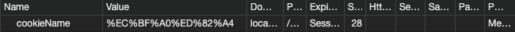

# Cookie

쿠키는 웹 브라우저가 보관하는 데이터이다. 쿠키는 서버 브라우저 모두 생성할 수 있다. 웹 브라우저는 웹 서버에 요청을 보낼 때 쿠키를 함께 전송하며 브라우저의 사용자 정보를 알 수 있다.


## 쿠키의 동작 방식
쿠키의 동작 방식은 3단계로 구성된다.
1. 쿠키 생성 단계 : 서버에서 생성한 쿠키를 응답의 헤더에 저장하여 웹 브라우저에게 전송한다
2. 쿠키 저장 단계 : 브라우저는 응답으로 받은 쿠키에 대한 정보를 쿠키 저장소에 저장한다
3. 쿠키 전송 단계 : 브라우저는 저장한 쿠키를 요청에 포함시켜 서버에 전송한다. 서버는 쿠키를 사용해 필요한 작업을 진행한다

## 쿠키의 구성 요소
쿠키를 구성하는 요소는 다음과 같다
- 이름 : 각각의 쿠키를 식별하는데 사용한다
- 값 : 쿠키의 이름과 관련한 값
- 유효시간 : 쿠키의 유효시간. 별도로 지정하지 않으면 브라우저를 종료할 때 쿠키가 삭제된다
- 도메인 : 쿠키를 전송할 도메인
- 경로 : 쿠키를 전송할 요청 경로

## 주요 메소드
쿠키의 속성을 변경하거나 가져올 수 있는 주요 메소드는 아래와 같다
|메소드|설명|
| --- | --- |
|String getName()| 쿠키 이름을 반환한다|
|String getValue()| 쿠키 값을 반환한다|
|void setValue(String value)|쿠키 값을 지정한다|
|void setDomain(String pattern)|쿠키가 전송된 서버의 도메인을 지정한다|
|String getDomain()|쿠키의 도메인을 반환한다|
|void setPath(String uri)|쿠키를 전송할 경로를 지정한다|
|String getPath()|쿠키의 전송 경로를 반환한다|
|void setMaxAge(int expiry)|쿠키의 유효시간을 초 단위로 지정한다.|
|int getMaxAge()|쿠키의 유효시간을 반환한다|


## 쿠기 사용하기 & 가져오기
### 생성하기
JSP로 쿠키를 생성하려면 쿠키 객체를 생성해 response 객체의 addCookie 메소드를 사용하면 된다.
```java
<%
    Cookie cookie = new Cookie("cookieName", URLEncoder.encode("쿠키", "utf-8"));
    response.addCookie(cookie);
%>
```


response 객체에 쿠키를 추가하면 실제로 Set-Cookie 헤더를 통해 전달된다. Set-Cookie 헤더에 대한 예시는 다음과 같다.
```
HTTP/1.0 200 OK
Content-type: text/html
Set-Cookie: yummy_cookie=choco
Set-Cookie: tasty_cookie=strawberry
```


### 가져오기
다음은 브라우저에 저장된 쿠키 목록을 가져오는 예제이다.
```java
<%@ page contentType="text/html; charset=UTF-8" %>
<%@ page import="java.net.URLDecoder" %>

<%
    Cookie[] cookies = request.getCookies();

    if(cookies != null) {
        for (Cookie cookie : cookies) {

%>

<%= cookie.getName()%> : <%= URLDecoder.decode(cookie.getValue(), "utf-8")%>
<br>
<%
    }
}
%>

```

request.getCookies 메소드는 Cookie 배열을 반환한다. 브라우저의 출력 결과는 다음과 같다
```
JSESSIONID : E17BFA9A79B1A72D4E89606F0131BD90
cookieName : 쿠키
```

## 쿠키 수정하기 & 삭제하기

### 수정하기
동일한 이름을 가진 쿠키 객체를 생성하여 response 객체에 추가하면 기존 이름을 가진 쿠키를 덮어씌우게 된다. 

```java
<%@ page contentType="text/html; charset=UTF-8" %>
<%@ page import="java.net.URLEncoder" %>

<%
    Cookie cookie = new Cookie("cookieName", URLEncoder.encode("쿠키수정", "utf-8"));
    response.addCookie(cookie);
%>
```

```
JSESSIONID : E17BFA9A79B1A72D4E89606F0131BD90
cookieName : 쿠키수정
```

### 삭제하기
Cookie 클래스의 setMaxAge 메소드의 인자 값으로 0을 주고 response 객체에 추가하면 해당 이름의 쿠키가 삭제된다.

```java
<%
    Cookie cookie = new Cookie("cookieName", URLEncoder.encode("쿠키", "utf-8"));
    cookie.setMaxAge(0);

    response.addCookie(cookie);
%>
```

## 쿠키의 도메인 & 경로

### 도메인
보안적인 문제때문에 기본적으로 쿠키는 쿠키를 생성한 서버에만 전송된다. Cookie 도메인을 통해 지정해 쿠키를 전송할 수 있는 서버를 지정할 수 있다. 도메인을 지정할 수 있는 메소드는 setDomain() 이며 다음과 같은 형식으로 도메인을 지정할 수 있다.

- `.somehost.com` : 도메인이 점(.)으로 시작하는 경우 관련 도메인에 전부 쿠키를 전송한다.
    - 예를들어 mail.somehost.com, www.somehost.com, javacan.somehost.com과 같은 도메인에 모두 쿠키를 전송한다.

- `www.somehost.com` : 특정 도메인에 대해서만 쿠키를 전송한다

별도로 쿠키 객체에 도메인을 설정하지 않으면 쿠키를 생성한 서버에만 전송된다.

### 경로
```java
cookie.setPath("/jsp_war_exploded/chap09/cookieDomain.jsp");
```

쿠키에 도메인 이후의 부분의 경로를 지정하려면 setPath() 메소드를 활용할 수 있다.

## 쿠키 유효시간
쿠키는 유효시가을 가진다. 유효시간을 정해놓으면 그 기간동안 웹 브라우저를 종료해도 쿠키를 삭제하지 않는다/ 유효시간을 따로 지정하지 않으면 웹 브라우저를 종료할때 삭제된다.

쿠키의 유효시간은 setMaxAge 메소드를 통해 지정할 수 있다. 0을 입력할 경우 쿠키는 삭제되고, 음수로 입력할 경우 브라우저를 닫을 때 쿠키가 삭제된다

```java
cookie.setMaxAge(60 * 60) // 60초(1분) & 60 = 1시간
cookie.setMaxAge(0) // 쿠키 삭제
cookie.setMaxAge(-1) // 브라우저를 닫으면 쿠키 삭제
```

