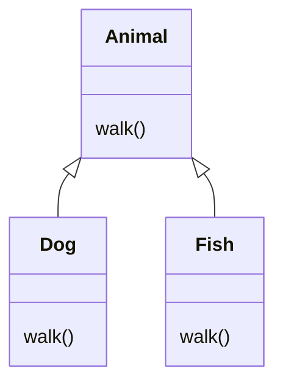
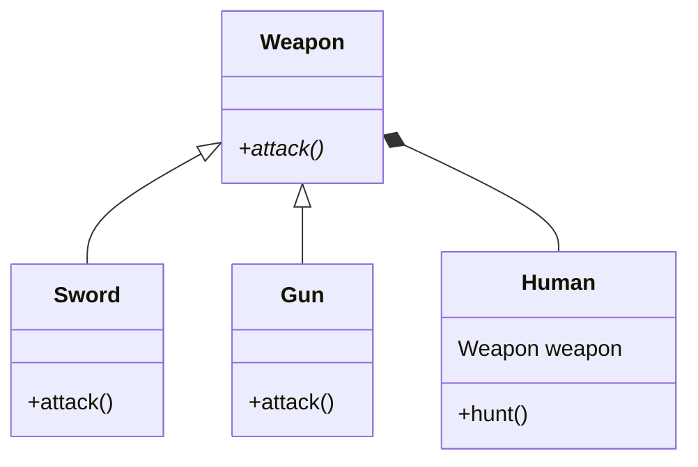

# SOLID
객체지향 프로그래밍 설계의 5가지 기본 원칙으로 OOP를 기반한 여러 디자인 패턴의 뼈대이며 스프링 프레임워크의 근간이다.

## S : 단일 책임 원칙 (Single Responsibility Principle)

하나의 클래스는 하나의 단 하나의 책임(기능 담당)을 져야 한다. 책임이라는 것은 기능에 대한 담당을 나타낸다. 예를 들어 클래스명이 UserAndAccount, DepositAndWithdrawal 처럼 두개의 역할(기능)을 가진 클래스는 단일 책임을 위배하는 클래스라고 볼 수 있다.

"하나의 책임"이라는 범위가 주관적인 특징이 있으며 어떤 프로그램을 개발하느냐에 따라서 기준이 달라질 수 있다.

단일 책임 원칙의 가장 이상적인 형태는 해당 클래스에 기능 수정이 필요할때 기능에 대한 책임을 지닌 클래스만 수정이 가능해야 한다. 다르게 이야기하면 클래스를 수정해야 하는 이유는 오직 **하나**여야 한다.


## O : 개방 폐쇄 원칙 (Open-Closed Principle)

클래스는 변화에는 닫혀 있어야 하며, 확장에는 열려 있어야 한다. 
- 변경에 닫혀있다 : 새로운 변경 사항이 발생했을 때 클래스의 직접적인 수정을 제한 함
- 확장에 열려있다 : 새로운 변경 사항이 발생했을 때 유연하게 코드를 추가함으로써 큰 힘을 들이지 않고 어플리케이션의 기능을 확장할 수 있음

### OCP를 만족하지 못한 예
```java
public class Animal {
    public void makeNoise(AnimalType type) {
        switch(type) {
            case DOG -> System.out.println("왈왈");
            case CAT -> System.out.println("냐옹");
            // case COW -> System.out.println("음메"); -> OCP를 만족하지 못한 설계
        }
    }
}
```

동물이 내는 소리를 출력하는 기능을 담당하는 Animal 클래스가 위와 같이 구현되어 있다. 

만약 여기서 소가 내는 소리를 추가해야 하는 상황이 발생하면 클래스의 switch문 내부에 case를 추가해줘야 한다. 클래스의 직접적인 코드 수정이 발생했으므로 OCP를 만족한 설계라고 보기 어렵다.


### OCP를 만족한 설계

위 예시와 똑같은 상황에서 만약 소가 내는 소리를 추가해야 하는 상황이 동일하게 발생하면 상속과 다형성을 활용해 OCP를 만족하는 설계에 대한 예시는 다음과 같다.

- Animal 클래스를 추상 클래스로 선언하고 makeNoise 메소드를 추상 메소드로 전환해 하위 클래스가 오버라이딩 하도록 한다
    ```java
    public abstract class Animal {
        abstract public void makeNoise();
    }
    ```

- Animal 클래스를 상속받아 makeNoise 메소드를 각각 정의한 Dog, Cat 클래스를 구현한다
    ```java
    public class Dog extends Animal {
        @Override
        public void makeNoise() {
            System.out.println("왈왈");
        }
    }

    public class Cat extends Animal {
        @Override
        public void makeNoise() {
            System.out.println("야옹");
        }
    }
    ```

- 새롭게 추가되는 Cow 클래스도 마찬가지로 Animal 클래스를 상속받아 구현한다
    ```java
    public class Cow extends Animal {
        @Override
        public void makeNoise() {
            System.out.println("음메");
        }
    }
    ```

앞으로 추가될 동물 클래스도 모두 Animal 클래스를 상속받아 makeNoise 메소드를 각각 구현하면 기존 클래스를 수정하지 않고(변화에는 닫힘) 새로운 동물 클래스를 추가할 수 있다(확장에는 열림). 

## L : 리스코프 치환 원칙 (Liskov Substituition Principal)

하위 클래스 타입은 언제나 자신의 기반 타입(base type)으로 교체될 수 있어야 한다는 원칙이다. 좀 더 풀어서 말하면 하위 클래스의 인스턴스는 상위 클래스의 타입의 변수에 대입하여 부모의 메소드를 사용해도 동작이 의도대로 흘러가야 하는 것을 의미한다.

LSP 원칙을 따르면 부모 클래스의 메소드에 대한 오버라이딩을 기존에 의도된 바와 같은 동작으로 자식 클래스에서 정의할 수 있어야 한다.

### LSP를 만족하지 못한 예


상위 클래스인 Animal(동물) 클래스에서 walk 메소드를 구현했을때 하위 클래스인 Dog, Fish 클래스는 walk 메소드를 각각 하위 클래스의 타입에 맞게 아래와 같이 오버라이딩 했다.

```java
public class Dog extends Animal {
    @Override
    public void walk() {
        System.out.println("강아지가 걷는다");
    }
}
```

```java
public class Fish extends Animal {
    @Override
    public void walk() {
        throw new RuntimeException("물고기는 걸을 수 없습니다.");
    }
}
```

이를 main 메소드에서 하위 클래스 인스턴스를 상위 클래스 타입 변수에 할당해 walk 메소드를 호출해보자
```java
public static void main(String[] args) {
    Animal animal = new Dog();
    animal.walk();

    Animal animal2 = new Fish();
    animal2.walk(); // "물고기는 걸을 수 없습니다."예외 발생
}
```
Dog 타입 객체는 정상적으로 실행되었다. 하지만 Fish 타입 객체는 부모 타입 변수에 할당되었음에도 불구하고 부모 클래스의 walk 메소드가 의도한대로 동작하지 않고 예외를 발생시켰으므로 이는 LSP 원칙을 위배한 케이스라고 볼 수 있다.

위같은 경우에는 차라리 walk 메소드를 선언한 인터페이스를 따로 분리하여 설계하는 것이 더 올바른 방식이라고 할 수 있다.

### LSP의 예시
LSP 대표적인 예로 Collection 인터페이스의 List를 예시로 들 수 있다. LinkedList, ArrayList 타입의 인스턴스를 Collection 타입의 변수에 대입하여 add 메소드를 사용해도 원래의 요소를 추가하는 상위 클래스의 의도대로 둘 다 동작한다. 

## I : 인터페이스 분리 원칙 (Interface Segregation Principal)

하나의 큰 인터페이스를 사용하는 것 보다 작은 인터페이스로 분리하여 사용해야 한다는 원칙이다. SRP 원칙이 클래스의 단일 책임을 강조한다면, ISP 원칙은 인터페이스의 단일 책임을 강조한다고 불 수 있다.

인터페이스를 통해 외부에 메소드를 전달할때는 항상 사용되는 최소한의 메소드만 전달하는 것이 좋다. 여러개의 메소드가 필요하다면 인터페이스의 다중 상속 효과를 활용하여 여러개의 인터페이스를 implement 하는 방법을 사용할 수 있다.

## D : 의존 역전 원칙 (Dependancy Inversion Principal)

구체적인 것에 의존하는것 보다 추상적인 것에 의존해야 한다. 어떤 클래스를 참조해서 사용하는 상황이 생긴다면 해당 클래스를 참조하게 되면 참조한 클래스에 변화가 생겼을때 같이 영향을 받기 때문에, 변하지 않는 해당 클래스의 **상위 클래스**나 **인터페이스**를 참조해야 한다는 원칙이다.

예를 들어 hunt(사냥) 기능을 구현한 Human 클래스가 있다. Human 클래스는 칼, 총을 이용해 사냥이 가능하므로 별도의 Sword, Gun 클래스도 아래와 같이 구현해준다.

```java
public class Sword {
    public void attack() {
        System.out.println("칼로 공격하기");
    }
}
```

```java
public class Gun {
    public void attack() {
        System.out.println("총으로 공격하기");
    }
}
```

만약 Human 클래스가 칼을 이용해 사냥을 하고자 한다면 Sword 클래스를 의존해 멤버 객체로 두어 hunt 메소드 내부에서 사용할 수 있다.

```java
public class Human {
    Sword sword;

    public Human(Sword sword) {
        this.sword = sword;
    }

    public void hunt() {
        sword.attack();
    }
}
```
하지만 Human 클래스가 총을 이용해 사냥을 하고자 한다면, Human 클래스 내부의 코드를 또 다시 수정해줘야 한다. 



이를 방지하기 위해 Sword, Gun 클래스의 attack 메소드를 선언한 상위 인터페이스에 의존하도록 하면 Human 클래스를 수정해보자.
```java
public class Human {
    Weapon weapon;

    public Human(Weapon weapon) {
        this.weapon = weapon;
    }

    public void hunt() {
        weapon.attack();
    }
}
```

```java
public static void main(String[] args) {
    Sword sword = new Sword();
    Human swordUsinghuman = new Human(sword);

    swordUsinghuman.hunt();

    Gun gun = new Gun();
    Human gunUsingHuman = new Human(gun);

    gunUsingHuman.hunt();
}
```
위와 같이 간단하게 클라이언트 코드에서 사용할 무기 객체를 생성자에 매개변수로 넘겨주면 Human 클래스를 수정하지 않고 무기 교체가 가능하다. 