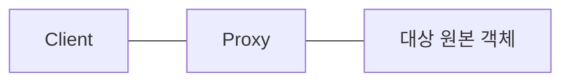
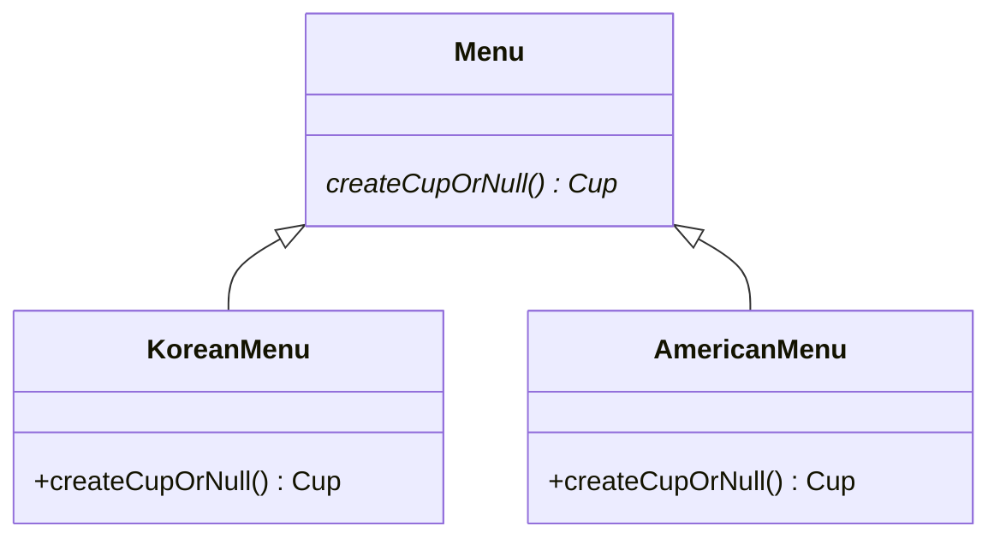
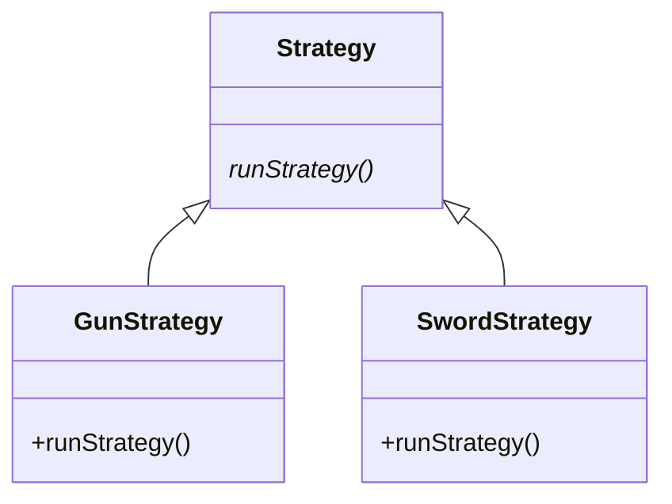

# 디자인패턴

디자인 패턴이란 실제 개발 현장에서 많은 사람들이 인정한 객체 지향 프로그래밍의 베스트 프렉티스를 모아놓은 패턴들의 모음이다.

디자인 패턴은 객체지향의 다음과 같은 특성을 활용하여 구성된다
- 상속
- 인터페이스
- 합성 (객체를 클래스 멤버로 활용)

## 어댑터 패턴 (Adapter Pattern)
래퍼 (Wrapper) 패턴이라고도 불린다. 기존 클래스를 새로운 wrapper 클래스로 감싸 어댑터 클래스를 만든 뒤 기존 클래스의 메소드를 어댑터 클래스의 메소드에서 호출하는 방법이다.

### wrapper 클래스를 사용해 기존 메소드의 시그니처 바꾸기
어떤 클래스의 메소드 시그니처를 해당 클래스의 소스코드를 변경하지 않고 (다른 코드가 사용할 수 있기 때문에) wrapper 클래스를 사용해 바꿀 수 있다. 주로 레거시 클래스를 새로운 클래스로 교체할때 사용되는 패턴이다.

아래와 같은 ServiceA 클래스가 있다고 하자.
```java
public class ServiceA {

    void runServiceA() {
        System.out.println("run service A");
    }
}
```

예시로 새로운 인터페이스를 정의하고 싶은 순간에 runServiceA의 메소드 시그니처를 바꿔서 호출하고 싶은 경우가 있다. 이럴 때 아래와 같이 wrapper 클래스를 활용하여 기존 클래스를 수정하지 않고 runServiceA 메소드를 내부적으로 호출하는 wrapper 클래스의 메소드를 새롭게 정의하여 사용할 수 있다.

```java
public class AdapterServiceA {
    Service service = new Service();

    // 새로운 메소드 시그니처
    void runService() {
        // 기존 클래스의 메소드를 내부적으로 호출
        service.runService();
    }
}
```

메소드 시그니처를 변경하는 것 외에 Adapter 패턴은 다음과 같은 용도로 사용할 수 있다
- 내부 클래스를 클라이언트에 노출시키지 않기 위해
- 기존 클래스를 변경하지 않고 기능을 확장하기 위해

## 프록시 패턴(Proxy Pattern)
프록시 패턴은 대상 원본 객체를 대리하여 대신 처리하게 함으로써 로직의 흐름을 제어하는 패턴이다. 중간에 proxy(대리) 객체를 두어 원본 객체를 내부적으로 사용한다. 프록시 클래스는 원본 객체의 입력값과 반환값을 그대로 유지하고 제어에 대한 흐름만 담당한다.

프록시 패턴은 다음과 같은 상황에서 사용한다
- 보안 : 클라이언트가 작업을 수행할 수 있는 권한을 가졌는지 중간에서 검증할 수 있다
- 캐싱 : 원본 객체의 처리결과에 대한 내부 캐시를 유지하여 원본 객체를 호출하지 않고 중간에서 직접 처리할 수 있다
- 데이터 유효성 검사 : 데이터 원본 객체로 전달하기 전에 데이터에 대한 유효성 검증을 수행할 수 있다
- 지연 초기화 : 대상 객체의 생성 비용이 비싸다면 프록시 객체가 그것을 필요로 할때까지 연기할 수 있다
- 로깅 : 원본 객체의 메소드를 수행하기 전에 입력값이나 상태를 기록할 수 있다
- 원격 객체 : 어플리케이션 외부에 있는 원격 객체를 가져와 로컬처럼 보이게 할 수 있다



프록시 패턴에 대한 코드 예시는 아래와 같다
```java
// 원본 객체
public class Service implements IService{
    @Override
    public void runSomething() {
        System.out.println("running service");
    }
}
```

실제 작업을 수행하는 원본 객체를 구현한다.

```java
public class Proxy implements IService {

    IService service;

    Proxy(Service service) {
        this.service = service;
    }

    @Override
    public void runSomething() {
        
        // 추가적인 작업 진행

        // 원본 객체를 내부적으로 호출
        service.runSomething();
    }
}

```
원본 객체를 멤버로 갖는 프록시 클래스를 정의한다. 프록시 클래스에서 호출할 runSomething 메소드는 실제 원본 객체의 작업 메소드를 호출전에 유효성 검사나 지연 초기화 같은 추가적인 작업을 먼저 실행할 수 있다.


## 데코레이터 패턴(Decorator Pattern)
데코레이터 패턴은 메소드 호출의 반환값의 변화를 주기 위해 중간에 장식자를 두는 패턴이다.

데코레이터 패턴은 프록시 패턴과 일반적으로 구성은 같지만, 원본 객체의 반환값을 수정하지 않는 프록시 패턴과는 다르게 데코레이터 패턴은 원본 객체가 돌려주는 반환값에 장식(decorator)을 더하여 클라이언트에게 전달한다.

데코레이터 패턴을 적용한 예시는 다음과 같다.
- Collections.unmodifiableList() : 반환하는 컬렉션의 요소를 수정할 수 없게 함 (읽기 전용)
- HttpServletRequestWrapper, HttpServletResponseWrapper : HTTP 요청과 응답을 가공할 수 있다.


데코레이터 패턴에 대한 코드 예시는 아래와 같다

```java
public class Service implements IService {
    @Override
    public String runSomething() {
        System.out.println("running service");

        return "running service";
    }
}
```

실제 작업을 수행하는 원본 객체를 구현한다. 원본 객체의 runSomething 메소드는 "running service"라는 문자열 값을 반환한다.

```java
public class Decorator {
    private IService service;

    Decorator(Service service) {
        this.service = service;
    }

    public String runSomeThing() {
        // 반환값의 변화를 준다
        return "decorator pattern" + runSomeThing();
    }
}
```
원본 객체를 멤버로 갖는 데코레이터 클래스를 정의한다. 원본 객체의 runSomeThing 메소드를 호출하는 메소드를 정의해 반환값에 대한 변화를 준다.

## 싱글톤 패턴 (Singleton Pattern)
<a href="https://github.com/sungjunjin/til/blob/main/cs/singleton.md">별도로 정리</a> 

## 템플릿 메소드 패턴 (Template Method Pattern)

템플릿 메소드 패턴이란 여러 클래스에서 공통적으로 사용되는 메소드를 템플릿화 하여 상위 클래스에 정의하고, 하위 클래스에서 확장될 기능을 각각 다르게 구현하는 패턴이다.

아래와 같이 강아지와 고양이 클래스가 있다.
```java
public class Dog {
    public void playWithOwner() {
        System.out.println("귀염둥이 이리온");
        System.out.println("멍! 멍!");
        System.out.println("꼬리 살랑 살랑");
        System.out.println("잘했어");
    }
}
```

```java
public class Cat {
    public void playWithOwner() {
        System.out.println("귀염둥이 이리온");
        System.out.println("야옹! 야옹!");
        System.out.println("꼬리 살랑 살랑");
        System.out.println("잘했어");
    }
}
```

두 클래스는 공통적으로 사용되는 메소드를 템플릿화 한 상위 클래스는 다음과 같다.

```java
abstract public class Animal {
    public void playWithOwner() {
        System.out.println("귀염둥이 이리온");
        System.out.println("잘했어");
    }

    public abstract void play();

    // Hook 메소드
    void runSomething() {
        System.out.println("꼬리 살랑살랑");
    }
}
```

상위 클래스인 Animal 클래스에는 템플릿을 제공하는 playWithOwner 메소드와 하위 클래스의 구현을 강제하는 추상 메소드인 play, 마지막으로 선택적으로 오버라이딩 할 수 있는 hook 메소드로 구현한다.

템플릿 메소드를 적용한 예시는 다음과 같다.
- HttpServlet : HttpServlet을 상속하고 doGet, doPost 메소드를 오버라이딩 하면 상위 서블릿 객체에서 템플릿 로직을 수행하다가 하위 클래스의 오버라이딩 된 doGet, doPost 메소드를 참조하여 실행한다.

## 팩토리 메소드 패턴 (Factory Method Pattern)
팩토리 메소드 패턴은 객체를 생성하는 팩토리 메소드를 **다형적으로** 구성함으로써 하위 클래스의 메소드가 상위 클래스의 팩토리 메소드를 오버라이딩하여 사용하는 패턴을 의미한다. 

### 팩토리 메소드 패턴 예시

예시로 우선 Cup 클래스를 정의하자. 멤버 변수로 용량(ml)을 가지고 있다.
```java
public class Cup {
    private int sizeMl;

    Cup(int sizeMl) {
        this.sizeMl = sizeMl;
    }
}
```


팩토리 메소드 패턴을 사용해 생성되는 Cup 인스턴스의 용량을 각 나라에 따라 다르게 하고 싶으면 아래와 같이 추상 팩토리 메소드를 정의한 추상 클래스를 구현하고 나라마다 다형적으로 하위 클래스의 팩토리 메소드를 구성할 수 있다. 코드 예시는 다음과 같다.

```java
abstract public class Menu {
    abstract Cup createCupOrNull(CupSize size);
}
```

```java
public final class KoreanMenu extends Menu {
    @Override
    Cup createCupOrNull(CupSize size) {
        return switch (size) {
            case SMALL -> new Cup(300);
            case MEDIUM -> new Cup(500);
            case LARGE -> new Cup(1000);
            default -> null;
        };
    }
}
```

```java
public final class AmericanMenu extends Menu {
    @Override
    Cup createCupOrNull(CupSize size) {
        return switch (size) {
            case SMALL -> new Cup(500);
            case MEDIUM -> new Cup(1000);
            case LARGE -> new Cup(1200);
            default -> null;
        };
    }
}
```

사용은 아래와 같이 할 수 있다.
```java
public static void main(String[] args) {
    Menu koreanMenu = new KoreanMenu();
    Cup koreanMediumCup = koreanMenu.createCupOrNull(CupSize.MEDIUM); // 대한민국 컵

    Menu americanMenu = new AmericanMenu();
    Cup americanSmallCup = americanMenu.createCupOrNull(CupSize.SMALL); // 미국 컵
}
```

## 전략 패턴 (Strategy Pattern)

전락 패턴은 다형성과 조합을 활용해 클라이언트가 전략(Strategy) 객체를 주입하여 사용하는 패턴이다.

전략 패턴은 다음과 같은 3 요소로 구성된다.
- 전략 메소드를 가진 전략 객체
- 전략 객체를 사용하는 컨텍스트 객체
- 전략 객체를 주입하는 클라이언트

### 전략 객체
예를 들어 클라이언트가 군인 객체를 가지고 전쟁을 한다고 했을 때 칼을 사용할 수 있고 총을 사용할 수 있다. 따라서 전략 객체는 다음과 같이 구성할 수 있다.



```java
public interface Strategy {
    void runStrategy();
}
```

```java
public class GunStrategy implements Strategy {
    @Override
    public void runStrategy() {
        System.out.println("나는 총을 사용해 싸운다");
    }
}
```

```java
public class SwordStrategy implements Strategy {

    @Override
    public void runStrategy() {
        System.out.println("나는 칼을 사용해 싸운다");
    }
}
```

### 컨텍스트
전략 객체를 사용하는 객체를 컨텍스트라고 한다. 여기서는 군인 객체가 전략 객체를 사용한다.

```java
public class Soldier {
    Strategy strategy;

//    생성자 주입도 사용
//    public Soldier(Strategy strategy) {
//        this.strategy = strategy;
//    }

    public void setStrategy(Strategy strategy) {
        this.strategy = strategy;
    }

    public void fight() {
        strategy.runStrategy();
    }
}
```

컨텍스트 객체는 Strategy 인터페이스를 멤버로 두고 있고 setStrategy 메소드를 통해 Strategy 인터페이스를 구현한 전략 객체들을 주입받을 수 있다. 경우에 따라서 전략 객체의 생성자 주입도 사용된다.

주입된 전략 객체를 기반으로 fight 메소드에서 해당 전략을 실행한다.

### 클라이언트
컨텍스트 객체를 사용하는 클라이언트는 원하는 전략 객체를 컨텍스트 객체에 주입한다. 

```java
public static void main(String[] args) {
    GunStrategy gunStrategy = new GunStrategy();
    Soldier gunSoldier = new Soldier();
    gunSoldier.setStrategy(gunStrategy);

    gunSoldier.fight();
}
```

실행 결과
```
> Task :StrategyMain.main()
나는 총을 사용해 싸운다
```

## 템플릿 콜백 패턴 (Template Callback Pattern - 견본 / 회신 패턴)

전략 패턴과 유사하지만 전략을 별도의 클래스가 아닌 익명 클래스로 구현한 패턴이다. Spring DI는 템플릿 콜백 패턴을 사용한다. 앞서 전략 패턴에서 예로 들었던 군인 객체와 전략 대한 예시를 템플릿 콜백 패턴으로 변경했을때 코드는 다음과 같다.

메소드가 1개인 함수형 인터페이스를 사용해 콜백 메소드를 구성한다. 아래와 같이 해당 메소드를 구현한 전략 익명 클래스를 클라이언트 코드에서 직접 정의해 매개변수로 넘겨준다.

```java
public interface Strategy {
    public void runStrategy();
}
```

```java
public class Soldier {
    Strategy strategy;

    public void fight(Strategy strategy) {
        strategy.runStrategy();
    }
}
```

```java
public static void main(String[] args) {
    Soldier swordUsingSoldier = new Soldier();

    // 칼을 사용한 내부 클래스 정의
    swordUsingSoldier.fight(new Strategy() {
        @Override
        public void runStrategy() {
            System.out.println("나는 칼을 사용해 싸운다");
        }
    });

    Soldier gunUsingSolider = new Soldier();

    // 총을 사용한 내부 클래스 정의
    gunUsingSolider.fight(new Strategy() {
        @Override
        public void runStrategy() {
            System.out.println("나는 총을 이용해 싸운다");
        }
    });
}
```

### 코드 중복 제거하기
익명 클래스를 생성하는 코드를 컨텍스트 객체의 내부 private 메소드를 활용해 코드를 간결하게 표현할 수 있다. 예시는 다음과 같다.

```java
public class Soldier {
    void fight(String weaponSound) {
        this.executeWeapon(weaponSound).runStrategy();
    }

    private Strategy executeWeapon(String weaponSound) {
        return new Strategy() {
            @Override
            public void runStrategy() {
                System.out.println(weaponSound);
            }
        };
    }
}
```

```java
public static void main(String[] args) {
    Soldier swordUsingSoldier = new Soldier();
    swordUsingSoldier.fight("나는 칼을 사용해 싸운다");

    Soldier gunUsingSolider = new Soldier();
    gunUsingSolider.fight("나는 총을 사용해 싸운다");
}
```