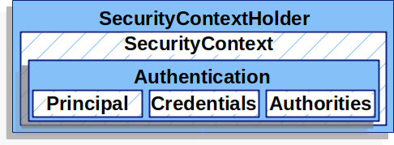

# Spring Security

## 아키텍처


Spring Security의 아키텍처는 위와 같다. 

### SecurityContextHolder 
SecurityContext를 제공하며 기본적으로 ThreadLocal을 사용한다.

### Authentication과 Principal
Spring Security에서 인증이 완료된 대상의 정보를 Principal이라고 하고 이를 Authentication 객체 내부에 저장한다.

Principal 내부에서는 인증 대상과 관련된 메타정보와 권한(ROLE)을 가지고 있다.

아래와 같이 SecurityContextHolder를 사용해 해당 쓰레드에서 인증된 대상의 정보를 가져올 수 있다.
```java
Authentication authentication = SecurityContextHolder.getContext().getAuthentication();
Object principal = authentication.getPrincipal();
```

## AuthenticationManager
Spring Security에서 인증을 담당하는 인터페이스이며, 구현체는 ProviderManager를 사용한다. 등록된 AuthenticationProvider를 사용해 인증을 처리한다. 


## Spring Security Test
build.gradle에 test scope의 의존성 추가한다.
```
testImplementation 'org.springframework.security:spring-security-test'
```

익명 유저를 사용한 테스트는 
```java
@Test
@DisplayName("anonymous 유저 루트 페이지 접근 성공")
public void index_anonymous() throws Exception {
    mockMvc.perform(get("/")
                    .with(anonymous()))
            .andDo(print())
            .andExpect(status()
            .isOk());
}
```

```java
@Test
@DisplayName("anonymous 유저 루트 페이지 접근 성공")
@WithAnonymousUser
public void index_anonymous() throws Exception {
    mockMvc.perform(get("/"))
            .andDo(print())
            .andExpect(status()
                    .isOk());
}
```

임의의 로그인한 유저를 사용한 테스트
```java
@Test
public void index_user() throws Exception {
    // test라는 이름의 USER 권한을 가진 유저가 로그인되어 있다고 가정
    mockMvc.perform(get("/")
                    .with(user("test")
                    .roles("USER")))
            .andDo(print())
            .andExpect(status()
            .isOk());
}
```

```java
@Test
@WithMockUser(username = "test", roles = "USER")
public void index_user() throws Exception {
    mockMvc.perform(get("/"))
            .andDo(print())
            .andExpect(status()
            .isOk());
    }
```