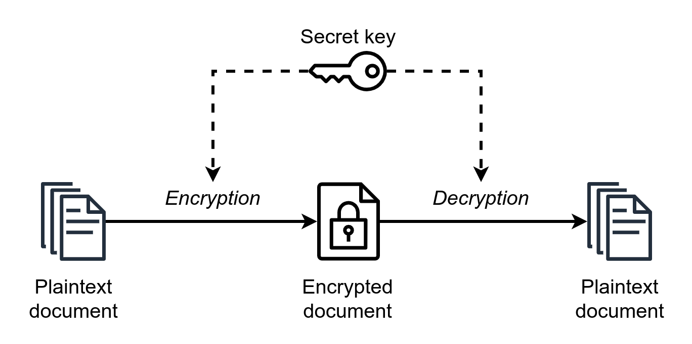

## 대칭키 (Symmetric Encryption)


대칭키 혹은 비공개키 암호화는 암복호화에 사용되는 키가 동일하며, 해당 키를 아는 사람만이 문서를 복호화해 볼 수 있다는 특징이 있다. AES, DES가 대표적인 대칭키 알고리즘이다.

### 대칭키의 장단점
장점 : 암복호화 속도가 빠르다. 
단점 : 키의 공유가 복잡하다. 키를 탈취 당하면 해당 키를 사용하는 모든 데이터에 대한 암복호화가 가능하다. 상대방이 많아질수록 그 만큼의 키를 생성해야 하기 때문에 관리가 어렵다.

## 비대칭키(Asymmetic Encryption)


암복호화에 사용되는 키가 각각 다르다. 주로 암호화에는 모든 사용자들에게 공유되어 있는 공개키(public key), 복호화에는 키의 소유자만이 알고 있는 비밀키(private or secret key)가 사용된다. 위 그림과 반대로 전자서명의 경우에는 암호화에 비밀키 복호화에 공개키가 사용되기도 한다.

대표적인 비대칭키 알고리즘은 RSA가 있다.

### 비대칭키를 활용한 전자서명
비대칭키 알고리즘을 사용한 전자서명 방식은 다음과 같다.

1. A는 평문을 자신의 비밀키로 암호화 한다
2. 평문과 함께 비밀키로 암호화된 암호문을 B에게 전송한다
```
Hello World
---전자서명---
MIICeAIBADANBgkqhkiG9w0BAQEFAASCAmIwggJeAgEAAoGBAL1tgl4TBszIX4nnWM03xk06H3I0mRjxBylOWq77tDOEk9dw61xzaYqKVgXybpZ/FRnJ+fry+3CdFppMpKZ70OAi996i091beJ7YwFNnwRajRbEB8nTpSEu6nG+vHSuhAJzMAm2qAXKvLaDd1SeMzXwp87T5bymzJ8dFrbpcGNZdAgMBAAECgYEAk5Jsrb1E3uR7CYQhuj5pTmCpft9bJgMgAR35p7iPelMemghuU2fWIQgEXD2xyazXU2/2P3psSB8ZLLvoyYpL/fgcJkAebaRzpPu/vPXk1g4fMLjHH82nEci+2/kCGUYT4uMZbQ5wLFsCSHVejpFYezPGTZsGx/CsFAF15EqonkECQQD1emprdPKAAyBQTOrVwKEPDw3CXKoeGEPsefGtaNjjuBQkjktECFYDUHadzTySfaBtd/yDLojtRHsxtxBMqv6fAkEAxYwQMZIxXHSQgbAtA8CzQfSysSUxTFEBjG09JRfzthPH1j5h5clS2QmsQevRtQq4nb/TQCiLouOswyBu2dqVgwJACU7T/DEaBNqZfhH8kZBVSxHiDq2e0bdP1AansFCacMAJG329wt2iDUwew0sF8fQLgjsbewnnrT98gF0VpCKTtwJBAL6RrZWEiGW+dSEGyYYTQVphKnjFflc21h2XzCKahpqhXmiJaXt4yZliQXCeg4D4xLw5Lxt3ga0zoZfjE8zJlu0CQQCOPGKGOT8Ln7Fw2dmtiKcqvcjwyubBSyb/SCKqSoKZswhTBHdV86YPSQz/3a1SYCBcESFjvEeOC/YODlCQ0bn+
```
3. B는 공개된 A의 공개키로 암호문을 해독한다.
4. 해독된 데이터를 A로부터 전달받은 평문과 비교한다
5. 해독된 데이터와 평문이 일치하면 A로부터 전달받은 데이터임을 확신할 수 있다

#### 비대칭키의 장단점
장점 : 키 공유가 간단하다. 공개키는 공유되어 있기 때문에 사전에 키를 교환할 필요가 없다. 
단점 : 암복호화를 위해 복잡한 수학 연산을 수행하므로 대칭키 알고리즘보다 속도가 느리다. 


