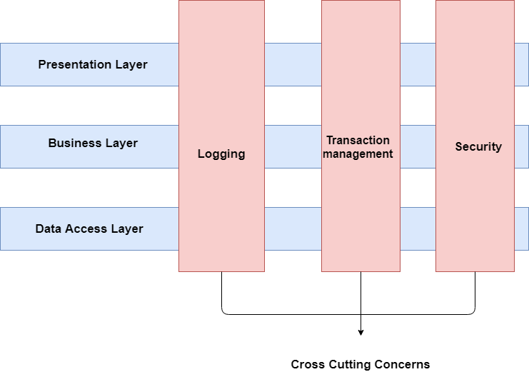
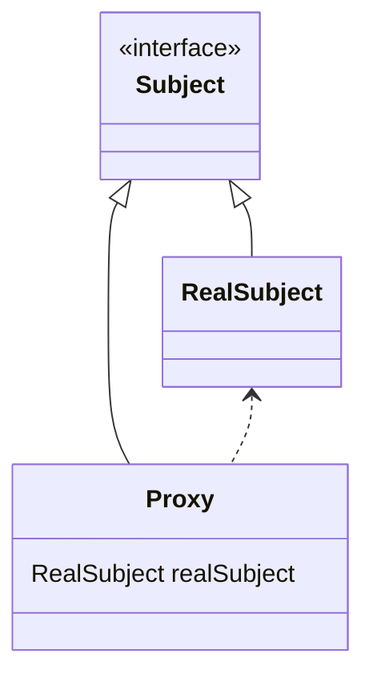
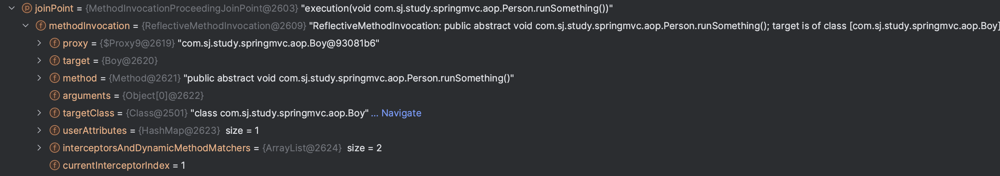

# AOP

AOP는 OOP를 보완하는 수단으로써 공통 관심사(Cross Cutting Concerns)를 모듈화 할 수 있는 프로그래밍 기법이다. 공통 관심사란 여러 클래스에서 공통적으로 수행되는 작업이다. 예를들면 로깅, 보안, 트랜잭션이 있다.

AOP를 구현하는 방법은 다음과 같다.
- 컴파일 단계 : 컴파일 시점 이전에 AOP가 적용되고 이후 코드가 컴파일 되는 방식이다. 대표적으로 AspectJ가 있다
- 바이트코드 조작 : 컴파일된 클래스가 클래스로더에 의해 메모리에 로딩되는 시점에 AOP가 적용되는 방식이다. 이 방법 또한 AspectJ가 제공을 한다
- 프록시 패턴 : AOP가 적용될 클래스와 똑같은 시그니처를 가진 인터페이스를 생성하고 해당 인터페이스를 구현한 Proxy 클래스를 생성한다. Proxy 클래스의 메소드 내부에서 AOP 로직을 적용하고 실제 호출될 메소드를 호출하는 패턴이다

스프링에서 사용하는 AOP는 프록시 패턴을 기반으로 동작한다

## 프록시 패턴을 기반으로 동작하는 스프링 AOP

스프링 AOP는 프록시 패턴을 기반으로 동작한다. 클라이언트는 인터페이스 타입을 구현한 Proxy 객체를 실제로 호출하게 된다. Proxy 객체는 RealSubject 클래스를 참조하여 AOP에 정의된 advice 로직을 실행하고 실제 RealSubject의 메소드를 호출한다.

### 프록시 객체의 생성 과정
Aspect를 등록하면 스프링 컨테이너에서 BeanPostProcessor 인터페이스를 구현한 추상 클래스인 AbstractAutoProxyCreator에서 AOP가 적용된 빈을 감싸는 프록시 빈을 생성한다. 

## AOP 구성 & 예시
```java
@Component
@Aspect
public class MyAspect {
    @Before("execution(public void com.sj.study.springmvc.aop.Boy.runSomething())")
    public void before(JoinPoint joinPoint) {
        System.out.println("열쇠로 문을 열고 집에 들어간다");
    }
}
```

#### @Aspect
@Aspect 어노테이션을 클래스에 적용하면 해당 클래스를 AOP에서 사용하겠다는 의미를 가진다. 해당 클래스는 @Component 어노테이션을 사용해 빈으로도 등록해준다.

#### Pointcut
Pointcut은 Aspect를 **어디에** 적용한건지에 대한 정보를 가지고 있다.
```java
"execution(public void com.sj.study.springmvc.aop.Boy.runSomething())"
```

위 코드는 Pointcut 표현식이다. 의미는 `com.sj.study.springmvc.aop` 패키지의 Boy 클래스의 runSomething 메소드를 대상으로 Aspect를 적용하겠다는 의미를 가진다.

execution외에도 해당되는 어노테이션을 가진 메소드를 대상으로 Aspect 로직을 적용하는 @annotation 표현식 등이 있다.
```java
"@annotation(PerfomanceLogging)"
```

#### JoinPoint
JoinPoint는 Aspect가 끼어들 수 있는 지점을 의미한다. Aspect가 적용된 메소드를 JoinPoint 인터페이스 타입의 매개변수로 넘겨받아 사용할 수 있다.




#### Advice
Advice는 Pointcut에 적용할 로직, 즉 메소드를 의미한다. 또한 언제 로직을 적용할건지에 대한 개념까지 포함되어 있다.

아래는 Pointcut에 실제 적용할 로직에 해당되는 부분이다.
```java
public void before(JoinPoint joinPoint) {
    System.out.println("열쇠로 문을 열고 집에 들어간다");
}
```

Advice를 적용할 시점은 어노테이션으로 지정한다. 위 예시는 @Before 어노테이션을 지정했다. 사용할 수 있는 Advice 어노테이션은 다음과 같다.
- @Before : 타겟 메소드 실행전에 어드바이스 기능을 수행
- @After : 타겟 메소드의 결과에 관계없이(즉 성공, 예외 관계없이) 타겟 메소드가 완료 되면 어드바이스 기능을 수행
- @AfterReturning : 타겟 메소드가 성공적으로 결과값을 반환 후에 어드바이스 기능을 수행
- @AfterThrowing : 타겟 메소드가 수행 중 예외를 던지게 되면 어드바이스 기능을 수행
- @Around : 어드바이스가 타겟 메소드를 감싸서 타겟 메소드 호출전과 후에 어드바이스 기능을 수행

### Aspect 등록하기
xml 설정파일 기준으로 Aspect 어노테이션을 적용한 클래스를 빈으로 등록한다.
```xml
<?xml version="1.0" encoding="UTF-8"?>
<beans xmlns="http://www.springframework.org/schema/beans"
       xmlns:xsi="http://www.w3.org/2001/XMLSchema-instance"
       xmlns:aop="http://www.springframework.org/schema/aop"
       xmlns:context="http://www.springframework.org/schema/context"
       xsi:schemaLocation="
       http://www.springframework.org/schema/beans
       http://www.springframework.org/schema/beans/spring-beans.xsd
       http://www.springframework.org/schema/aop
       http://www.springframework.org/schema/aop/spring-aop-3.1.xsd"
>
    <aop:aspectj-autoproxy/>
    <!-- 빈으로 등록-->
    <bean id="myAspect" class="com.sj.study.springmvc.aop.MyAspect"/>

    <bean id="boy" class="com.sj.study.springmvc.aop.Boy"/>
</beans>
```
