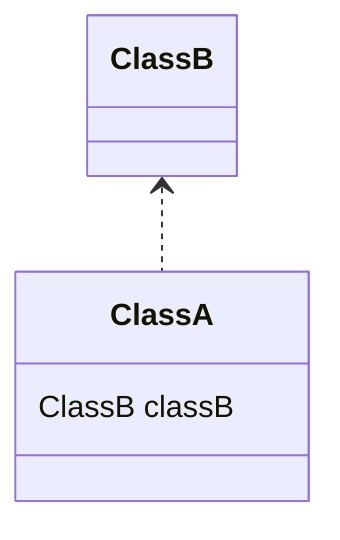
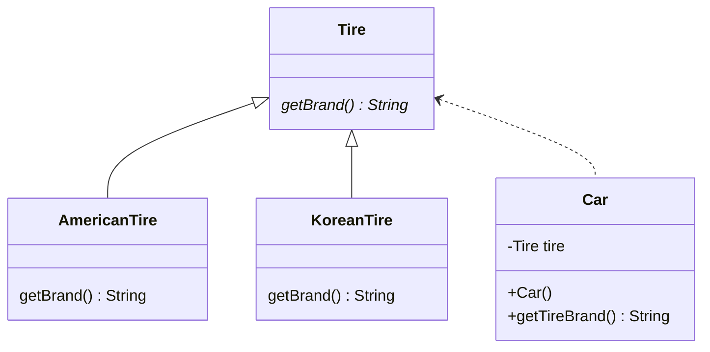

# DI (Dependency Injection)

## 의존성 (Dependency)
클래스 A가 제대로 작동하려면 클래스 B가 필요한 경우, 클래스 A는 클래스 B에 의존한다. 이를 클래스 다이어그램으로 표현하면 다음과 같다.



## 주입 (Injection)

Tire 인터페이스에 의존하는 Car 클래스가 있다고 가정해보자. 클래스 다이어그램을 활용한 구성도는 다음과 같다.



Car 클래스에 대한 구현 코드는 아래와 같다. Car 클래스의 생성자에서 사용할 타이어의 객체를 생성해서 Tire 멤버 변수에 할당한다. 

```java
public class Car {
    private final Tire tire;

    public Car() {
        this.tire = new KoreanTire();
//      this.tire = new AmericanTire();
    }

    public String getTireBrandName() {
        return this.tire.getBrand();
    }
}
```

하지만 사용할 타이어의 종류를 Car 클래스가 생성자에서 정하는 방식은 유연성이 떨어진다. 만약 사용하고자 하는 타이어의 종류를 바꿀 경우 직접 Car 클래스를 수정해줘야 한다는 점에서 OCP 원칙을 위반한다고 볼 수 있다. 또한 만약 Tire 클래스의 생성자에 매개변수라도 추가된다면 Car 클래스의 생성자에서 추가된 매개변수에 대응을 해줘야 한다. 이러한 이유에서 의존하고 있는 객체에 대한 결합도가 높은 구조가 된다.

### 생성자를 통한 주입
만약 사용하고자 하는 타이어의 종류를 Car 클래스 외부에서 정해주면 어떨까? 아래와 같이 생성자에서 Tire 인터페이스 타입의 매개변수를 받아 외부에서 가져오는 방식으로 수정해보자.

```java
public class Car {
    private final Tire tire;

    public Car(Tire tire) {
        this.tire = tire;
    }

    public String getTireBrandName() {
        return this.tire.getBrand();
    }
}
```

외부에서는 아래와 같이 코드를 작성할 수 있다.

```java
KoreanTire koreanTire = new KoreanTire();
// AmericanTire americanTire = new AmericanTire();

// 사용한 타이어 클래스를 주입
Car car = new Car(koreanTire);
```

이런 방법을 통해서 Tire 인터페이스를 구현한 클래스의 추가나, 변화가 생겨도 Car 클래스에서 수정할 필요는 없다. 의존 클래스에 대한 결합도를 낮출 수 있으며, 테스트 코드를 짜기에도 용이하다. 이러한 방식을 **의존성 주입(Dependency Injection)** 이라고 한다.

### setter를 통한 주입

주입된 Tire 객체를 바꿀 여지가 있는 경우 setter를 통한 주입 방식을 사용한다. 

```java
public class Car {
    private Tire tire;
    
    public void setTire(Tire tire) {
        this.tire = tire;
    }
}
```

위 방법은 아래와 같이 사용한다.
```java
KoreanTire koreanTire = new KoreanTire();

Car car = new Car();
car.setTire(koreanTire); // 한국 브랜드 타이어 주입
```

## Spring IoC
위에서는 사용자가 직접 의존하는 객체를 만들어 주입을 해줬다. 이번에는 스프링이 의존성 객체를 생성하고 필요에 따라 주입을 해주는 스프링 컨테이너를 활용한 의존성 주입 방식이다. 

**설정파일**이나 **어노테이션**을 활용해 필요한 객체(의존성)를 스프링에 등록하여 사용하는데, 이렇게 스프링에 등록되어 스프링 컨테이너가 관리하는 객체(의존성)를 **빈(Bean)** 이라고 한다. 

스프링 컨테이너에 객체를 빈으로 등록했을때의 장점은 다음과 같다
- 필요한 의존성들을 (빈으로 등록된 객체에 한해서) 스프링 컨테이너가 알아서 주입해준다
- 빈의 스코프를 지정할 수 있다
    - Singleton : 어플리케이션에서 항상 한 개의 인스턴스를 사용한다 (기본값)
    - Request : 요청마다 인스턴스를 생성한다
    - Session : 세션마다 인스턴스를 생성한다
    - Prototype : 항상 새로운 인스턴스를 만든다

- 빈의 라이프사이클 인터페이스를 활용할 수 있다
    - postConstruct()
    - preDestroy()

### XML을 사용한 주입
스프링 초기에 사용한 방식이다. 

```java
public class Car {
    private Tire tire;

    // xml 설정파일을 활용한 빈 주입에는 setter가 필요하다
    public void setTire(Tire tire) {
        this.tire = tire;
    }

    public String getTireBrandName() {
        return this.tire.getBrand();
    }
}
```

스프링 IoC 컨테이너를 사용하기 위해서는 빈 설정 파일이 필요하다. resources 패키지 하위에 xml 파일을 설정해준다.

`resources/applicationContext.xml`
```xml
<?xml version="1.0" encoding="UTF-8"?>
<beans xmlns="http://www.springframework.org/schema/beans"
       xmlns:xsi="http://www.w3.org/2001/XMLSchema-instance"
       xsi:schemaLocation="http://www.springframework.org/schema/beans http://www.springframework.org/schema/beans/spring-beans.xsd">

    <!-- 빈 등록-->
    <bean id="koreanTire" class="com.sj.study.springmvc.di.KoreanTire"/>
    <bean id="americanTire" class="com.sj.study.springmvc.di.AmericanTire"/>

    <bean id="car" class="com.sj.study.springmvc.di.Car">
        <!-- 필요한 의존성 주입-->
        <property name="tire" ref="koreanTire"></property> 
    </bean>
</beans>
```

- bean의 id는 camel case를 사용하는 것이 컨벤션이다
- class는 등록하고자 하는 빈의 경로를 설정해준다
- property의 name 속성은 빈에 정의된 setter를 참조한다. 여기서는 Car 클래스 내부에 setTire 메소드를 사용하여 의존성을 주입한다
- property의 ref 속성은 주입할 빈의 id를 참조한다

빈 설정 파일을 통해 빈을 등록했으면 아래와 같이 ApplicationContext를 활용해 등록한 빈을 가져올 수 있다. ApplicationContext는 BeanFactory 인터페이스를 통해 등록된 빈을 가져올 수 있으며, 그 외에 다국어 처리 기능, 이벤트 발생 기능, 리소스 로딩 기능을 담당한다.

```java
public static void main(String[] args) {
    ApplicationContext context = new ClassPathXmlApplicationContext("applicationContext.xml");

    Car car = context.getBean("car", Car.class);
    KoreanTire koreanTire = context.getBean("koreanTire", KoreanTire.class);
    AmericanTire americanTire = context.getBean("americanTire", AmericanTire.class);
}
```

### @Autowired & @Resource

#### Autowired
@Autowired 어노테이션은 스프링 프레임워크에서 제공하는 어노테이션이다. @Autowired 어노테이션은 필드, 생성자, setter 메소드에 사용해 의존성을 주입받을 수 있다.

기존 xml 파일에 `<context:annotation-config/>` 태그의 추가와 각종 설정 파일을 추가한 빈 설정 파일은 다음과 같다.

`resources/applicationContext.xml`
```xml
<?xml version="1.0" encoding="UTF-8"?>
<beans xmlns="http://www.springframework.org/schema/beans"
       xmlns:xsi="http://www.w3.org/2001/XMLSchema-instance"
       xmlns:context="http://www.springframework.org/schema/context"
       xsi:schemaLocation="http://www.springframework.org/schema/beans http://www.springframework.org/schema/beans/spring-beans.xsd
       http://www.springframework.org/schema/context
       http://www.springframework.org/schema/context/spring-context-3.1.xsd"
>

    <context:annotation-config/>

    <bean id="tire" class="com.sj.study.springmvc.di.KoreanTire"/>
    <bean id="americanTire" class="com.sj.study.springmvc.di.AmericanTire"/>
    <bean id="car" class="com.sj.study.springmvc.di.Car"/>
</beans>
```

주입하고자 하는 필드에 @Autowired 어노테이션을 달아준다.
```java
public class Car {

    @Autowired
    private Tire tire;

    public String getTireBrandName() {
        return this.tire.getBrand();
    }
}
```

#### Resource

@Resource 어노테이션은 자바 표준 어노테이션이다. 해당 어노테이션을 사용하면 @Autowired와 동일하게 필요한 의존성을 알아서 주입해준다.

```java
public class Car {

    @Resource
    private Tire tire;

    public String getTireBrandName() {
        return this.tire.getBrand();
    }
}
```

#### @Autowired vs @Resource
@Autowired와 @Resource 어노테이션의 차이점은 다음과 같다.
|  | @Autowired | @Resource |
| --- | --- | --- |
| 출처 | 스프링 프레임워크 | 표준 자바 |
| 패키지 | org.springframwork.beans.factory.annotation.Autowired | javax.annotation.Resource |
| 빈 검색 방식 | byType 먼저, 못 찾으면 byName | byName 먼저, 못 찾으면 byType |
| 주입되는 빈 강제하기 | @Qualifier 사용 | @Resource(name=””) 사용 |

### 생성자 주입이 권장되는 이유
스프링 레퍼런스에서 권장하는 의존성 주입 방식은 생성자 주입 방식이다. 생성자 주입을 활용하게 되면 다음과 같은 이점이 있다.

- 불변성과 테스트 용이성: 생성자 주입은 의존성이 불변하다는 장점을 가진다. 따라서 빈 주입 방식중에 유일하게 final 키워드 적용이 가능하다.

- 순환 의존성 방지: 생성자 주입을 사용하면 순환 의존성(circular dependency)을 방지할 수 있다. 순환 의존성은 빈이 서로를 의존하고 있는 경우 발생하는 문제로, 생성자 주입을 사용하면 스프링이 순환 의존성을 해결하는 데 컴파일 단계에서 도움을 준다. 

- 생성자를 사용하면 의존하는 멤버에 대한 빈 객체가 제대로 주입되었는지 확인할 수 있다. 혹여나 Null이 들어온다면 생성자를 실행하는 단계에서 NPE가 발생하기 때문이다. 
