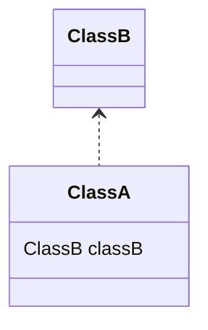
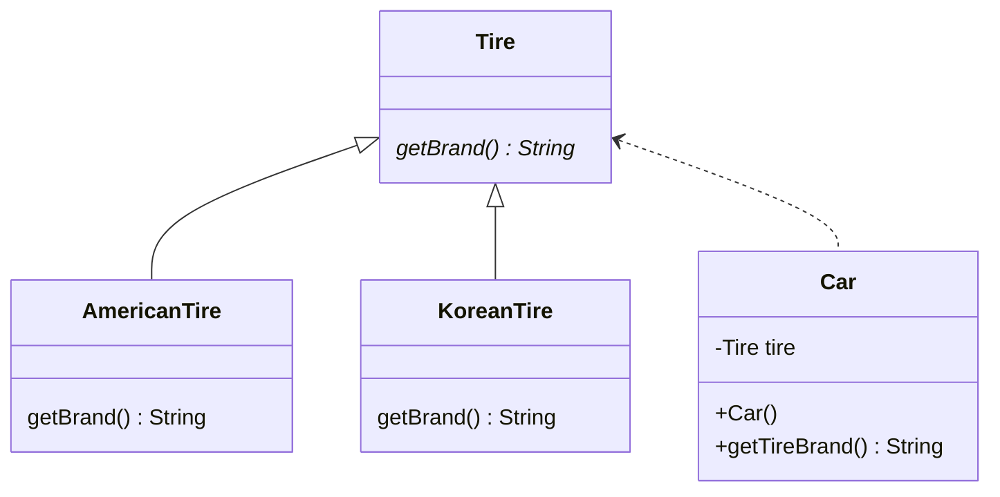

# DI

## 의존성 (Dependency)
클래스 A가 제대로 작동하려면 클래스 B가 필요한 경우, 클래스 A는 클래스 B에 의존한다. 이를 클래스 다이어그램으로 표현하면 다음과 같다.



## 주입 (Injection)

Tire 인터페이스에 의존하는 Car 클래스가 있다고 가정해보자. 클래스 다이어그램을 활용한 구성도는 다음과 같다.



Car 클래스에 대한 구현 코드는 아래와 같다. Car 클래스의 생성자에서 사용할 타이어의 객체를 생성해서 Tire 멤버 변수에 할당한다. 

```java
public class Car {
    private final Tire tire;

    public Car() {
        this.tire = new KoreanTire();
//      this.tire = new AmericanTire();
    }

    public String getTireBrandName() {
        return this.tire.getBrand();
    }
}
```

하지만 사용할 타이어의 종류를 Car 클래스가 생성자에서 정하는 방식은 유연성이 떨어진다. 만약 사용하고자 하는 타이어의 종류를 바꿀 경우 직접 Car 클래스를 수정해줘야 한다는 점에서 OCP 원칙을 위반한다고 볼 수 있다. 또한 만약 Tire 클래스의 생성자에 매개변수라도 추가된다면 Car 클래스의 생성자에서 추가된 매개변수에 대응을 해줘야 한다. 이러한 이유에서 의존하고 있는 객체에 대한 결합도가 높은 구조가 된다.

만약 사용하고자 하는 타이어의 종류를 Car 클래스 외부에서 정해주면 어떨까? 아래와 같이 생성자에서 Tire 인터페이스 타입의 매개변수를 받아 외부에서 가져오는 방식으로 수정해보자.

```java
public class Car {
    private final Tire tire;

    public Car(Tire tire) {
        this.tire = tire;
    }

    public String getTireBrandName() {
        return this.tire.getBrand();
    }
}
```

외부에서는 아래와 같이 코드를 작성할 수 있다.

```java
KoreanTire koreanTire = new KoreanTire();

// 사용한 타이어 클래스를 주입
Car car = new Car(koreanTire);
```

이런 방법을 통해서 KoreanTire 클래스의 변화가 생겨도 Car 클래스에서 수정할 필요는 없다. 의존 클래스에 대한 결합도를 낮출 수 있으며 이런한 방식을 **의존성 주입(Dependency Injection)** 이라고 한다.
