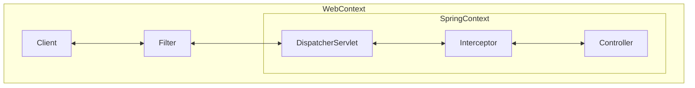

# DispatcherServlet

## DispatcherServlet이란?


디스패처 서블릿은 클라이언트의 HTTP 요청을 서블릿 컨테이너가 받아 filter를 거친 후 Spring Context에서 가장 먼저 요청을 받게 된다. 해당 요청을 처리할 수 있는 컨트롤러에게 위임하여 프론트 컨트롤러(Front Controller)라고 한다.

## 동작 순서
디스패처 서블릿의 동작 순서는 다음과 같다

#### 1. 클라이언트의 요청을 서블릿 받음

서블릿 컨테이너로부터 받은 클라이언트의 HTTP 요청은 필터를 거쳐 Spring Context에서 가장 먼저 디스패처 서블릿에게 전달된다.

#### 2. 요청을 분석하고 적합한 핸들러를 찾아 컨트롤러로 전달
```java
@Nullable
protected HandlerExecutionChain getHandler(HttpServletRequest request) throws Exception {
    if (this.handlerMappings != null) {
        for (HandlerMapping mapping : this.handlerMappings) {
            HandlerExecutionChain handler = mapping.getHandler(request);
            if (handler != null) {
                return handler;
            }
        }
    }
    return null;
}
```

getHander 메소드 내부에서 handlerMapping을 통해 요청에 대한 적합한 핸들러를 찾아 인터셉터 등의 정보를 포함한 HandlerExecutionChain으로 감싸 반환한다.

```java
// Actually invoke the handler.
mv = ha.handle(processedRequest, response, mappedHandler.getHandler());
```
핸들러 어댑터가 컨트롤러로 요청을 위임한다 -> 핸들러의 메소드를 실행한다.

#### 3. 비즈니스 로직을 처리 & 반환
컨트롤러는 서비스에 구현된 비즈니스 로직을 처리하고 결과를 반환한다.

#### 4. 핸들러 어댑터가 반환값을 처리하여 클라이언트로 반환
HandlerAdapter는 컨트롤러부터 받은 응답을 후처리한 후에 디스패처 서블릿으로 돌려준다. 여기서 컨트롤러가 ResponseEntity를 반환하면 MessageConverter를 사용해 응답 객체를 직렬화 하고 status code를 설정하여 클라이언트에게 응답한다.

만약 컨트롤러가 View 이름을 반환하면 ViewResolver를 통해 해당 이름의 View를 클라이언트에게 응답한다.

