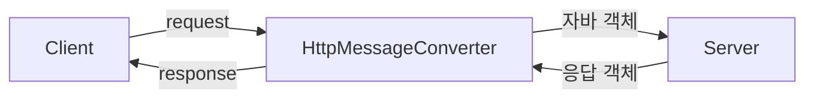

## HttpMessageConverter
스프링에서 요청과 응답에 대한 데이터를 변환하는 인터페이스이다. 클라이언트의 요청을 서버에서 처리하기 위해 적절한 자바 객체로 변환하거나, 서버의 응답 객체를 클라이언트가 이해할 수 있는 형식(ex JSON)으로 반환하는 역할을 수행한다.



스프링에서 제공하는 HttpMessageConverter의 구현체는 다양하다 예를들면 다음과 같다
- JSON 형식의 변환 : MappingJackson2HttpMessageConverter
- XML 형식의 변환 : MappingJackson2XmlHttpMessageConverter
- 문자열 형식의 변환 : StringHttpMessageConverter

### HttpMessageConverter의 동작 과정

#### 요청
HttpMessageConverter의 동작 과정은 다음과 같다
1. 클라이언트의 요청이 DispatcherServlet에 전달된다
2. DispatcherServlet은 핸들러 매핑을 통해 요청을 처리할 핸들러 메소드를 선택한다
3. HandlerAdapter는 핸들러 메소드를 호출하기 전에 요청을 분석하여 적합한 HttpMessageConverter 구현체를 선택한다
4. 해당 HttpMessageConverter는 요청 본문을 자바 객체로 변환한다

#### 응답
1. 핸들러 메소드의 응답으로 전달한 데이터를 리턴한다 HandlerMethodReturnValueHandler가 해당 데이터를 HttpMessageConverter의 반환 메소드를 호출한다
2. 전달 받은 데이터를 HttpMessageConverter로 전달하여 HTTP 응답 본문으로 반환한다
3. HandlerMethodReturnValueHandler는 HTTP 응답 본문을 HandlerAdapter에게 전달한다

## @RequestBody
```java
@RestController
public class Controller {
    @PostMapping("/post")
    public String post(@RequestBody UserDto userDto) {
        // 코드 생략       
    }
}
```
Controller 메소드의 파라미터에 @RequestBody를 적용하면 요청 본문의 데이터를 HttpMessageConverter를 통해 변환한 타입의 객체로 가져올 수 있다. 


