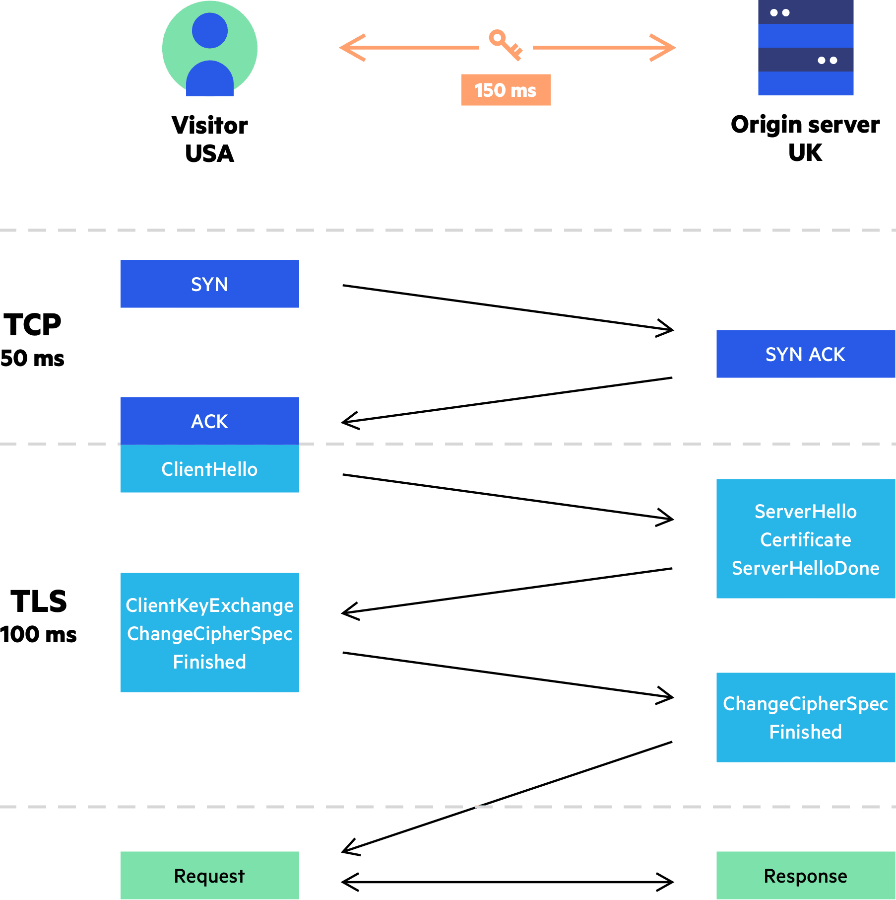

# HTTPS (Hypertext Transfer Protocol Secure)

기존 HTTP 통신에 보안이 추가되었다. HTTPS 통신을 사용하면 서버와 클라이언트간의 통신에 사용된 데이터가 전부 암호화된다. 

## TLS(Transport Layer Secured)
HTTPS는 TLS(전송 계층 보안) 프로토콜을 기반으로 에서 동작한다. TLS는 넷스케이프가 개발한 SSL(Secured Sockets Layer)의 후속 버전이다. 통상적으로 SSL / TLS는 같은 표현이다. 

### TLS의 작동 원리

TCP 3-way-handshake가 끝난 후에 TLS handshake가 수행된다. 동작 순서는 다음과 같다

#### 1. ClientHello
TLS handshaked의 첫 단계로써 클라이언트는 서버에게 다음과 같은 정보를 전송한다.
- 지원하는 암호화 방식
- 클라이언트의 TLS 버전 정보
- 클라이언트가 생성한 랜덤 데이터

#### 2. ServerHello
서버는 클라이언트의 응답하면서 다음과 같은 정보를 클라이언트에 전송한다.
- 지원하는 암호화 방식
- 서버가 생성한 랜덤 데이터
- 서버의 공개키가 담긴 인증서

#### 3. 인증서 확인
클라이언트는 서버가 보낸 인증서를 확인한다. 인증서는 CA를 통해 올바른 인증서인지 검증한다. 

- CA(Certificate Authority)란?
    - 전자서명 및 암호화를 위한 디지털 인증서를 관리하는 서비스를 제공하는 기관이다. 대표적으로 Comodo, DigiCert 등이 있다.

- 인증서 검증법
    - 서버가 보낸 인증서는 해당 CA의 비밀키로 암호화 되어 있다. 클라이언트는 CA의 공개키로 인증서를 복호화하여 CA가 발급한 인증서임을 확인할 수 있다.

#### 4. ClientKeyExchange
서버가 보낸 인증서에는 서버의 공개키가 포함되어 있다. 클라이언트는 앞서 ClientHello, ServerHello 단계에서 서버와 공유한 클라이언트의 랜덤 데이터와 서버의 랜덤 데이터를 기반으로 pre-master-secret이라는 key를 생성한 뒤, 서버의 공개키를 사용해 암호화 하여 서버에 전달한다. 

#### 5. Encrypted handshake message, Change cipher spec (handshake 종료)
서버는 클라이언트에게 전달받은 pre-master-secret을 서버의 개인키로 복호화 한다. 클라이언트와 서버간의 공유된 pre-master-secret값을 가지고 서버와 클라이언트간의 공통된 알고리즘을 기반으로 세션키를 생성한다. 

세션키는 이후 진행하는 http 통신에서 상호간의 암복호화 통신에 사용될 대칭키 값으로 사용되고 세션이 종료 후 폐기된다.

### 세션키 (대칭키)를 사용하는 이유
비대칭키 알고리즘은 대칭키 알고리즘에 비해 많이 연산이 많고 느리다는 단점이 있다. 따라서 TLS handshake를 통해 클라이언트와 서버간에 생성한 세션 키(대칭키)를 사전에 공유하여 이를 HTTP 통신에 활용해 비대칭키를 활용하는 방식에 비해 더 빠르고 효율적으로 통신할 수 있다.